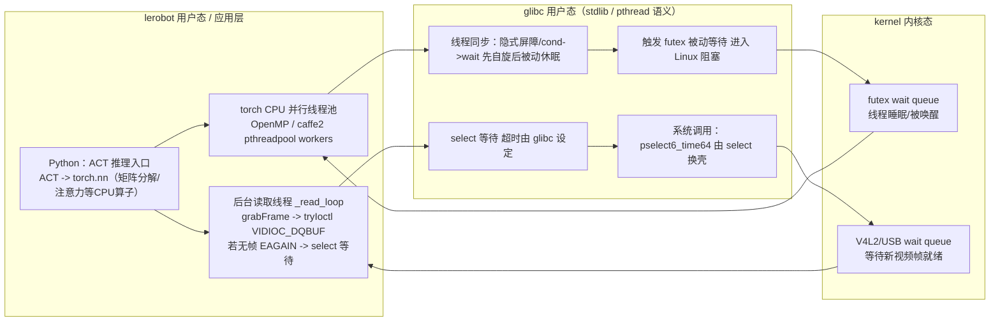

## ACT->futex系统调用

### 1. ACT模型内

/Users/vel/Desktop/RobotOS/Lerobot/lerobot/src/lerobot/policies/act/configuration_act.py

在 ACT 中，主要的计算开销和线程同步源于两个地方：

```python
# 多头自注意力层：计算序列内 token 间的依赖关系
x = self.self_attn(q, k, value=x, key_padding_mask=key_padding_mask) 
self.self_attn = nn.MultiheadAttention(config.dim_model, config.n_heads, dropout=config.dropout)

# 第一层线性变换（扩展维度）
x = self.linear2(self.dropout(self.activation(self.linear1(x))))
self.linear1 = nn.Linear(config.dim_model, config.dim_feedforward)
```

### 5. 并行两条等待链路示意图（lerobot / glibc / kernel）

下面把两条“从 Python 出发”的调用链路合在一张图里：

1) 计算分支：`ACT -> torch.nn` 的 CPU 并行（OpenMP / caffe2 pthreadpool）在需要同步时会退化到 `futex` 被动等待。  
2) 读取分支：后台 `_read_loop` 调用 OpenCV/V4L2 取帧；当队列没帧（`EAGAIN`）时走 `select -> glibc -> pselect6_time64`，由内核 wait queue 在 USB 摄像头就绪时唤醒。



### 2. torchvision

`vision/torchvision/models/resnet.py`中`ResNet.forward(x)`跳转到`_forward_impl(x)`。

```python
    def _forward_impl(self, x: Tensor) -> Tensor:
        # See note [TorchScript super()]
        x = self.conv1(x)   # 第一个卷积层
        x = self.bn1(x)
        x = self.relu(x)
        x = self.maxpool(x)

        x = self.layer1(x)  # 进入 BasicBlock 组成的层
        x = self.layer2(x)
        x = self.layer3(x)
        x = self.layer4(x)

        x = self.avgpool(x)
        x = torch.flatten(x, 1)
        x = self.fc(x)

        return x
```

进入 BasicBlock 与 Conv2d , 在 BasicBlock 源码中：

```python
def forward(self, x: Tensor) -> Tensor:
    identity = x
    out = self.conv1(x)  # <--- 这里的 self.conv1 是在 __init__ 里通过 conv3x3() 创建的
    # ...

def conv3x3(in_planes: int, out_planes: int, stride: int = 1, groups: int = 1, dilation: int = 1) -> nn.Conv2d:
    """3x3 convolution with padding"""
    return nn.Conv2d(   # conv3x3 返回的是一个普通的 nn.Conv2d 实例。
        in_planes,
        out_planes,
        kernel_size=3,
        stride=stride,
        padding=dilation,
        groups=groups,
        bias=False,
        dilation=dilation,
    )

```

此时跳转到 Module._call_impl。

### 3. torch

#### 3.1 torch.nn.modules.conv

nn.Conv2d 的源码位于： torch/nn/modules/conv.py

```python
def _conv_forward(self, input: Tensor, weight: Tensor, bias: Tensor | None):
    if self.padding_mode != "zeros":
        return F.conv2d(
            F.pad(
                input, self._reversed_padding_repeated_twice, mode=self.padding_mode
            ),
            weight,
            bias,
            self.stride,
            _pair(0),
            self.dilation,
            self.groups,
        )

    return F.conv2d(
        input, weight, bias, self.stride, self.padding, self.dilation, self.groups
    )   # <--- 跳转到 F.conv2d  

def forward(self, input: Tensor) -> Tensor:
    return self._conv_forward(input, self.weight, self.bias)
```

/opt/anaconda3/envs/lerobot/lib/python3.10/site-packages/torch/_C/_VariableFunctions.pyi 中

```py
@overload
def conv2d(input: Tensor, weight: Tensor, bias: Optional[Tensor] = None, stride: Union[Union[_int, SymInt], Sequence[Union[_int, SymInt]]] = 1, padding: Union[Union[_int, SymInt], Sequence[Union[_int, SymInt]]] = 0, dilation: Union[Union[_int, SymInt], Sequence[Union[_int, SymInt]]] = 1, groups: Union[_int, SymInt] = 1) -> Tensor: ...
@overload
def conv2d(input: Tensor, weight: Tensor, bias: Optional[Tensor] = None, stride: Union[Union[_int, SymInt], Sequence[Union[_int, SymInt]]] = 1, padding: str = "valid", dilation: Union[Union[_int, SymInt], Sequence[Union[_int, SymInt]]] = 1, groups: Union[_int, SymInt] = 1) -> Tensor: ...
```

pytorch/aten/src/ATen/native/native_functions.yaml 中

```yaml
- func: conv2d(Tensor input, Tensor weight, Tensor? bias=None, SymInt[2] stride=1, SymInt[2] padding=0, SymInt[2] dilation=1, SymInt groups=1) -> Tensor
  dispatch:
    CompositeImplicitAutograd: conv2d_symint  # <--- 注意这里！
```

当执行 F.conv2d 时，调用的链路如下：

1. Python 层：调用 torch.conv2d。

2. 存根文件 (.pyi)：引导解释器去查找 torch._C（即 libtorch_python.so）。

3. C++ 桥接层 (python_variable_methods.cpp)： PyTorch 的自动生成工具根据你这段 YAML，在 C++ 侧生成了一个名为 THPVariable_conv2d 的包装函数。它负责把 Python 的 stride=[1,1] 转换成 C++ 的 SymIntArrayRef。把 Python 的 weight 转换成 at::Tensor。

4. 跳转到 ATen：包装函数最后会执行：

```cpp
return wrap(at::conv2d_symint(input, weight, bias, stride, padding, dilation, groups));
```

#### 3.2 pytorch/aten/src/ATen/native/Linear.cpp

### 4. torchC

pytorch/aten/src/ATen/native/Convolution.cpp

conv2d主要是torchvision的底层实现

```cpp

at::Tensor conv2d_symint(
    const Tensor& input_, const Tensor& weight, const std::optional<Tensor>& bias_opt,
    SymIntArrayRef stride, SymIntArrayRef padding, SymIntArrayRef dilation, c10::SymInt groups) {
  // See [Note: hacky wrapper removal for optional tensor]
  c10::MaybeOwned<Tensor> bias_maybe_owned = at::borrow_from_optional_tensor(bias_opt);
  const Tensor& bias = *bias_maybe_owned;

  TORCH_CHECK(
    !bias.defined() || bias.dtype() == input_.dtype(),
    "Input type (",
    input_.dtype().name(),
    ") and bias type (",
    bias.dtype().name(),
    ") should be the same");

  auto [input, is_batched] = batchify(input_, /*num_spatial_dims=*/ 2, "conv2d");
  Tensor output;
  if (at::isComplexType(input_.scalar_type())) {
    output = complex_convolution(input, weight, bias, stride, padding, dilation, false, {{0, 0}}, groups);
  } else {
    output = at::convolution_symint(input, weight, bias, stride, padding, dilation, false, {{0, 0}}, groups);
  }     // 这里调用了 ATen Dispatcher。由于在树莓派 CPU 上运行，它会跳过 CUDA 路径，选择 CPU 后端
  return is_batched ? std::move(output) : output.squeeze(0);
}
```

aten/src/ATen/ParallelOpenMP.cpp

```cpp
#ifdef USE_PTHREADPOOL
  // because PyTorch uses caffe2::pthreadpool() in QNNPACK
  caffe2::PThreadPool* const pool = caffe2::pthreadpool(nthreads);
  TORCH_INTERNAL_ASSERT(pool, "Invalid thread pool!");
#endif

```

在 ARM 芯片上跑 PyTorch 矩阵乘法（比如前向传播里的 nn.Linear）会调用这边的POSIX 线程池，当的 4 核 CPU 开始算矩阵时，这个线程池会把大矩阵切块，派发给 4 个 Worker 线程。

#### OpenMP线程池的调度

```c
#ifdef _OPENMP
  omp_set_num_threads(nthreads);
#endif
```

OpenMP 为了在 4 个核心之间调度，在每次循环开始和结束时都会设置隐式屏障（Implicit Barrier）。多个核心在屏障前互相等待，只要有一个核心稍微慢了一点（比如被操作系统调度切走了），其他核心全都会陷入自旋等待，随后被操作系统强行挂起，产生 futex 上下文切换。

#### 线程池的 C++ 源码（位于 caffe2/utils/threadpool）

### 从 PyTorch (caffe2) CPU 线程池、算子到 Linux 内核

pytorch/caffe2/utils/threadpool/WorkersPool.h

```c
  // Finally, do real passive waiting.
  // 最后，如果自旋没有等到通知，就执行真正的被动等待（陷入内核系统调用futex）。
  // 阻塞passive waiting
  {
    std::unique_lock<std::mutex> g(
        *mutex); // 加锁对应的互斥体，底层对应 pthread_mutex_lock
    T new_value = var->load(std::memory_order_relaxed);
    // Handle spurious wakeups.
    // 处理虚假唤醒。调用 std::condition_variable 的 wait，这在 Linux
    // 下最终会触发 futex 挂起当前线程。
    cond->wait(g, [&]() {
      new_value = var->load(std::memory_order_relaxed);
      return new_value != initial_value;
    });
    TORCH_DCHECK_NE(
        static_cast<size_t>(new_value), static_cast<size_t>(initial_value));
    return new_value;
  }
```

PyTorch 的一种混合调度策略：先空转一会儿（由于缓存命中率高且算子切分有时极细，如果工作线程马上做完，就省去了一次开销几十微秒的系统级别线程切换）；如果迟迟等不到，为了不无限烧坏 CPU，就退化为调用 cond->wait(g, ...) 的被动休眠。

### libstdc++ 调用链路

这段代码属于 **libstdc++**（GNU C++ 标准库），而不是 Glibc（GNU C 标准库）。但它最终会调用 Glibc 的函数。

#### 调用链路

```
PyTorch C++ 代码
    ↓ 调用
std::mutex::lock() 
    ↓ 调用（第250行）
__gthread_mutex_lock(&_M_mutex)
    ↓ 调用（gthr-posix.h 第746行）
pthread_mutex_lock()  ← Glibc 函数
    ↓ 调用（锁被占用时）
futex() 系统调用  ← Linux 内核
```

#### 源码位置

1. **libstdc++ - std::mutex::lock()**
   - 文件：`/Users/vel/Work/RobotOS/Lerobot/gcc-13.2.0/libstdc++-v3/include/std/mutex`
   ```cpp
   // 第250行
   int __e = __gthread_mutex_lock(&_M_mutex);
   ```

2. **libgcc - __gthread_mutex_lock()**
   - 文件：`/Users/vel/Work/RobotOS/Lerobot/gcc-13.2.0/libgcc/pgthr-posix.h`
   ```cpp
   // 第746-751行
   static inline int
   __gthread_mutex_lock (__gthread_mutex_t *__mutex)
   {
     if (__gthread_active_p ())
       return __gthrw_(pthread_mutex_lock) (__mutex);  // 调用 Glibc
     else
       return 0;
   }
   ```

3. **Glibc - pthread_mutex_lock()**
   - 声明：`/usr/include/pthread.h`
   - 实现：`glibc-2.42/nptl/pthread_mutex_lock.c`
   - 当锁被占用时，调用 Linux 内核的 `futex` 系统调用

   **pthread_mutex_lock() 内部流程**：
   ```
   pthread_mutex_lock(mutex)
       │
       ├── 1. 尝试原子获取锁：CAS(&mutex->__data.__lock, 0, current_thread_id)
       │      └── 如果锁空闲(oldval==0)，立即获取成功，返回
       │
       ├── 2. 锁已被占用，设置 FUTEX_WAITERS 标志
       │      └── atomic_compare_and_exchange_val_acq(&lock, oldval | FUTEX_WAITERS, oldval)
       │
       └── 3. 调用 futex_wait() 阻塞等待
               └── 文件：glibc-2.42/nptl/pthread_mutex_lock.c 第335行
               └── futex_wait((unsigned int *) &mutex->__data.__lock, oldval, ...)
   ```

### Glibc 内部调用链路
4. **Glibc 内部调用链路**
   ```
   pthread_mutex_lock()
       ↓
   lll_futex_wait()  ← lowlevellock-futex.h 第75行
       ↓
   lll_futex_syscall()  ← lowlevellock-futex.h 第56-61行
       ↓
   INTERNAL_SYSCALL(futex, ...)  ← 系统调用指令
       ↓
   Linux 内核 futex 系统调用
   ```

   - **lll_futex_wait()**：Glibc 封装层
     - 文件：`glibc-2.42/sysdeps/nptl/lowlevellock-futex.h`
     ```c
     // 第75-78行
     # define lll_futex_timed_wait(futexp, val, timeout, private)     \
       lll_futex_syscall (4, futexp,                                 \
     		     __lll_private_flag (FUTEX_WAIT, private),  \
     		     val, timeout)
     ```

   - **lll_futex_syscall()**：最终系统调用
     - 文件：`glibc-2.42/sysdeps/nptl/lowlevellock-futex.h`
     ```c
     // 第56-61行
     # define lll_futex_syscall(nargs, futexp, op, ...)                      \
       ({                                                                    \
         long int __ret = INTERNAL_SYSCALL (futex, nargs, futexp, op, 	\
     				       __VA_ARGS__);                    \
         (__glibc_unlikely (INTERNAL_SYSCALL_ERROR_P (__ret))         	\
          ? -INTERNAL_SYSCALL_ERRNO (__ret) : 0);                     	\
       })
     ```

   - **INTERNAL_SYSCALL(futex, ...)**：编译器生成的系统调用指令
     - **x86_64 架构**：执行 `syscall` 指令，系统调用号为 `__NR_futex`
     - **ARM64 架构**（树莓派）：执行 `svc #0` 指令，系统调用号为 `__NR_futex`
     - ARM64 系统调用号定义在：`/Users/vel/Work/RobotOS/Lerobot/linux/include/uapi/asm-generic/unistd.h`
### Linux 内核 - futex 系统调用
5. **Linux 内核 - futex 系统调用**
   - 文件：`/Users/vel/Work/RobotOS/Lerobot/linux/kernel/futex/syscalls.c`
   - 入口：`SYSCALL_DEFINE6(futex, ...)`
   - 内核处理流程：
     1. 检查 futex 地址上的值是否等于预期值
     2. 如果相等，将当前线程加入 futex 等待队列
     3. 线程进入睡眠状态，不消耗 CPU
     4. 当其他线程调用 `futex_wake()` 唤醒时，线程恢复执行
