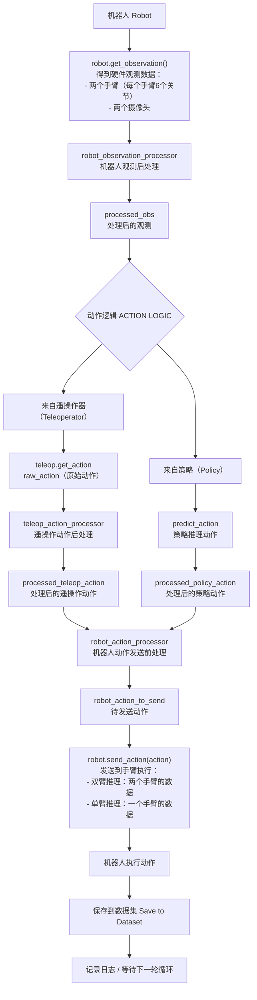
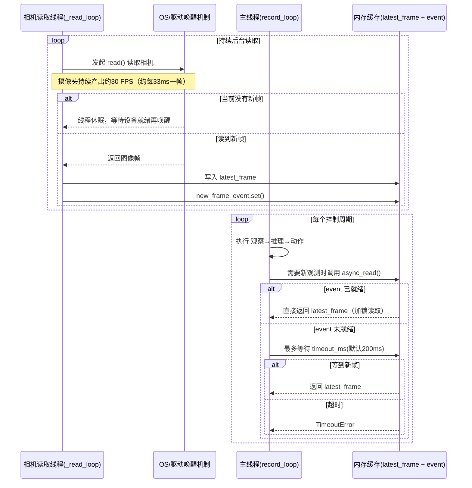
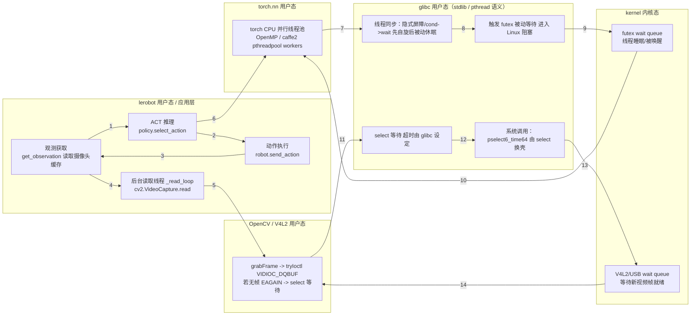

## 1. Python记录日志

```bash
INFO 2026-03-24 18:21:59 ls/utils.py:227 Recording episode 19
INFO 2026-03-24 18:22:01 t/record.py:451 [Record Loop] timestamp=2.2s | obs=11.9ms | inference=2148.0ms | action=1.2ms | wait=0.0ms | total=2161.3ms | fps=0.5
INFO 2026-03-24 18:22:02 t/record.py:451 [Record Loop] timestamp=3.2s | obs=2.8ms | inference=109.1ms | action=5.0ms | wait=0.0ms | total=116.9ms | fps=8.6
INFO 2026-03-24 18:22:03 t/record.py:451 [Record Loop] timestamp=4.2s | obs=4.1ms | inference=65.8ms | action=3.0ms | wait=0.0ms | total=73.3ms | fps=13.6
INFO 2026-03-24 18:22:04 t/record.py:451 [Record Loop] timestamp=5.3s | obs=2.1ms | inference=86.8ms | action=4.2ms | wait=0.0ms | total=93.1ms | fps=10.7
INFO 2026-03-24 18:22:05 t/record.py:451 [Record Loop] timestamp=6.3s | obs=2.8ms | inference=64.7ms | action=5.1ms | wait=0.0ms | total=72.6ms | fps=13.8
INFO 2026-03-24 18:22:06 t/record.py:451 [Record Loop] timestamp=7.4s | obs=16.1ms | inference=54.5ms | action=1.4ms | wait=0.0ms | total=72.0ms | fps=13.9
INFO 2026-03-24 18:22:07 t/record.py:451 [Record Loop] timestamp=8.4s | obs=8.5ms | inference=51.3ms | action=3.2ms | wait=0.0ms | total=63.1ms | fps=15.8
INFO 2026-03-24 18:22:11 t/record.py:451 [Record Loop] timestamp=11.6s | obs=1.8ms | inference=2237.2ms | action=0.6ms | wait=0.0ms | total=2241.6ms | fps=0.4
INFO 2026-03-24 18:22:12 t/record.py:451 [Record Loop] timestamp=12.6s | obs=4.2ms | inference=57.1ms | action=2.7ms | wait=0.0ms | total=64.1ms | fps=15.6
INFO 2026-03-24 18:22:13 t/record.py:451 [Record Loop] timestamp=13.7s | obs=3.4ms | inference=79.9ms | action=0.8ms | wait=0.0ms | total=84.1ms | fps=11.9
INFO 2026-03-24 18:22:14 t/record.py:451 [Record Loop] timestamp=14.7s | obs=15.7ms | inference=65.1ms | action=2.7ms | wait=0.0ms | total=83.5ms | fps=12.0
INFO 2026-03-24 18:22:15 t/record.py:451 [Record Loop] timestamp=15.8s | obs=4.1ms | inference=86.8ms | action=2.8ms | wait=0.2ms | total=94.2ms | fps=10.6
INFO 2026-03-24 18:22:16 t/record.py:451 [Record Loop] timestamp=16.8s | obs=2.0ms | inference=12.4ms | action=0.6ms | wait=18.4ms | total=33.4ms | fps=29.9
INFO 2026-03-24 18:22:18 t/record.py:451 [Record Loop] timestamp=19.0s | obs=1.7ms | inference=1530.6ms | action=0.8ms | wait=0.0ms | total=1533.0ms | fps=0.7
INFO 2026-03-24 18:22:19 t/record.py:451 [Record Loop] timestamp=20.0s | obs=2.9ms | inference=11.5ms | action=0.8ms | wait=18.2ms | total=33.4ms | fps=30.0
INFO 2026-03-24 18:22:20 t/record.py:451 [Record Loop] timestamp=21.0s | obs=8.1ms | inference=53.1ms | action=6.6ms | wait=0.0ms | total=68.0ms | fps=14.7
INFO 2026-03-24 18:22:21 t/record.py:451 [Record Loop] timestamp=22.1s | obs=7.1ms | inference=93.0ms | action=3.9ms | wait=0.3ms | total=104.5ms | fps=9.6
INFO 2026-03-24 18:22:22 t/record.py:451 [Record Loop] timestamp=23.2s | obs=4.1ms | inference=62.0ms | action=4.4ms | wait=0.0ms | total=70.6ms | fps=14.2
INFO 2026-03-24 18:22:23 t/record.py:451 [Record Loop] timestamp=24.2s | obs=14.5ms | inference=91.4ms | action=9.3ms | wait=0.0ms | total=115.1ms | fps=8.7
INFO 2026-03-24 18:22:27 t/record.py:451 [Record Loop] timestamp=27.7s | obs=3.7ms | inference=3173.0ms | action=0.8ms | wait=0.0ms | total=3177.6ms | fps=0.3
INFO 2026-03-24 18:22:28 t/record.py:451 [Record Loop] timestamp=28.7s | obs=2.8ms | inference=49.7ms | action=8.4ms | wait=0.0ms | total=60.9ms | fps=16.4
INFO 2026-03-24 18:22:29 t/record.py:451 [Record Loop] timestamp=29.7s | obs=3.2ms | inference=34.6ms | action=1.7ms | wait=0.0ms | total=39.6ms | fps=25.3
INFO 2026-03-24 18:22:30 t/record.py:451 [Record Loop] timestamp=30.9s | obs=12.4ms | inference=108.9ms | action=6.3ms | wait=0.0ms | total=127.6ms | fps=7.8
INFO 2026-03-24 18:22:31 t/record.py:451 [Record Loop] timestamp=31.9s | obs=6.1ms | inference=37.5ms | action=0.7ms | wait=0.0ms | total=44.4ms | fps=22.5
INFO 2026-03-24 18:22:32 t/record.py:451 [Record Loop] timestamp=32.9s | obs=3.1ms | inference=30.3ms | action=1.3ms | wait=0.0ms | total=35.0ms | fps=28.6
INFO 2026-03-24 18:22:36 t/record.py:451 [Record Loop] timestamp=37.4s | obs=3.5ms | inference=4043.0ms | action=1.2ms | wait=0.0ms | total=4047.7ms | fps=0.2
INFO 2026-03-24 18:22:37 t/record.py:451 [Record Loop] timestamp=38.5s | obs=4.2ms | inference=55.6ms | action=0.7ms | wait=0.0ms | total=60.5ms | fps=16.5
INFO 2026-03-24 18:22:39 t/record.py:451 [Record Loop] timestamp=39.5s | obs=4.2ms | inference=73.1ms | action=2.6ms | wait=0.0ms | total=80.0ms | fps=12.5
```

```bash
【Episode 时间】: 545.292 - 585.361 (持续 40.07s)
```


## 2. 分析内核日志

从545.292 - 585.361 (持续 40.07s) python产生巨量调用
```bash
python-23209   [003] .....   545.611706: do_select: pselect6: total=370 ns, sleep=0 ns, context=370 ns, ret=0, end_time=545.259471858 s, fd=10, file=ttyACM1
python-23209   [003] .....   545.611713: do_select: pselect6: total=370 ns, sleep=0 ns, context=370 ns, ret=0, end_time=545.259479043 s, fd=10, file=ttyACM1
python-23209   [003] .....   545.611720: do_select: pselect6: total=370 ns, sleep=0 ns, context=370 ns, ret=0, end_time=545.259485524 s, fd=10, file=ttyACM1
python-23209   [003] .....   545.611735: do_select: pselect6: total=9425 ns, sleep=0 ns, context=9425 ns, ret=1, end_time=545.259501134 s, fd=10, file=ttyACM1
ckg_server-1478    [003] .....   545.628377: __arm64_sys_futex: futex: op=0, val=0, ret=0, total=38338456 ns, cpu=74 ns, sleep=38338382 ns
python-23209   [003] .....   545.646017: do_select: pselect6: total=1280937 ns, sleep=1272013 ns, context=8924 ns, ret=1, end_time=545.293777071 s
python-23209   [003] .....   545.646107: do_select: pselect6: total=870 ns, sleep=0 ns, context=870 ns, ret=1, end_time=545.293869379 s, fd=3, file=ttyACM0
python-23209   [003] .....   545.646136: do_select: pselect6: total=407 ns, sleep=0 ns, context=407 ns, ret=1, end_time=545.293898710 s, fd=3, file=ttyACM0
python-23209   [003] .....   545.646153: do_select: pselect6: total=334 ns, sleep=0 ns, context=334 ns, ret=1, end_time=545.293916061 s, fd=3, file=ttyACM0
python-23209   [003] .....   545.646162: do_select: pselect6: total=297 ns, sleep=0 ns, context=297 ns, ret=1, end_time=545.293924875 s, fd=3, file=ttyACM0
```

```bash
python-23209   [001] .....   585.358442: sys_exit: NR 98 = 0
python-23209   [001] .....   585.358781: sys_enter: NR 98 (55557478cc04, 81, 7fffffff, 0, 0, ffffffff00000000)
python-23209   [001] .....   585.358788: __arm64_sys_futex: futex: op=1, val=2147483647, ret=2, total=4462 ns, cpu=4462 ns, sleep=0 ns
python-23209   [001] .....   585.358788: sys_exit: NR 98 = 2
python-23636   [000] .....   585.359163: __arm64_sys_futex: futex: op=1, val=2147483647, ret=3, total=6425 ns, cpu=6425 ns, sleep=0 ns
python-23636   [000] .....   585.359163: sys_exit: NR 98 = 3
python-23636   [000] .....   585.359415: sys_enter: NR 98 (55557478cc04, 80, f3b0, 0, 7fffff505048, 55558148bc4c)
```

写了两个脚本进行分析结果

```bash
vel@raspberrypi:~$ /home/vel/miniconda3/bin/python /home/vel/lerobot/syscall-analyze/anazyze_ps6.py
分析文件: /home/vel/lerobot/syscall-analyze/full_trace.txt
==================================================
【Episode 时间】: 10040.126 - 10080.135 (持续 40.01s)

【Python pselect6 调用统计】(Episode 内)
  调用次数: 36191
  总context时间: 207,489,694 ns (207.49 ms)
  总sleep时间: 612,104,616,506 ns (612104.62 ms)
  总CPU时间: 207,489,694 ns (207.49 ms)

【时间占比分析】
  ★ CPU时间占Episode时间比例: 0.5186%
  ★ Sleep时间占Episode时间比例: 1529.8992%
  ★ Context时间占Episode时间比例: 0.5186%
vel@raspberrypi:~$ /home/vel/miniconda3/bin/python /home/vel/lerobot/syscall-analyze/analyze_futex.py
分析文件: /home/vel/lerobot/syscall-analyze/full_trace.txt
======================================================================
【Episode 时间】: 10040.126 - 10080.135 (持续 40.01s)

【Futex 按线程统计】(Episode 内, 按CPU时间降序)
-------------------------------------------------------------------------------------
线程名称                            调用次数     Futex总时间  占Episode%     CPU(s)     Sleep(s)
-------------------------------------------------------------------------------------
python (total):               64,569     290.2794     725.53   1.553467     288.7260
                              16,698      23.5947              0.642928      22.9517
                               9,666      34.9667              0.185323      34.7814
                               8,596      33.4858              0.150545      33.3352
                               9,299      36.5122              0.116053      36.3961
                               2,420       1.6629              0.101116       1.5618
                               1,869       1.5724              0.063302       1.5091
                               2,075      14.6663              0.062736      14.6035
                               2,248      15.6759              0.054871      15.6210
                               1,904      14.9239              0.041886      14.8820
                               1,873      13.8501              0.036957      13.8132
                               1,866      14.9853              0.031064      14.9542
                               1,963      13.8831              0.026682      13.8564
                               1,877      15.2346              0.025215      15.2094
                               2,056      15.2317              0.014639      15.2171
-------------------------------------------------------------------------------------
总计                           241,396    3252.5844    8129.54   4.093114    3248.4913
【Episode 时间分析】(总时长: 40.01s)
-------------------------------------------------------------------------------------
  ★ Futex总时间占Episode时间:   3252.5844s (8129.5358%)
  ★ CPU时间占Episode时间: 4.0931s (10.2304%)
  ★ 睡眠时间占Episode时间: 3248.4913s (8119.3055%)
```


## 3. 推理一个episode



## 4.get_observation()的camera异步读取逻辑

简化后可以理解为：`get_observation()` 并不是在主线程里“现拍现等”，而是从相机后台线程维护的“最新帧缓存”里取图。



- 读取线程视角：一直尝试 `read()`，读不到时由 OS 挂起，设备有数据再唤醒。
- 主线程视角：每轮控制结束后，需要观测时才去看缓存里有没有“新的一帧”。
- 关键点：主线程不直接和相机硬件长时间阻塞交互，主要是查事件和读内存缓存。
- 帧率基线：摄像头约 `30 FPS`，即平均约 `33ms` 产生一帧新图像。

## 模型耗时长的调用链路图





