# LeRobot 观测-推理-执行软件栈全链路分析报告

本报告详细分析了 LeRobot 在 `record` 模式下的“观测-推理-执行”循环软件栈。该软件栈涵盖了从 Python 应用层到 Linux 内核系统的完整调用链路。

---

## 1. 软件栈详细说明

整个软件栈可以按照数据流的方向分为三个核心部分：**观测 (Observation)**、**推理 (Inference)** 和 **执行 (Execution)**。

### 1.1 观测阶段 (Observation)
观测阶段负责从硬件（摄像头和舵机）获取环境状态。

*   **LeRobot 模块**:
    *   `/Users/vel/Work/RobotOS/Lerobot/lerobot/src/lerobot/record.py` 中的 `record_loop` 发起调用。
    *   `robot.get_observation()` 封装了对传感器数据的并发/异步读取 (位于 `/Users/vel/Work/RobotOS/Lerobot/lerobot/src/lerobot/robots/so101_follower/so101_follower.py`)。
    *   `/Users/vel/Work/RobotOS/Lerobot/lerobot/src/lerobot/cameras/opencv/camera_opencv.py` 封装了 OpenCV 的视频捕获逻辑。
    *   `/Users/vel/Work/RobotOS/Lerobot/lerobot/src/lerobot/motors/motors_bus.py` 封装了对飞特 (Feetech) 舵机寄存器的读取。
*   **库层 (Libraries)**:
    *   **OpenCV (cv2)**: 提供 `VideoCapture.read()` 接口。底层 C++ 实现位于 `cap_v4l.cpp`。
    *   **PySerial**: 提供 `serial.Serial.read/write` 接口，用于 RS485 串口通信。
*   **stdlibc++**:
    *   `std::vector`, `std::map` 等容器用于存储缓冲区信息。
    *   `std::chrono` 用于超时管理。
*   **glibc**:
    *   `select()` / `pselect6()`: OpenCV 使用其等待 V4L2 文件描述符就绪。
    *   `ioctl()`: 发送 `VIDIOC_DQBUF` (出队缓冲区) 和 `VIDIOC_QBUF` (入队) 命令。
    *   `mmap()`: 将内核 DMA 缓冲区映射到用户空间，实现零拷贝数据传输。
    *   `read()`: PySerial 通过 `read` 系统调用获取串口数据。
*   **Kernel (内核)**:
    *   **V4L2 子系统**: 处理视频帧队列，管理 `videobuf2`。
    *   **USB/UVC 驱动**: 接收 USB 异步传输数据，通过 DMA 填充内存。
    *   **TTY 子系统**: 处理 `/dev/ttyACM0` 等串口设备的字符流。

### 1.2 推理阶段 (Inference)
推理阶段负责将观测数据输入神经网络并预测动作。

*   **LeRobot 模块**:
    *   `/Users/vel/Work/RobotOS/Lerobot/lerobot/src/lerobot/utils/control_utils.py` 中的 `predict_action` 函数。
    *   负责 `NumPy` 到 `Torch Tensor` 的转换、归一化及维度变换（HWC -> CHW）。
*   **库层 (Libraries)**:
    *   **PyTorch**: 调用 `policy.forward()`。
    *   **ATen (C++ Backend)**: 执行核心矩阵运算（如 `aten::addmm`）。
    *   **c10 (Core Lib)**: 管理 PyTorch 的原生线程池 `c10::ThreadPool`。
*   **stdlibc++**:
    *   `std::thread`: 创建工作线程。
    *   `std::mutex` / `std::condition_variable`: 用于线程池的任务调度和同步。
    *   `std::atomic`: 用于引用计数和状态同步。
*   **glibc**:
    *   `pthread_create` / `pthread_join`: 管理底层线程生命周期。
    *   `futex()`: **关键系统调用**。用于实现互斥锁和条件变量的睡眠与唤醒。
    *   `sched_setaffinity`: (可选) 用于将计算线程绑定到特定的 CPU 核心（如树莓派的小核/大核）。
*   **Kernel (内核)**:
    *   **调度器 (Scheduler)**: 负责多线程在多核 CPU 上的分发。
    *   **Futex 子系统**: 在内核态处理线程挂起和唤醒。

### 1.3 执行阶段 (Execution)
执行阶段负责将预测的动作发送到机器人硬件。

*   **LeRobot 模块**:
    *   `robot.send_action()` 将动作字典解析为舵机目标位置 (位于 `/Users/vel/Work/RobotOS/Lerobot/lerobot/src/lerobot/robots/so101_follower/so101_follower.py`)。
    *   `/Users/vel/Work/RobotOS/Lerobot/lerobot/src/lerobot/motors/motors_bus.py` 的 `sync_write` 构建飞特协议的数据包。
*   **库层 (Libraries)**:
    *   **PySerial**: 调用 `write()` 将二进制协议包发送到串口。
*   **stdlibc++**:
    *   通常为简单的内存拷贝和字符串处理。
*   **glibc**:
    *   `write()`: 发送数据包到串口设备文件。
    *   `tcdrain()` / `tcflush()`: 确保串口缓冲区数据已物理发送。
*   **Kernel (内核)**:
    *   **USB-Serial 驱动 (cdc_acm)**: 将数据封装为 USB 事务。
    *   **USB 主机控制器驱动 (xHCI/EHCI)**: 通过物理总线发送电平信号给舵机转接板。

---

## 2. 软件栈架构图

```mermaid
graph TD
    subgraph "1. 观测 (Observation)"
        A1[record.py] --> A2[camera_opencv.py / motors_bus.py]
        A2 --> A3["OpenCV (cap_v4l.cpp) / PySerial"]
        A3 --> A4["stdlibc++ (std::vector/mutex)"]
        A4 --> A5["glibc (pselect6 / ioctl / read)"]
        A5 --> A6["Kernel (V4L2 / TTY / USB)"]
    end

    subgraph "2. 推理 (Inference)"
        B1[control_utils.py] --> B2[PyTorch / ATen]
        B2 --> B3["stdlibc++ (std::thread / cond_var)"]
        B3 --> B4["glibc (pthread / futex)"]
        B4 --> B5["Kernel (Scheduler / Futex)"]
    end

    subgraph "3. 执行 (Execution)"
        C1[so101_follower.py] --> C2[motors_bus.py / PySerial]
        C2 --> C3["glibc (write / tcdrain)"]
        C3 --> C4["Kernel (USB-Serial / xHCI)"]
    end

    style A1 fill:#f9f,stroke:#333,stroke-width:2px
    style B1 fill:#f9f,stroke:#333,stroke-width:2px
    style C1 fill:#f9f,stroke:#333,stroke-width:2px
    
    style A6 fill:#ff9,stroke:#333,stroke-width:2px
    style B5 fill:#ff9,stroke:#333,stroke-width:2px
    style C4 fill:#ff9,stroke:#333,stroke-width:2px
```

---

## 3. 层次概览表

| 层次 | 观测阶段 (Obs) | 推理阶段 (Inf) | 执行阶段 (Exec) |
| :--- | :--- | :--- | :--- |
| **LeRobot (应用层)** | `robot.get_observation()` | `predict_action()` | `robot.send_action()` |
| **Libraries (库层)** | `OpenCV (V4L2 backend)`, `PySerial` | `PyTorch`, `ATen`, `c10` | `PySerial` |
| **stdlibc++ (C++ 标准库)** | `std::chrono`, `std::map` | `std::thread`, `std::condition_variable` | `std::vector` |
| **glibc (系统库)** | `pselect6`, `ioctl`, `mmap` | `pthread`, `futex` | `write`, `tcdrain` |
| **Kernel (内核/硬件)** | `V4L2`, `UVC Driver`, `USB Stack` | `CPU Scheduler`, `Futex Subsystem` | `USB-Serial`, `xHCI` |

---
*文档生成时间：2026-03-30*
