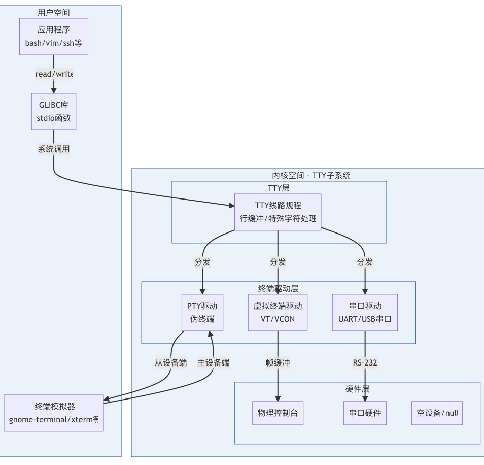
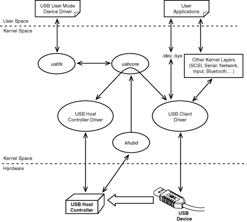
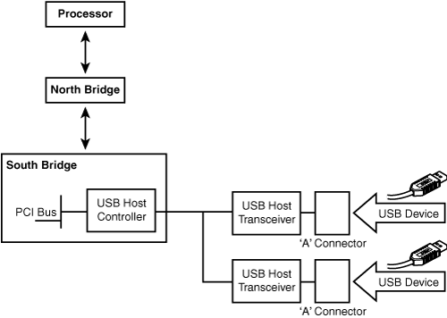

## **总览架构**

```
┌─────────────────────────────────────────────────────────────┐
│  1. Python 层（用户态）                                       │
│     ├─ 1.1 ACT 模型                                          │
│     ├─ 1.2 PySerial / 用户驱动库                             │
│     └─ 1.3 CPython API（os.write）                           │
└───────────────┬──────────────────────────────────────────────┘
                │ 调用：PyOS_Write → _Py_write → write()
                ▼
┌─────────────────────────────────────────────────────────────┐
│  2. C 库（glibc 层，用户态）                                 │
│     └─ glibc write() → 执行 syscall 指令                    │
└───────────────┬──────────────────────────────────────────────┘
                │ CPU 切换到内核态
                ▼
┌─────────────────────────────────────────────────────────────┐
│  3. Linux 内核（开始）                                       │
│                                                             │
│  3.1 系统调用入口层                                          │
│      └─ sys_write → ksys_write                              │
│                                                             │
│  3.2 VFS/FS 写入子系统                                       │
│      └─ vfs_write → new_sync_write → write_iter             │
│                                                             │
│  3.3 TTY 子系统（串口抽象）                                  │
│      ├─ tty_write                                           │
│      ├─ iterate_tty_write                                   │
│      └─ line discipline（n_tty_write） 行规程             │
│                                                             │
│  3.4 ACM 子系统（USB CDC-ACM 驱动）                         │
│      ├─ acm_tty_write                                       │
│      ├─ acm_start_wb                                        │
│      └─ usb_submit_urb                                      │
│                                                             │
│  3.5 USB Core（驱动框架层）                                 │
│      ├─ usb_hcd_submit_urb                                  │
│      └─ 调用 HCD→urb_enqueue()                              │
│                                                             │
│  3.6 Host Controller Driver（xHCI/DWC3）                     │
│      ├─ xhci_urb_enqueue                                    │
│      ├─ xhci_queue_bulk_tx（构造 TRB）                       │
│      ├─ giveback_first_trb                                  │
│      └─ xhci_ring_ep_doorbell → writel(DB_VALUE, addr)      │
│                                                             │
└───────────────┬──────────────────────────────────────────────┘
                │ Doorbell 写寄存器 → HCD 硬件开始 DMA
                ▼
┌─────────────────────────────────────────────────────────────┐
│  4. USB 控制器（硬件）                                       │
│     ├─ DMA 读取 TRB Ring                                     │
│     ├─ DMA 读取数据缓冲区 transfer_buffer                    │
│     └─ 发送 USB Bulk OUT 包                                  │
└───────────────┬──────────────────────────────────────────────┘
                ▼
┌─────────────────────────────────────────────────────────────┐
│  5. MCU / 机器人控制器                                       │
│     ├─ USB Bulk OUT 解包                                     │
│     ├─ 解析动作命令                                          │
│     └─ 控制舵机、电机                                         │
└──────────────────────────────────────────────────────────────┘
```

---

# **1. Python 层（用户态）**

### 1.1 ACT → Feetech飞特舵机库 → PySerial → PyOS(os.write())

```
action → serial.write(bytes)
```

### 1.2 CPython 调用链


| 函数                 | 作用                        |
| ------------------ | ------------------------- |
| `_Py_write()`      | CPython 封装写接口，处理 EINTR/信号 |
| `_Py_write_impl()` | 真正调用 glibc 的 write()      |

---

# **2. glibc 层**

### 调用链

```
glibc write(fd, buf, count)
    ↓
syscall(SYS_write)
```

这边如果要看具体系统调用具体要**先编译在反汇编**，而且X86的ARM还不一样，我还没研究明白。

如果是ARM的话，**从EL0到EL1**需要切换特权级，就是在这边实现的。所以下面也就进入内核态了。

所以这边的作用是：

* 构造**系统调用**参数
* 执行 syscall 汇编指令
* 切换到内核态

---

# **3. Linux 内核层**

## **3.1 FS系统调用入口**

### 调用链

```css
sys_write()         // 系统调用入口
    ↓
ksys_write()        // write() 系统调用的内核实现
```

### ksys_write()作用
* 根据 fd **找到 struct file（文件对象）**
* 设置正确的文件偏移（pos/ppos）
* 调用 vfs_write() 完成真正写入


---

## **3.2 FS/VFS 写子系统**

### 调用链

```(
vfs_write()     // VFS(虚拟文件系统)层的通用写接口
    ↓
new_sync_write()    //同步写入包装层，目的是同步接口，解决write的同步性
    ↓
file->f_op->write_iter()
```

### vfs_write()作用

* 权限与可写性验证
* 用户空间指针有效性检查
* 文件边界与追加模式处理
* 写事务开始与结束（文件系统可能使用）
* 分发到具体文件系统/设备的 write/write_iter 实现


### new_sync_write()作用

同步写入包装层，目的是**同步接口，解决write的同步性**。

所有常规文件、socket、pipe、设备等写入最终都会走到new_sync_write。

调用文件的 write_iter 回调`file->f_op->write_iter()`


**write_iter** 是文件系统 / 驱动在 file_operations 中提供的回调函数指针，在fs.h中定义，各种文件类型自己实现。


| 文件类型                | write_iter 实现在哪里？                                    |
| ------------------- | ---------------------------------------------------- |
| **普通文件（ext4）**      | fs/ext4/file.c → `ext4_file_write_iter()`            |
| **XFS 文件系统**        | fs/xfs/xfs_file.c → `xfs_file_write_iter()`          |
| **Btrfs 文件系统**      | fs/btrfs/file.c → `btrfs_file_write_iter()`          |
| **管道 pipe**         | pipe 走的是 `pipe_write()`（不使用 write_iter）              |
| **socket（TCP/UDP）** | net/socket.c → `sock_write_iter()`                   |
| **字符设备（设备驱动）**      | 驱动自己实现其 write()，通常不使用 write_iter                     |
| **终端 tty**          | drivers/tty/tty_io.c → `tty_write()` |


---

## **3.3 drivers/tty 子系统**

在 Linux 或 UNIX 中，TTY（Teletypewriter）是一个抽象设备。有时它指的是一个物理输入设备，例如串口，有时它指的是一个允许用户和系统交互的虚拟 TTY 设备，例如图形终端。

TTY 是 Linux 内核中对“文本交互式设备”的统一抽象层，用于处理输入输出、行编辑、控制字符、信号、会话与终端行为。

在 Linux 中：`/dev/ttyS0, /dev/ttyUSB0, /dev/ttyAMA0, /dev/ttyACM0`
都属于 TTY（Teletypewriter） 框架下的串口驱动（serial driver）。


这里就是要写到串口硬件
### 调用链

```css
tty_write() // 啥也没干直接调用file_tty_write
    ↓
file_tty_write()    // 检查 TTY 结构体是否损坏或非法,可写性检查,获取行规程对象,调用iterate_tty_write
    ↓
iterate_tty_write() // 将 write() 的数据拆成合理块大小，避免 DOS 式长数据写入
                    // 是对低层驱动的一种保护（降低锁竞争、避免巨量拷贝）
    ↓
ld->ops->write(tty, file, tty->write_buf, size);   
       （默认是 n_tty_write）
    ↓
n_tty_write()       //是Line discipline层，n_tty_write在drivers/tty/n_tty.c

```

### 作用

* **分块写**，提高驱动效率，满足硬件要求，默认 chunk = 2KB（NTTY 所能稳定处理的大小）
* **行规程**（**Line Discipline，LDISC**） 处理（如果开启 OPOST）
* 最终调用低层串口（比如ACM/UART......）驱动的 write

行规程是 Linux TTY 子系统中独有的的一个“协议处理层”，位于**用户进程**与**底层串口驱动**之间，用来处理人类交互式终端的输入输出行为。

行规程让 TTY 具备这些传统终端行为，负责解释用户输入、处理终端行为并管理缓冲区。

| 功能                   | 描述                          |
| -------------------- | --------------------------- |
| **回显 echo**          | 你输入一个字符，需要回显到屏幕             |
| **Ctrl-C 发送 SIGINT** | 解释控制字符，不是普通字节               |
| **Ctrl-Z 暂停任务**      | 解释并发信号                      |
| **规范模式（canonical）**  | 只有按 Enter 才把一行送出            |
| **行编辑功能**            | Backspace 删除，Ctrl-U 删除整行    |
| **处理 NL/CR**         | '\r' / '\n' 的转换规则           |
| **输入缓冲管理**           | input buffer, echo buffer 等 |


---

## **3.4 ACM 子系统（CDC-ACM 驱动）drivers/usb/class/cdc-acm**

CDC-ACM层：
* 构建 TTY 设备：/dev/ttyACM0
* 实现 TTY 的写接口（最核心）
* 自动电源管理 / autosuspend
* 管理 USB Bulk 传输（IN/OUT）


### 调用链

```css
acm_tty_write() // 实现 TTY 的写接口（最核心）
    ↓
acm_start_wb()  // 提交写 URB 到 USB 栈。这一步会让 USB 控制器（如 xHCI）开始 DMA 传输
    ↓
usb_submit_urb()
```

### 作用

* 分配 acm_wb 缓冲区
* 准备 **URB** （USB Request Block）,一次 USB 发送动作完全被描述为一份 URB。
* 提交到 USB Core

URB 是 USB Core 能够管理**并发和队列**的基础

```c
struct urb {
    struct usb_device *dev;         // 目标 USB 设备
    unsigned int pipe;              // 管道 + 方向 + 端点号
    void *transfer_buffer;          // 数据 buffer（Out: 数据要发出去）
    dma_addr_t transfer_dma;        // DMA 地址
    int transfer_buffer_length;     // 要发送的字节数
    int actual_length;              // 实际发送/接收的字节数（由硬件填写）
    unsigned int transfer_flags;    // 零包？短包？是否使用 DMA 映射？
    void (*complete)(struct urb *); // 完成回调函数
};
```

---

## **3.5 USB Core 子系统**

### 调用链

```
usb_submit_urb()
    ↓
usb_hcd_submit_urb()
    ↓
hcd->driver->urb_enqueue(hcd, urb, mem_flags)        ← 这里进入具体 HCD（如 xHCI）
unmap_urb_for_dma(hcd, urb)
```

### usb_submit_urb 做的事
1. 各种合法性检查（设备/endpoint/flags/packet 长度等）
2. 规范化参数（方向、interval、transfer_flags）
3. 初始化 urb 状态字段
4. 处理 Isochronous 特殊逻辑
5. 处理 SG 逻辑
6. 调用 usb_hcd_submit_urb（底层）

### usb_hcd_submit_urb()作用

* 校验 URB（USB Request Block）,一次 USB 发送动作完全被描述为一份 URB。
* 执行 **DMA 映射**（map_urb_for_dma）
* 调用 HCD 驱动的 urb_enqueue（如 DWC2/**XHCI**/EHCI）

---

## **3.6 Host Controller Driver（如 xHCI / DWC3）**

**xHCI**（**eXtensible Host Controller Interface**）是 USB 3.x/USB 2.0/USB 1.1 的统一主机控制器规范，是现代 Linux（包括树莓派、PC）使用的 USB 控制器硬件抽象层。

内核中负责处理 USB 传输（**URB → TRB → DMA**）的就是 xHCI 驱动

### 调用链（核心）

linux/drivers/usb/host/xhci.c

```css
xhci_urb_enqueue() // 功能：将一个 URB 放入 xHCI（USB3 控制器）的传输队列。根据端点类型选择不同的 queue_xxx_tx() 函数，并为本次 URB 分配对应的传输描述（TD，多个 TRB）。
                    //根据端点类型选择 TX 函数
这里正式进入 xHCI 的 TRB 构造逻辑：
Control → xhci_queue_ctrl_tx()			控制传输
Bulk   → xhci_queue_bulk_tx()			批量传输，写字符控制肯定是走的这个
Intr   → xhci_queue_intr_tx()			中断传输
Isoc   → xhci_queue_isoc_tx_prepare()	等时传输
    ↓
    ↓   下面的在 linux/drivers/usb/host/xhci-ring.c
xhci_queue_bulk_tx()    //为一个 Bulk URB 构造 xHCI 所需的一系列 NORMAL TRB，把它们排入对应的 Transfer Ring，并在最后交给硬件。这是 USB3 Bulk 传输（比如写串口数据）的核心数据路径。
    ↓
queue_trb()             // queue_trb() 只是“写 DMA 描述符”。
    ↓
giveback_first_trb()    // 也是在xhci_queue_bulk_tx被调用的，在queue_trb结束之后
    ↓
xhci_ring_ep_doorbell()
    ↓
writel(DB_VALUE, db_addr)   ← 启动硬件 DMA
```

### xhci_queue_bulk_tx 作用

* 找到该 URB 对应的 Transfer Ring，并决定需要多少个 TRB
* 将整个缓冲区切分为若干 TRB 并入队列
* 调用 queue_trb() 把 TRB 写入 ring

**TRB（Transfer** Request Block）是 xHCI **硬件 DMA 引擎**能识别的“硬件级指令单元
ACM 驱动会整合数据或按需要把 chunk **拼接**发送。
TRB 是固定大小（**16 字节**）的 DMA 描述符，是 xHCI 控制器理解的最小单位。
TRB 有严格的**64KB 边界限制**，一个 TRB 描述的 buffer 不允许跨越 64KB 物理地址边界。

### queue_trb 作用

把一个 TRB 硬件指令写入 xHCI 的 DMA Ring，并保证硬件在读取前所有字段已经按正确顺序写好。
写四块`cpu_to_le32`4 × 32-bit，加起来正好16字节，

1. 先写 field0/1/2
2. 然后 memory barrier
3. 最后写 field3

```css
TRB (16 bytes total)
+-----------------------+
| field[0] | 4 bytes    |  ← buffer addr low
+-----------------------+
| field[1] | 4 bytes    |  ← buffer addr high
+-----------------------+
| field[2] | 4 bytes    |  ← length + TD size
+-----------------------+
| field[3] | 4 bytes    |  ← control bits (TYPE/CYCLE/CHAIN/IOC)
+-----------------------+
```

### giveback_first_trb 作用

* wmb() 保证所有 TRB 字段已经写入内存（DMA 区域）
* 设置 TRB 的 CYCLE bit（C=1 表示 TRB 有效）
* 调用 xhci_ring_ep_doorbell(xhci, slot_id, ep_index, stream_id)

### xhci_ring_ep_doorbell 作用

先写完TRB ring，再写 doorbell 寄存器，触发 xHCI 控制器开始读取 TRB ring。

- 真正写 doorbell MMIO 寄存器，触发 xHCI 控制器开始读取 TRB ring。
- 加入读写屏障，确保在非一致性系统上（例如 RPi 4/5 的 PCIe）DMA 和寄存器写入顺序正确。

```c
trace_xhci_ring_ep_doorbell(slot_id, DB_VALUE(ep_index, stream_id));
readl(db_addr);
writel(DB_VALUE(ep_index, stream_id), db_addr);		// 这是 write() 写串口数据时，USB3 控制器真正的Start DMA Transfer，向内存映射的寄存器写一个 32-bit 值
readl(db_addr); // 再读一次确保写入完成（flush）
```

writel() 写 doorbell 寄存器，触发 xHCI 控制器开始读取 TRB ring。

后面CPU执行一道写指令，硬件控制器自动完成，写完之后在回到CPU，CPU再执行下一条指令，这样CPU和硬件控制器就同步了。

Python 层在 os.write() 处会阻塞（挂起），直到数据被提交给硬件（HCD），直到内核报告数据已经被成功地写入目标文件描述符为止。

serial.write() 成功返回时，它保证了数据已进入内核的传输流程，但数据包可能仍在前往舵机 MCU 的路上。

---

# **4. USB 控制器（硬件：DWC3/xHCI）**

### 行为

* DMA 读取 TRB
* DMA 获取数据缓冲区
* 发送 USB 包
* 产生 Event TRB 返回给 CPU



USB Client Driver（USB 设备类驱动），也称 USB Function Driver，即和**设备功能**相关的驱动。包括：
| 设备             | Linux 驱动    |
| -------------- | ----------- |
| USB CDC-ACM 串口 | cdc_acm.ko  |
| USB 储存         | usb-storage |
| USB 摄像头        | uvcvideo    |
| 蓝牙 dongle      | btusb       |
| 键盘鼠标           | usbhid      |

USB Host Controller Driver（HCD），是**软件对硬件的封装**，对应不同控制器：
| 控制器  | 驱动       |
| ---- | -------- |
| EHCI | ehci-hcd |
| OHCI | ohci-hcd |
| xHCI | xhci-hcd |
| DWC2 | dwc2     |
| DWC3 | dwc3     |

**khubd**（USB Hub 管理**线程**）内核线程，用于：
hotplug 事件
USB 插拔检测
重置端口
枚举设备
分配地址




CPU-> 北桥->南桥（PCI/USB Host Controller）-> USB 设备
---

# **5. MCU 设备侧**

### 行为

* USB Bulk OUT 解包
* 解析舵机数据协议
* 执行动作
