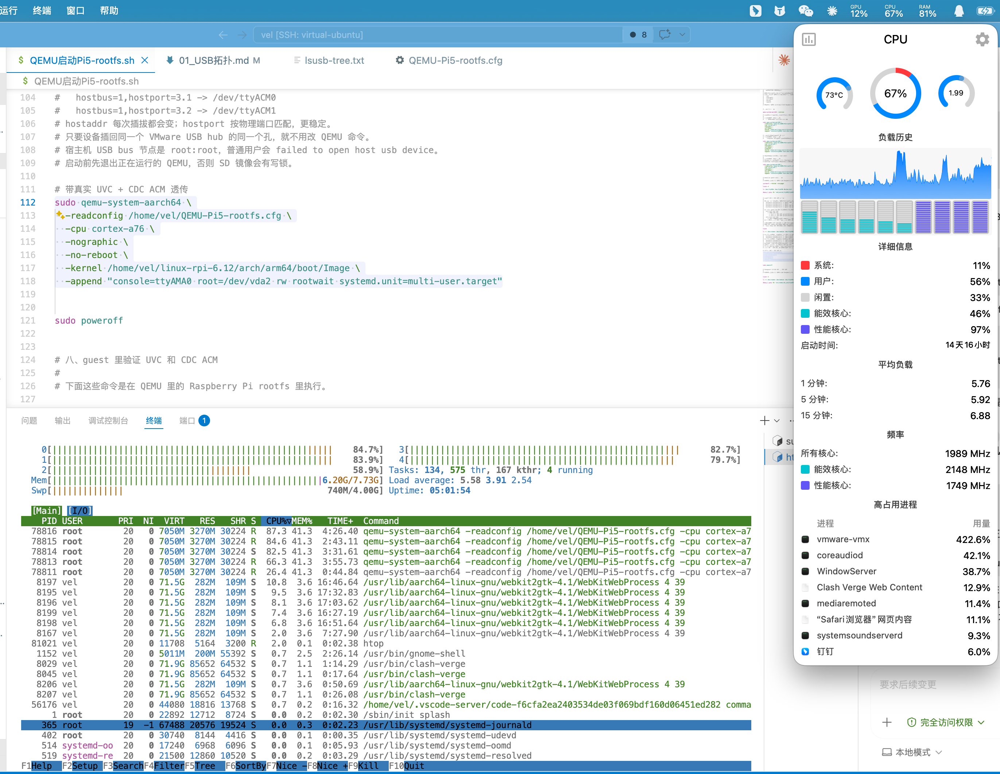

# QEMU 模拟结果

## 0. 结论

QEMU 模拟链路基本没问题，可以继续作为后续新 kernel 和 USB 外设验证的实验基座。

当前 QEMU 方案已经验证：
  - UVC 摄像头能枚举，能被 uvcvideo 绑定，能被 OpenCV / v4l2 读帧。
  - CDC ACM 串口板能枚举，能生成 /dev/ttyACM0 和 /dev/ttyACM1。
  - LeRobot 可以连接 SO101 follower / leader。
  - replay 可以验证 ACM / 机械臂链路。
  - 离线 record 在低 fps 下能进入稳定采集循环，说明 camera + ACM + 数据写入链路不是空跑。

需要单独说明的是：
  - 当前 QEMU 不是完整 Raspberry Pi 5 / BCM2712 / RP1 / DWC3 硬件模型。
  - guest 内实时 policy 推理和长时间高 fps 采集不是本次实验的成功标准。
  - record 里的 timeout 更像是实时性和调度压力问题，不是“QEMU USB 模拟不可用”。


## 1. 真机目标链路

真机目标来自：

```text
QEMU要模拟的硬件/01_USB拓扑.md
树莓派5真机文件快照/2026-05-18/hardware/lsusb-tree.txt
```

真 Raspberry Pi 5 上，LeRobot 相关 USB 链路是：

```text
BCM2712
  -> AXI
  -> PCIe pcie@1000120000
  -> RP1
  -> RP1 DWC3 USB host
  -> Linux xhci-hcd root hub
  -> USB hub
  -> UVC camera / CDC ACM serial / HID keyboard
```

真机 `lsusb -t` 里能看到两路 UVC 摄像头和两路 CDC ACM 串口板：

```text
/:  Bus 01.Port 1: Dev 1, Class=root_hub, Driver=xhci-hcd/2p, 480M
    |__ Port 1: Dev 2, If 0, Class=Hub, Driver=hub/4p, 480M
        |__ Port 1: Dev 3, If 0, Class=Video, Driver=uvcvideo, 480M
        |__ Port 1: Dev 3, If 1, Class=Video, Driver=uvcvideo, 480M
        |__ Port 2: Dev 4, If 1, Class=Video, Driver=uvcvideo, 480M
        |__ Port 2: Dev 4, If 0, Class=Video, Driver=uvcvideo, 480M
        |__ Port 3: Dev 5, If 0, Class=Communications, Driver=cdc_acm, 12M
        |__ Port 3: Dev 5, If 1, Class=CDC Data, Driver=cdc_acm, 12M
        |__ Port 4: Dev 6, If 0, Class=Communications, Driver=cdc_acm, 12M
        |__ Port 4: Dev 6, If 1, Class=CDC Data, Driver=cdc_acm, 12M
```

这里要注意两层区别：

```text
设备树层：
  BCM2712 / PCIe / RP1 / DWC3 USB host 是静态板级硬件。

USB 枚举层：
  UVC camera / CDC ACM serial / HID keyboard 是 USB host 工作后运行时枚举出来的外设。
```

## 2. 当前 QEMU 环境

当前实验链路是：

```text
Mac / VMware Fusion
  -> Ubuntu 24 VM
  -> qemu-system-aarch64
  -> QEMU virt machine  # QEMU 提供的通用 ARM64 虚拟开发板，不是 Raspberry Pi 5 板卡模型。
  -> Raspberry Pi rootfs
  -> LeRobot / Linux USB / V4L2 / CDC ACM
```


它大致提供的是一套“容易让 Linux 启动”的标准虚拟硬件：

```text
通用 ARM CPU
通用中断控制器 / timer
PL011 串口
virtio block / virtio net
可挂载的 PCI / USB 控制器
QEMU 自动生成的 virt 设备树
```

它不会提供真 Pi 5 的这些板级硬件：

```text
BCM2712 machine model
RP1 PCIe endpoint
RP1 DWC3 USB host
Pi 5 firmware / bootloader 链路
bcm2712-rpi-5-b.dtb 里的真实硬件拓扑
```

因此当前实验里的 `virt machine` 是第一阶段替代环境：

```text
它能验证 Linux 通用驱动和 LeRobot 外设 I/O；
但不能代表新 kernel 已经完成 Raspberry Pi 5 主板适配。
```

启动脚本入口是：

```text
QEMU启动Pi5-rootfs.sh
```

主要 QEMU 配置是：

```text
QEMU-Pi5-rootfs.cfg
```

当前 QEMU 不是完整 Pi 5 machine。它使用的是：

```text
machine = virt
CPU     = cortex-a76
block   = virtio-blk-device
net     = virtio-net-device
USB     = qemu-xhci + usb-host passthrough
```

也就是说，本阶段没有模拟这些 Pi 5 专属硬件：

```text
BCM2712 machine model
RP1 PCIe endpoint model
RP1 内部 DWC3 USB host
Pi firmware / bootloader 完整启动链
```

本阶段做的是一个工程替代：

```text
用 QEMU virt 把 ARM64 kernel 和 rootfs 跑起来；
用 qemu-xhci 提供 USB host；
用 usb-host 把真实 UVC / CDC ACM 设备透传进 guest；
观察 Linux 和 LeRobot 能不能正常使用这些外设。
```

## 3. QEMU USB 配置

当前 QEMU 配置里有两个 `qemu-xhci` 控制器：

```ini
[device "xhci"]
  driver = "qemu-xhci"
  p2 = "8"
  p3 = "4"

[device "xhci_cam1"]
  driver = "qemu-xhci"
  p2 = "2"
  p3 = "1"
```

第一路 UVC 挂在第一个 xHCI：

```ini
[device "uvc-camera-0"]
  driver = "usb-host"
  hostbus = "1"
  hostport = "4.1"
  isobufs = "32"
  isobsize = "64"
  bus = "xhci.0"
  port = "6"
```

第二路 UVC 挂在第二个 xHCI：

```ini
[device "uvc-camera-1"]
  driver = "usb-host"
  hostbus = "1"
  hostport = "4.2"
  isobufs = "32"
  isobsize = "64"
  bus = "xhci_cam1.0"
  port = "1"
```

两路 CDC ACM 串口板挂在 QEMU hub 下游：

```ini
[device "cdc-acm-0"]
  driver = "usb-host"
  hostbus = "1"
  hostport = "3.1"
  bus = "xhci.0"
  port = "2.3"

[device "cdc-acm-1"]
  driver = "usb-host"
  hostbus = "1"
  hostport = "3.2"
  bus = "xhci.0"
  port = "2.4"
```

这里有三个重要差异要记录：

```text
1. 真机 USB host 是 RP1 DWC3，Linux 里表现成 xhci-hcd。
   当前 QEMU 直接使用 qemu-xhci，不经过 RP1/DWC3。

2. QEMU 自带 usb-hub 是 full-speed hub。
   UVC 摄像头是 480M high-speed，不能挂到这个 hub 下游，
   否则会遇到 speed mismatch。
   所以当前 UVC 直接挂到 xHCI 高速端口。

3. isobufs / isobsize 是 QEMU usb-host 的等时传输缓冲参数。
   真实 Pi 5 上没有这两个参数。
```

`isobufs = "32"` 和 `isobsize = "64"` 的作用是给 UVC 等时传输多留一些 QEMU 缓冲。之前双 UVC 在嵌套环境里容易出现 `select() timeout`，提高缓冲后，双摄 v4l2 压测稳定性明显好一些。

## 4. 实验流水

### 4.1 第一阶段：确认 VMware Fusion 必须做真实 USB 直通

一开始如果使用 VMware 的 webcam 虚拟功能，guest 里看到的不是原始 UVC 摄像头，而是 VMware 包装过的虚拟 webcam。这样会影响 UVC descriptor、格式、帧率和 OpenCV/V4L2 行为。

后来改为：

```text
在 VMware Fusion 里把摄像头作为 USB 设备直通给 Ubuntu VM，
而不是使用 VMware 的 webcam 虚拟功能。
```

改完后，Ubuntu VM 里能看到真实摄像头、USB hub 和 CDC ACM 设备。这个阶段的意义是：

```text
QEMU 的 usb-host 透传必须拿到真实 USB 设备；
否则后面 guest 里的 UVC 行为不代表真实摄像头。
```

### 4.2 第二阶段：QEMU guest 内 USB 枚举

QEMU 启动后，guest 里可以看到两路 UVC 和两路 CDC ACM。

一个阶段性的 `lsusb -t` 结果类似：

```text
/:  Bus 001.Port 001: Dev 001, Class=root_hub, Driver=xhci_hcd/4p, 480M
    |__ Port 001: Dev 010, If 0, Class=Video, Driver=uvcvideo, 480M
    |__ Port 001: Dev 010, If 1, Class=Video, Driver=uvcvideo, 480M
    |__ Port 003: Dev 004, If 0, Class=Hub, Driver=hub/7p, 12M
        |__ Port 001: Dev 025, If 0, Class=Communications, Driver=cdc_acm, 12M
        |__ Port 001: Dev 025, If 1, Class=CDC Data, Driver=cdc_acm, 12M
        |__ Port 002: Dev 026, If 0, Class=Communications, Driver=cdc_acm, 12M
        |__ Port 002: Dev 026, If 1, Class=CDC Data, Driver=cdc_acm, 12M
    |__ Port 004: Dev 005, If 0, Class=Hub, Driver=hub/7p, 480M
        |__ Port 001: Dev 024, If 0, Class=Video, Driver=uvcvideo, 480M
        |__ Port 001: Dev 024, If 1, Class=Video, Driver=uvcvideo, 480M
        |__ Port 002: Dev 022, If 0, Class=Video, Driver=uvcvideo, 480M
        |__ Port 002: Dev 022, If 1, Class=Video, Driver=uvcvideo, 480M
```

最终进入 QEMU guest 后，LeRobot 使用的关键设备是：

```text
/dev/video0
/dev/video2
/dev/ttyACM0
/dev/ttyACM1
```

这说明 Linux USB 栈已经完成了这些绑定：

```text
UVC camera -> uvcvideo -> /dev/video*
CDC ACM    -> cdc_acm  -> /dev/ttyACM*
```

### 4.3 第三阶段：确认摄像头格式和 LeRobot camera 枚举

在 guest 里执行：

```bash
python -m lerobot.find_cameras
```

能检测到两路 OpenCV camera：

```text
--- Detected Cameras ---
Camera #0:
  Name: OpenCV Camera @ /dev/video0
  Type: OpenCV
  Id: /dev/video0
  Backend api: V4L2
  Default stream profile:
    Width: 640
    Height: 480
    Fps: 30.0

Camera #1:
  Name: OpenCV Camera @ /dev/video2
  Type: OpenCV
  Id: /dev/video2
  Backend api: V4L2
  Default stream profile:
    Width: 640
    Height: 480
    Fps: 30.0
```

摄像头支持 MJPG。单路 v4l2 测试中，`640x480@30` 可以跑到 20 到 28fps 左右，最终接近 30fps：

```bash
v4l2-ctl -d /dev/video0 \
  --set-fmt-video=width=640,height=480,pixelformat=MJPG \
  --set-parm=30 \
  --stream-mmap=3 \
  --stream-count=120 \
  --stream-poll
```

结果片段：

```text
Frame rate set to 30.000 fps
<<<<<<<<<<<<<<<<<<<<<< 20.77 fps
<<<<<<<<<<<<<<<<<<<<<<<<<<<<<< 25.24 fps
<<<<<<<<<<<<<<<<<<<<<<<<<<<<<< 26.72 fps
<<<<<<<<<<<<<<<<<<<<<<<<<<<<< 27.45 fps
```

这一步证明：

```text
摄像头不是只能枚举，实际 V4L2 读帧也能工作。
```

### 4.4 第四阶段：双摄压测

为了确认两路 UVC 同时工作，做了双摄并行压测：

```bash
v4l2-ctl -d /dev/video0 \
  --set-fmt-video=width=640,height=360,pixelformat=MJPG \
  --set-parm=30 \
  --stream-mmap=3 \
  --stream-count=300 \
  --stream-poll >/tmp/cam0.log 2>&1 &

v4l2-ctl -d /dev/video2 \
  --set-fmt-video=width=640,height=360,pixelformat=MJPG \
  --set-parm=30 \
  --stream-mmap=3 \
  --stream-count=300 \
  --stream-poll >/tmp/cam2.log 2>&1 &

wait
```

尾部结果：

```text
<<<<<<<<<<<<<<<<<<<<<< 20.70 fps
<<<<<<<<<<<<<<<<<<<<<<<<<<<<<< 25.12 fps
<<<<<<<<<<<<<<<<<<<<<<<<<<<<< 26.57 fps
<<<<<<<<<<<<<<<<<<<<<<<<<<<<<< 27.35 fps
<<<<<<<<<<<<<<<<<<<<<<<<<<<< 27.60 fps
<<<<<<<<<<<<<<<<<<<<<<<<<<<<<< 27.93 fps
<<<<<<<<<<<<<<<<<<<<<<<<<<<<<< 28.15 fps
<<<<<<<<<<<<<<<<<<<<<<<<<<<<< 28.31 fps
<<<<<<<<<<<<<<<<<<<<<<<<<<<<< 29.33 fps
<<<<<<<<<<<<<<<<<<<<<<<<<<<<< 29.33 fps
```

两路摄像头都能完成 300 帧压测，尾部接近 30fps。这个结果很关键：

```text
纯 UVC 摄像头链路在 QEMU guest 里是可用的。
```

所以后面 LeRobot `record` 里的 timeout 不能简单判断成“摄像头透传不可用”。

### 4.5 第五阶段：ACM / 机械臂 replay 验证

为了先排除 CDC ACM 和机械臂链路问题，使用本地缓存数据集做离线 replay。

过程中遇到过两个和 QEMU 目标无关的问题：

```text
1. Hugging Face 联网 SSL / 代理问题。
2. 本地数据集是 LeRobot v2.1，需要转换到 v3.0。
```

数据集转换后：

```text
current_version = v2.1
converted_version = v3.0
```

之后可以用离线方式 replay：

```bash
HF_HUB_OFFLINE=1 HF_DATASETS_OFFLINE=1 python -m lerobot.replay \
  --robot.type=so101_follower \
  --robot.port=/dev/ttyACM0 \
  --robot.id=R12254705 \
  --dataset.repo_id=Vel044/so101_test \
  --dataset.root=/home/vel/.cache/huggingface/lerobot/Vel044/so101_test \
  --dataset.episode=0
```

这个阶段的意义是：

```text
/dev/ttyACM0 不是只生成了设备节点；
LeRobot 也能通过它和 SO101 follower 通信。
```

也就是说，CDC ACM / 机械臂链路可以作为后续 kernel/QEMU 验证对象继续使用。

### 4.6 第六阶段：LeRobot record / policy 推理实验

之后尝试运行完整 `lerobot.record`，配置为：

```text
两路 OpenCV camera:
  /dev/video0, 640x360, fps=30
  /dev/video2, 640x360, fps=30

dataset/control fps:
  15

SO101 follower:
  /dev/ttyACM0

SO101 leader:
  /dev/ttyACM1

policy:
  /home/vel/so101-bottle/last/pretrained_model
```

运行时相机、follower、leader 都能连接：

```text
OpenCVCamera(0) connected.
OpenCVCamera(2) connected.
R12254705 SO101Follower connected.
R07254705 SO101Leader connected.
```

这说明：

```text
LeRobot 层能打开两路 camera；
也能打开 follower / leader 的串口；
外设连接阶段不是失败点。
```

但是完整 record 阶段出现严重性能问题：

```text
[Record Loop] timestamp=71.9s | obs=912.3ms | inference=70929.0ms | action=29.5ms | wait=0.1ms | total=71871.2ms |fps=0.0
```

另一次更明显：

```text
[Record Loop] timestamp=144.3s | obs=980.6ms | inference=143190.6ms | action=172.2ms | wait=0.4ms | total=144344.7ms |fps=0.0
```

目标是 `15fps`，每轮预算只有：

```text
1 / 15 = 66.7ms
```

但实际一次 policy 推理用了 70 秒到 143 秒。这个量级已经远远超过实时控制要求。

随后出现：

```text
TimeoutError: Timed out waiting for frame from camera OpenCVCamera(0) after 3000 ms.
Read thread alive: True.
```

以及 OpenCV/V4L2：

```text
VIDEOIO(V4L2:/dev/video0): select() timeout
OpenCVCamera(0) read failed (status=False)
```

这个 timeout 的含义要结合代码理解：

```text
LeRobot camera connected 只表示 VideoCapture 打开成功、参数设置成功。
record 时 camera.async_read() 会启动后台线程持续 read()。
后台线程没有按 dataset.fps=15 节流，而是持续从 V4L2 拉帧。
当 QEMU guest 里 policy 推理把 CPU/调度拖垮后，后台相机线程拿不到稳定新帧，
下一轮 async_read(timeout_ms=3000) 就会超时。
```

所以这不是“摄像头不能用”的第一现场。第一现场是：

```text
inference=70929.0ms
inference=143190.6ms
fps=0.0
```

`record` 最终只写出很少的 frame，例如：

```text
Generating train split: 1 examples
frame I:1
```

这也符合上面的判断：

```text
外设能连，第一轮可以产生数据；
但 guest 内 policy 推理太慢，实时循环无法持续。
```

CPU 打满现象见：

```text
模拟的时候CPU是吃满了.png
```



### 4.7 第七阶段：完全离线 record 采集实验

为了确认 `record` 不依赖 Hugging Face 联网，也为了排除 policy 大模型推理的影响，后面改成完全离线采集：

```text
HF_HUB_OFFLINE=1
HF_DATASETS_OFFLINE=1
TRANSFORMERS_OFFLINE=1
dataset.push_to_hub=false
dataset.root=/home/vel/lerobot_data/...
```

这时不再加载 policy，动作来自 SO101 leader，图像来自两路 OpenCV camera，数据写到本地 dataset。

一开始如果不显式设置 `dataset.fps`，默认按 30fps 采集，QEMU guest 压力太大，循环只能跑到几 fps：

```text
[Record Loop] timestamp=1.2s | obs=1079.2ms | inference=21.0ms | action=60.0ms | wait=0.1ms | total=1163.9ms |fps=0.9
[Record Loop] timestamp=2.3s | obs=83.0ms   | inference=20.8ms | action=10.3ms | wait=0.1ms | total=114.7ms  |fps=8.7
[Record Loop] timestamp=4.6s | obs=32.9ms   | inference=30.0ms | action=10.8ms | wait=0.1ms | total=74.1ms   |fps=13.5
```

改成 `dataset.fps=5` 后，前几秒循环能稳定跑到目标 5fps：

```text
[Record Loop] timestamp=1.2s | obs=52.2ms | inference=12.7ms | action=22.1ms | wait=114.7ms | total=202.3ms |fps=4.9
[Record Loop] timestamp=2.2s | obs=30.7ms | inference=14.0ms | action=25.8ms | wait=130.0ms | total=201.0ms |fps=5.0
[Record Loop] timestamp=3.2s | obs=29.8ms | inference=34.4ms | action=14.1ms | wait=124.9ms | total=203.5ms |fps=4.9
[Record Loop] timestamp=4.3s | obs=42.9ms | inference=36.6ms | action=6.0ms  | wait=115.9ms | total=202.0ms |fps=4.9
[Record Loop] timestamp=5.3s | obs=26.8ms | inference=34.6ms | action=11.8ms | wait=135.3ms | total=209.0ms |fps=4.8
```

这个结果很重要：

```text
QEMU guest 里 camera + ACM + LeRobot record 主循环不是完全跑不起来。
在 5fps 低速采集下，前几秒已经能按目标周期运行。
```

后续又出现过 timeout：

```text
TimeoutError: Timed out waiting for frame from camera OpenCVCamera(0) after 3000 ms.
Read thread alive: True.
```

以及另一次同步写图测试里，动作阶段出现 1 到 3 秒级抖动：

```text
[Record Loop] timestamp=2.4s | obs=904.5ms | inference=15.2ms | action=1514.2ms | total=2434.3ms |fps=0.4
[Record Loop] timestamp=3.8s | obs=15.4ms  | inference=19.2ms | action=1372.2ms | total=1407.6ms |fps=0.7
[Record Loop] timestamp=7.6s | obs=15.2ms  | inference=19.2ms | action=3705.1ms | total=3739.9ms |fps=0.3
```

这里的判断是：

```text
完全离线 record 已经进一步证明 QEMU 链路是能收发数据的。
失败点不是“QEMU 不能模拟 USB 外设”，而是长时间实时采集时，
camera 后台读线程、CDC ACM 动作读写、PNG 写盘和 QEMU 调度之间仍然会有抖动。
```

因此，低 fps record 的实验反而加强了本次结论：

```text
QEMU 模拟链路本身可以用。
它已经足够验证后续新 kernel 是否具备 USB / UVC / CDC ACM / LeRobot I/O 能力。
只是不能把它当成稳定实时采集或实时 policy 运行环境。
```

## 5. 对几个现象的解释

### 5.1 为什么 connected 后还会 timeout

`OpenCVCamera connected` 只证明：

```text
/dev/videoX 能打开；
width / height / fps / MJPG 能设置；
启动阶段可以读到初始帧。
```

它不保证：

```text
后续 60 秒内双摄 + policy/teleop + 串口 + 写盘可以稳定实时运行。
```

`record` 里 camera 后台线程会持续读帧。guest 内 policy 推理过慢、CDC ACM 动作阶段抖动、同步/异步写图压力叠加时，整个 QEMU 环境调度会被拉长，后台读帧线程就可能出现 V4L2 `select() timeout`。

因此这里的 timeout 是系统实时性失败后的表现，不是摄像头硬件或 UVC 透传天然失败，也不能据此判断 QEMU USB 模拟不可用。

### 5.2 为什么不用 camera fps=15

摄像头实际枚举出来的 profile 主要是 30fps。尝试把 OpenCV camera 设置成 `fps=15` 时，LeRobot 会校验实际 fps：

```text
RuntimeError: OpenCVCamera(0) failed to set fps=15 (actual_fps=30.0).
```

所以最终使用：

```text
camera fps = 30
dataset fps = 15
```

也就是摄像头按它支持的 30fps 打开，LeRobot 数据集/控制循环按 15fps 记录。

### 5.3 `isobufs` / `isobsize` 是什么

这两个参数属于 QEMU `usb-host`：

```text
isobufs  = QEMU 给 USB isochronous transfer 排队的 buffer 数量。
isobsize = 每个 iso buffer 的大小。
```

UVC 摄像头视频流通常使用等时传输。提高这两个值可以让 QEMU 在 host/guest 调度抖动时有更多缓冲余量。

它们不是 Raspberry Pi 5 真实硬件属性。真机上不会出现 `isobufs` / `isobsize` 这种配置。

## 6. 最终结论

### 6.1 已经验证可用的部分

当前 QEMU 环境已经验证：

```text
1. Raspberry Pi rootfs 可以在 QEMU aarch64 virt 上启动。
2. QEMU guest 可以使用通用 xHCI USB host。
3. 真实 UVC 摄像头可以通过 usb-host 透传进 guest。
4. guest 内 uvcvideo 可以绑定摄像头并生成 /dev/video0、/dev/video2。
5. OpenCV / V4L2 可以从两路摄像头读帧。
6. 双摄 MJPG 压测可以接近 30fps。
7. 两路 CDC ACM 串口板可以通过 usb-host 透传进 guest。
8. guest 内 cdc_acm 可以生成 /dev/ttyACM0、/dev/ttyACM1。
9. LeRobot 可以连接 SO101 follower / leader。
10. replay 可以用于验证 ACM / 机械臂通信链路。
11. 完全离线 record 在 5fps 下能进入目标周期附近的采集循环，进一步证明 camera + ACM + 本地数据写入链路可用。
```

所以从“后续写 kernel 前先摸底 QEMU 能不能用”的角度看：

```text
QEMU 模拟链路本身是能用的。
```

### 6.2 不能误判的部分

当前方案不能说明：

```text
1. QEMU 已经完整模拟 Raspberry Pi 5。
2. QEMU 已经模拟 BCM2712 / RP1 / DWC3。
3. QEMU guest 适合实时运行视觉 policy 或长时间高 fps 采集。
4. `lerobot.record` 里的 timeout 证明摄像头不可用。
5. `lerobot.record` 里的 timeout 证明 QEMU USB 模拟不可用。
```

特别是第 4、5 点，本次实验里摄像头单独压测是能跑的，离线 record 也能在 5fps 下进入正常周期。`record` 里的 timeout 主要发生在实时循环被 policy、ACM 动作阶段或写盘压力拖长以后。

### 6.3 对后续新 kernel / QEMU 模拟的意义

本次实验给后续工作提供了一个可用基线：

```text
如果新 kernel 能在同样 QEMU virt 环境里启动，
并具备 virtio、xHCI、uvcvideo、cdc_acm、V4L2、TTY 等能力，
那么就可以继续复用当前这套外设验证方式。
```

后续可以按层验证：

```text
启动层：
  kernel 是否能启动、挂载 rootfs、进入用户态。

USB host 层：
  是否能看到 QEMU xHCI root hub。

UVC 层：
  是否能枚举 /dev/video0、/dev/video2，并通过 v4l2-ctl 读帧。

CDC ACM 层：
  是否能枚举 /dev/ttyACM0、/dev/ttyACM1，并被 LeRobot motors bus 使用。

LeRobot 层：
  find_cameras、replay、record 连接阶段是否正常。
```

因此，这次模拟结果的核心不是“QEMU 可以完整跑实时 LeRobot policy”，而是：

```text
QEMU 当前已经能承载 Pi5 + LeRobot 关键 USB 外设链路的验证。
摄像头和串口板都能连上，也能发数据、收数据。
从“写新 kernel 前验证 QEMU 能不能作为硬件链路实验环境”的角度看，QEMU 模拟基本没问题。
这足够作为后续写新 kernel 和继续模拟硬件链路的实验基座。
```

## 7. 后续路线：Pi5 + RP1 USB 子集

这次实验也说明，后续如果要让新 kernel 更接近真实 Raspberry Pi 5，就不应该长期停留在通用 `virt + qemu-xhci` 这一层。

但也不要一开始就模拟完整 BCM2712 / RP1。完整 Pi 5 硬件面太大：

```text
BCM2712 SoC
GIC / timer / UART / pinctrl / clocks
PCIe controller
RP1 PCIe endpoint
RP1 内部 USB / GPIO / I2C / SPI / PWM / SDIO / Ethernet 等外设
Pi firmware / bootloader / mailbox / power 管理
```

当前 LeRobot 目标真正依赖的是 USB 外设链路。所以更合理的路线是先做：

```text
Pi5 + RP1 USB 子集
```

也就是优先模拟这条链：

```text
BCM2712-ish machine
  -> PCIe
  -> RP1-ish endpoint
  -> RP1 USB host
  -> xHCI/root hub
  -> UVC camera / CDC ACM serial
```

这个路线的意义是：

```text
当前 QEMU 实验已经证明：
  UVC / CDC ACM / LeRobot 用户态这一层能跑。

路线 B 下一步要解决的是：
  怎么让新 kernel 从更接近真 Pi 5 的设备树和板级链路，
  初始化到同样的 USB / UVC / CDC ACM 结果。
```

建议分阶段做：

```text
B1. Pi5-lite machine
    先让 CPU / RAM / UART / timer / interrupt / rootfs 启动。
    目标是新 kernel 能按 Pi5-ish 设备树进入用户态。

B2. BCM2712 PCIe 骨架
    设备树里出现 /axi/pcie@1000120000。
    先满足 kernel 能走到 PCIe 初始化路径，不要求完整模拟真实 PCIe 控制器。

B3. RP1-ish endpoint
    PCIe 后面出现 RP1。
    RP1 先只提供必要 MMIO window / IRQ / 子设备空间。
    不急着做 GPIO、I2C、SPI、PWM 等无关外设。

B4. RP1 USB host 子集
    在 RP1 下暴露 usb@200000 / usb@300000 这类节点。
    后端可以先复用 QEMU xHCI 或类似机制。
    目标是让 guest kernel 最终仍然枚举出 /dev/video* 和 /dev/ttyACM*。
```

这条路线和当前实验是接上的：

```text
当前实验验证的是“USB 外设和 LeRobot 用户态能不能用”。
后续 Pi5 + RP1 USB 子集验证的是“新 kernel 能不能从 Pi5 风格板级链路走到同样的 USB 结果”。
```

所以后续不是推翻当前 QEMU 实验，而是在当前已验证的 UVC / CDC ACM / LeRobot 链路下面，逐步替换更接近真机的板级入口。
