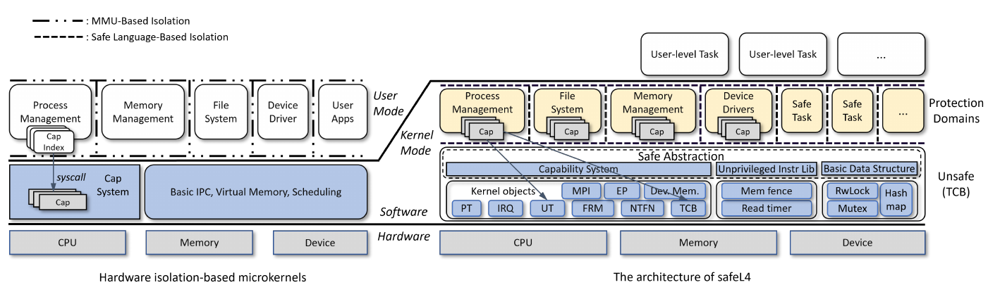
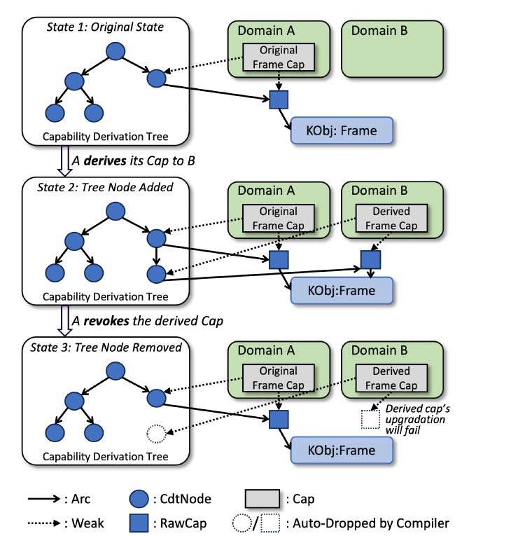
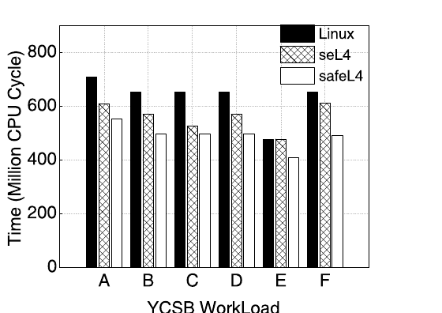

# safeL4：重新思考基于安全语言的单地址空间微内核

> 原文：*safeL4: Rethinking Safe Language-Based Single Address Space Microkernels*（ASPLOS'27 投稿，匿名作者）
> 原始 PDF：`safeL4-Rethinking-Safe-Language-Based-Single-Address-Space-Microkernels.pdf`
> 译注：原文中缩写 **TCB** 有两个不同含义——绝大多数指**可信计算基**（Trusted Computing Base，必须信任的代码集合）；仅在作为内核对象名（等宽字体 `TCB`）出现时指**线程控制块**（Thread Control Block）。译文已在各处分别标注。

## 摘要

微内核提供了高安全性、高可靠性和高灵活性等优良特性，但其对基于硬件的隔离机制的依赖导致了沉重的性能开销，限制了其广泛应用。尽管基于安全语言隔离来构建单地址空间微内核是解决性能问题的一条有前景的途径，这种方法在维持最小化原则（principle of minimality）以及对系统资源实施基于 capability 的细粒度访问控制方面仍面临挑战。我们提出 safeL4——一种基于安全语言构建微内核的方法。它通过对 unsafe 操作提供低层抽象来保证最小化，并基于安全语言的对象 capability 实现了一套 capability 系统，从而对系统资源的所有操作实现细粒度访问控制。我们用 Rust 实现了一个原型系统，评估结果表明 safeL4 提供的原语平均比 seL4 快 1.9 倍。

**CCS 概念：** • 软件及其工程 → 操作系统。

**关键词：** 微内核，安全语言，Capability 系统

## 1 引言

尽管存在性能方面的顾虑，微内核长期以来被认为相比宏内核（monolithic kernel）具有显著优势 [37, 56]，主要体现在安全性、可靠性和灵活性上。首先，微内核遵循最小化原则 [55]，确保*可信计算基*（TCB）尽可能小。其次，微内核利用 capability 系统 [8, 47, 76] 对系统资源实施细粒度访问控制，从而贯彻*最小权限原则*（PoLP）[42, 70]。最小化原则与基于 capability 的访问控制使得内核的形式化验证成为可能 [23]，并催生了世界上第一个经过形式化验证的操作系统内核 seL4 [45, 65, 75]。最后，通过将 OS 服务划分为可独立更新或替换的域（domain），微内核获得了高度的灵活性。本文余下部分将由微内核保护的域称为*保护域*（protection domain）[48]。

微内核由于上述优势，曾被寄望成为所有类型操作系统的基础 [56]。然而自第一代微内核 [1] 以来，它们主要被用于嵌入式和安全关键环境（即基本静态的系统）。相比之下，宏内核仍然是最普及、部署最广泛的内核架构。新兴场景——如智能汽车、智能手机、可信执行环境、容器和机密虚拟机——具有严格的安全与可靠性需求，因此青睐微内核 [17, 60, 61, 77, 87]。这些场景不再局限于嵌入式系统，还涉及运行需要广泛 OS 功能的通用应用。

然而，微内核所使用的基于硬件的隔离在这些场景中带来了显著的性能开销，包括*进程间通信*（IPC）引起的上下文切换、跨地址空间数据传输 [21]，以及 IPC 频率的增加 [17]。尽管已有多种缓解微内核性能问题的措施被提出，但没有一种从根本上解决了问题。例如，某些 OS 设计 [14, 17] 将最关键的服务器和驱动放进内核，这与最小化原则冲突；此外，一些措施在多个服务器间复制内核状态 [17]，引入了额外的状态同步开销。

事实上，还存在另一条技术路线，旨在设计不依赖硬件隔离的微内核以消除性能开销，即使用类型安全的语言。这些语言利用类型系统为组件（如模块、结构体、函数）定义清晰的契约，确保各组件之间只通过定义良好的接口交互，防止未授权访问 [15, 54]。基于安全语言的微内核与应用运行在同一地址空间和同一 CPU 模式，即*单地址空间 OS*（SASOS），但它们仍然遵循内核的通用概念——"操作系统中强制存在、且为所有其他软件所共用的那部分" [55]。这种基于语言的方法显著降低了硬件隔离引入的性能开销：跨域通信简化为函数调用，跨域数据传输通过零拷贝对象所有权转移实现。基于安全语言的微内核的典型代表包括 SPIN [6, 7]、Singularity [25, 40, 41] 和 RedLeaf [66]。还有一些内核虽然没有明确声称是微内核，但在设计中采纳了某些微内核特性，例如最小化可信计算基（TCB）（Asterinas [68]）和故障隔离（Tock [52, 71]、Theseus [10]）。

然而，当前基于安全语言的内核在满足微内核需求方面存在两个主要问题。**第一**，这些内核缺乏对所有系统资源进行细粒度访问控制的 capability 系统。capability 系统是微内核用来限制保护域可用系统资源的主要机制（例如消除环境权限（ambient authority）[64] 和混淆代理问题（confused deputy problem）[33]），从而贯彻 PoLP，并且是实现高可信度形式化验证的前提。因此，现代微内核如 seL4 [36]、L4Re [44] 和鸿蒙微内核 HongMeng [17] 都将 capability 系统作为核心机制。不幸的是，传统微内核的 capability 系统依赖基于硬件的隔离来保证 capability 不可伪造性，这在访问受 capability 保护的资源时引入了显著的性能开销。在 seL4 中访问一个受 capability 保护的内核对象消耗 379 个 CPU 周期（表 1），该开销主要由 CPU 模式切换、capability 容器（CNode）内的 capability 查找、capability 解码（因用户态应用与内核之间关于 capability 元数据的语义鸿沟而必需）以及权限检查组成。

**表 1.** 在 Raspberry Pi 3B+ 开发板上访问 seL4 内核对象的开销剖析（单位：CPU 周期）。

| 模式切换 | Cap 查找 | Cap 解码与权限检查 | 其他† | 总计 |
| -------- | -------- | ------------------ | ----- | ---- |
| 139      | 58       | 66                 | 116   | 379  |

† 其余开销（如 IPC 缓冲区查找、额外 capability 查找、返回路径调度）。

**表 2.** 基于安全语言的内核在最小化原则遵循度与可信计算基（TCB）大小上的比较。

| OS               | 最小化                                         | TCB 大小（LCS）core + alloc | 其他†  |
| ---------------- | ---------------------------------------------- | --------------------------- | ------ |
| SPIN [7]         | ✗（内存管理器、线程管理器）                    | -                           | -      |
| Singularity [41] | ✗（内存管理器、进程管理器、IO 管理器、调度器） | -                           | -      |
| Tock [52, 71]    | ✗（进程管理器、调度器）                        | 1 911                       | 2 903  |
| RedLeaf [66]     | ✗（内存管理器、调度器）                        | 4 357                       | 17 240 |
| Theseus [10]     | ✗（内存管理器、调度器）                        | 8 720                       | 40 459 |
| Asterinas [68]   | ✗（物理内存管理器、调度器）                    | 9 442                       | 11 090 |

† 除 Rust core 与 alloc 之外链接进可信计算基（TCB）的代码，包括内核/框架代码及整个 OS 所需的直接或间接 unsafe 依赖。

**第二**个问题是此类内核的可信计算基（TCB）往往变得庞大，主要由两个因素驱动。首先，除内核代码外，可信计算基还包括链接进内核镜像的工具链库和第三方依赖。其次，这些内核通常要求所有 unsafe 代码封装在内核内部，因为允许保护域中存在 unsafe 操作会破坏安全语言的隔离保证。为量化可信计算基大小，我们使用*链接代码量*（linked code size，LCS）指标 [68]，即统计链接进内核镜像的总代码行数（LoC）。如表 2 所示，我们对若干流行的基于 Rust 的内核的功能性和 LCS 的评估表明，它们没有遵循最小化原则，导致可信计算基相对庞大。虽然 Tock 的 LCS 较小，但那是因为它是面向低功耗微控制器的轻量级 OS。

为解决上述问题，我们提出 safeL4——一个基于 Rust 的单地址空间微内核。safeL4 的核心思想是构建不依赖硬件隔离的 capability，将其作为一等抽象（first-class abstraction），统一地向保护域提供满足微内核最小化原则和细粒度访问控制需求的系统资源抽象。首先，基于 Rust 的对象 capability（即对象引用或指针 [12, 20, 32]），safeL4 构建了一个不需要地址空间隔离来提供保护的 capability 系统。它在*单地址空间*（SAS）内对系统资源实施细粒度访问控制，从而消除了传统 capability 系统跨地址空间造成的性能开销。其次，它采用微内核式方法为硬件资源和通信功能提供低层抽象，只安全封装必不可少的 unsafe 操作，从而缩减可信计算基（TCB）。第三，通过 *capability 派生树*（capability derivation tree）与 Rust 的可见性控制，它解决了 Rust 原生对象 capability 既无法记录 capability 派生关系、又无法被撤销的问题。这为 capability 系统配备了语义足够丰富的接口，以支持内核对系统资源的管理。

safeL4 展示了用安全语言构建微内核的优势。首先，通过降低*域间通信*（IDC）的性能开销，safeL4 得以将 L4 系微内核中唯一与策略相关的组件——调度器 [23]——移出微内核，从而更贴近最小化原则。其次，安全语言提供的对象 capability 允许 capability 直接驻留在保护域内，无需专门的内核对象来容纳它们。这种方法不仅缩减了微内核的可信计算基（TCB），还简化了 capability 管理——后者是设计某些 OS 服务时的一个主要复杂性来源，因为它涉及调用方、被调用方和微内核之间的协调。本文贡献总结如下：

- 我们提出一种基于 Rust 特性为系统资源构建 capability 系统的方法，它避免了基于硬件隔离的 capability 系统的沉重开销，同时满足微内核的最小化原则以及基于 capability 的细粒度访问控制需求。
- 我们解决了 Rust 原生对象 capability 无法满足微内核系统资源管理需求的问题。
- 我们用 Rust 构建了 safeL4 原型并实现了核心 OS 服务。我们移植了 musl libc，使得以 unsafe 语言编写的应用能够在用户态运行。评估结果表明，safeL4 的安全抽象平均达到 seL4 的 1.91 倍性能，其中 IDC 性能提升 7.8 至 22.3 倍。

## 2 背景

### 2.1 seL4 Capability 系统

seL4 的 capability 系统管理对所有内核对象的访问控制。对内核对象的任何调用都必须通过该对象的 capability 进行，capability 封装了对象引用以及一组特定的访问权限，规定了应用被授权执行的操作。通过控制这些 capability 的传播，系统实现对内核资源的访问控制。seL4 内核采用 take-grant 模型 [13, 22] 的一个变体来管理权限经由 capability 的传播。

在 seL4 中，capability 存储在内核里，以防止用户级程序篡改。一个应用所拥有的 capability 集合构成其 capability 地址空间（CSpace）。在该空间内，每个 capability 被分配一个唯一的地址（索引），应用通过它来引用该 capability。

### 2.2 对象 Capability 系统

对象 capability 系统 [63, 79, 80] 是一种安全模型，它将面向对象编程的原则与基于 capability 的访问控制 [53] 相结合，用于在软件环境中管理和限制对资源的访问。在该模型中，对象被视为资源，对象方法充当访问这些资源的接口，而对象引用则充当 capability。以 Rust 为例，引用和智能指针可以扮演这一角色。多种内存安全语言及其子集都支持对象 capability 模型，包括 Java [59, 88]、E [62]、Encore、Pony 和 Rust [38]。

capability 的不可伪造性是防止未授权访问的根本。因此，对象 capability 系统必须保证对象引用不可伪造。这一要求解释了为什么在使用 Rust 时，只有其 safe 子集能够实施对象 capability 模型：unsafe Rust 允许原始指针操作，可以轻易绕过引用的不可伪造性。因此，safeL4 强制要求在其隔离域内执行的所有代码必须完全用 safe Rust 编写。

## 3 相关工作与动机

### 3.1 基于安全语言的内核

用安全语言构建内核以减少硬件隔离开销的研究历史悠久，可分为两个阶段。第一阶段横跨 1990 和 2000 年代，探索使用带垃圾回收的安全语言来构建 OS 保护域 [5–7, 25, 29, 40, 41, 86]。这一阶段的代表性微内核包括基于 Modula-3 语言 [16] 的 SPIN [6, 7]，以及基于 Sing# 的 Singularity [25, 40, 41]。除了提供保护域，SPIN 和 Singularity 还利用安全语言的对象 capability 为系统资源设计不可伪造的令牌，作为资源访问的权限凭证。此外，Singularity 通过强制域间共享的任何内存一次只能属于一个域（单一所有权），为保护域提供故障隔离，防止崩溃的域影响系统其余部分。

与 Singularity 同期，还出现了若干基于 Java 语言的 OS。J-Kernel [86] 利用 Java 的类型安全在域之间建立边界，并为跨域共享的对象设计了可撤销的 capability，确保其他域对已崩溃域的共享对象的任何访问都会触发异常。KaffeOS [5] 在 *Java 虚拟机*（JVM）内实现进程抽象，提供带有 CPU 和内存等资源管理机制的隔离进程。JX [29] 实现了一个管理硬件资源的微内核，以 JVM 作为保护域的单位，将应用和服务运行在不同的域中以实现特权分离。然而，由于这些安全语言依赖垃圾回收，可能引入不可预测的延迟，它们与某些 OS 服务的实时性需求相冲突 [24, 50]。

第二阶段始于 Rust 的出现——一种不依赖垃圾回收、因而支持高性能系统编程的语言。代表性内核包括 Tock [52, 71]、RedLeaf [66]、Theseus [10] 和 Asterinas [67, 68]。Tock [52] 的第一个版本旨在为低端嵌入式应用提供隔离，如今它提供 capability 来限制对特权 API 的访问 [71]。RedLeaf 捕获域间故障以实现故障隔离。Theseus 消除跨域的状态依赖（state spill）[11]。Asterinas 引入 framekernel 架构，将内核开发所需的 unsafe Rust 封装起来，从而最小化内核的可信计算基（TCB）。

### 3.2 现有微内核 Capability 系统的沉重开销

传统微内核 capability 系统依赖硬件隔离来保证 capability 不可伪造性，这给微内核带来了显著的性能开销。首先，capability 操作必须经由系统调用委托给内核执行，从而引入模式切换开销。其次，在微内核的多服务器场景中，如果一次 capability 操作涉及多个保护域，还会带来地址空间切换的开销。为避免这些开销，现有基于安全语言的内核没有采用传统微内核的显式、以 capability 为中心的权限模型。虽然这种做法减少了与 capability 相关的性能开销，却削弱了 capability 系统在 PoLP 等方面的优势。

基于安全语言的单地址空间微内核提供了重新审视性能与安全权衡的新契机。首先，安全语言中的对象 capability 不再依赖硬件隔离来保证不可伪造性 [12, 20, 32]，这为在单地址空间内构建 capability 系统建立了前提。其次，SAS 设计消除了资源访问中代价高昂的 CPU 模式切换和上下文切换。此外，由于保护域与内核驻留在同一地址空间，capability 通过带类型的接口调用，消除了解码原始字节以确定 capability 类型和被调用方法的开销。因此，基于安全语言的微内核可以在不产生高开销的情况下获得 capability 系统的安全收益。

### 3.3 基于安全语言的 OS 的新最小化要求

最小化是微内核的核心原则。然而在基于安全语言的微内核中，最小化除了要求最小化内核功能外还蕴含另一个要求：**unsafe 代码的使用必须被最小化**。这是因为安全语言提供隔离的前提是保护域内的代码必须用纯 safe 代码实现；否则语言的类型安全保证会被破坏。因此，任何包含 unsafe 代码的组件都天然成为系统可信计算基（TCB）的一部分。所以，基于安全语言的微内核不仅必须保留最小的硬件资源抽象，还要将这些抽象设计为语义足够丰富的安全抽象。这使得驻留在同一地址空间中的保护域——特别是文件系统和设备驱动等 OS 服务——能够完全用 safe Rust 实现。

幸运的是，这带来了一个天然的机会：微内核必须管理的硬件资源恰好是 Rust OS 中 unsafe 代码最集中的地方。因此，这两个需求可以统一起来：把硬件资源封装为微内核式的内核对象，将其集中在一个包含 unsafe 代码的最小内核中，并通过安全接口提供给保护域。此外，seL4 等现代微内核证明了高表达力可以与严格的最小化并存，使得基于小型可信计算基（约 1 万行代码量级）构建许多实用 OS 成为可能 [26, 28, 46, 69, 72, 73, 81, 85]。

Asterinas 已经开始探索在内核地址空间内部分离 safe 与 unsafe 代码。通过将 unsafe 硬件操作封装在一个特权框架（privileged framework）中，它以有原则的方式构建了内核的内存安全可信计算基（TCB）。Asterinas 旨在以最小的方式保证整个内核的内存安全属性，从而回答"哪些 unsafe 操作必须留在可信框架内"这一问题。然而，它仍在可信计算基内保留了某些 OS 功能，比如物理内存管理器；并且它没有使用 capability 来对所有系统资源进行统一的授予、派生和撤销。因此，它的特权框架更像一个表达力丰富的安全 OS 开发套件，而不是受最小化和 PoLP 等原则约束的微内核。

## 4 设计

### 4.1 概览

safeL4 是一个基于安全语言的微内核（见图 1 右侧）。safeL4 微内核将系统资源抽象为内核对象并用 capability 封装。一个保护域以一个 Rust crate（Rust 的编译单元）作为隔离边界。所有保护域运行在与微内核相同的地址空间和相同的特权级（内核模式）。safeL4 要求保护域用纯 safe 代码实现，其对硬件资源的使用和 IDC 都经由 capability 进行。safeL4 支持两类应用：安全任务（safe task）和用户级任务（user-level task）。安全任务是完全用 safe 代码编写、运行在保护域内的 OS 服务或应用。用户级任务运行在用户空间并由硬件隔离，支持以 unsafe 语言编写的遗留应用通过 POSIX 系统调用调用保护域内的 OS 服务。



**图 1.** 基于硬件隔离的微内核与 safeL4 的架构对比（EP: Endpoint；Dev. Mem.: DeviceMemory；PT: PageTable；IRQ: Interrupt；UT: Untyped；FRM: Frame；NTFN: Notification）。

safeL4 基于 Rust 智能指针构建 capability 系统，对所有系统资源实施细粒度访问控制。safeL4 通过采用类似微内核的方法来遵循最小化原则：为硬件资源提供低层抽象，并为非特权指令和必须用 unsafe Rust 实现的基本数据结构提供安全抽象。这些抽象确保保护域能完全用纯 safe 代码实现其逻辑。此外，safeL4 通过故障隔离将一个域的故障限制在其自身范围内。

**威胁模型。** 我们描述基于 safeL4 构建的 OS 的威胁模型。(1) 我们信任 Rust 编译器对 safe Rust 代码实施语言安全，包括内存安全、类型安全和无数据竞争。(2) 我们信任 Rust 的 core 和 alloc 库。尽管这些库包含 unsafe 代码，但鉴于 Rust 语言 [2–4, 19, 39, 49, 51, 58] 及其标准库 [27, 43] 上大量的形式化验证工作，这种信任是合理的。例如，RustBelt 项目 [43] 已经形式化验证了若干包含 unsafe 代码的核心 Rust 库，如 Arc、Rc、Cell、RefCell、Mutex 和 RwLock。(3) 我们信任全局堆分配器的实现，它是支持 alloc 提供的堆容器（如 Vec 和 BTreeMap）所必需的。(4) 基于 safeL4 的 OS 的可信计算基（TCB）包括 safeL4 微内核及其依赖。(5) 保护域内的所有代码都被排除在可信计算基之外。

### 4.2 Capability 系统

capability 系统封装了系统资源（内核对象，见 §4.3.1）的安全抽象，并充当 safeL4 暴露给保护域的接口。

#### 4.2.1 Capability 系统设计

在 Rust 中，Arc 与 Weak 智能指针的组合是共享所有权的常见模式。其语义契合 capability 的基本共享需求，许多基于 Rust 的操作系统都用这一原生机制为共享资源实现 capability。然而，对于严格的 capability 系统——例如支持 take-grant 模型 [34, 57] 的系统——直接使用 Arc 和 Weak 作为 capability 会引入以下两个问题。

**问题 1：Arc/Weak 无法支持撤销语义。** 在 capability 系统中，主体必须能够撤销他们共享出去的资源。然而 Arc 的语义阻止了这种撤销：一旦主体 A 复制一个 Arc 并传给主体 B，只要 B 仍持有该 Arc，A 就无法执行撤销。此外，Arc/Weak 无法表示多级 capability 派生层级，这也阻碍了撤销。例如，假设域 A 通过 Arc 拥有一个内核对象，以 Weak 的形式共享给域 B，域 B 又将其共享给域 C。Arc/Weak 无法追踪域 B 和 C 之间的派生关系。结果是，在共享链"A→B→C"中，域 B 无法撤销域 C 对该内核对象的访问。

**问题 2：Weak::upgrade 阻碍撤销。** 当一个域调用 `Weak::upgrade()` 时，它获得一个 Arc，可以无限期地持有对应的内核对象。这种行为在普通 Rust 程序中可以接受，但在 capability 系统中是有问题的：如果保护域可以无限期持有升级后的 Arc，原始资源所有者就无法撤销它。

为解决这两问题，我们将 Rust 的 Arc/Weak 与 *capability 派生树*（CDTree）相结合，并设计 capability 系统如下（清单 1）。❶ 每个内核对象被包裹在一个 `Arc<RwLock<KObj>>` 中，称为 RawCap，确保对对象的安全并发访问。❷ capability 系统不向保护域直接暴露 RawCap，而是提供一个名为 Cap 的包装器。Cap 是保护域可见的公共结构体，但其内部字段标记为 `pub(crate)`，将可见性限制在微内核内部。❸ 微内核维护 CDTree——一棵由 CdtNode 组成的私有全局树，记录 capability 之间的派生关系。对于所有 capability 操作（如派生、铸造、撤销），capability 系统维护以下不变量：CDTree 中的每个节点（CdtNode）与一个 RawCap 及其关联的 Cap 保持 1:1:1 对应。❹ 微内核暴露一个过程宏，允许保护域通过 capability 调用内核对象的方法。❺ 每个 Cap 包含一个私有字段 rights，指明其权限。

```rust
pub(crate) struct RawCap {
    pub(crate) object: Arc<RwLock<KObj>>,
}
pub(crate) struct CdtNode {
    pub(crate) cap: Arc<RawCap>,
    pub(crate) child: Vec<Arc<Mutex<CdtNode>>>,
}
pub struct Cap {
    pub(crate) raw_cap: Weak<RawCap>,
    pub(crate) rights: Rights,
    pub(crate) cdt_node: Weak<Mutex<CdtNode>>,
}
```

**清单 1.** safeL4 capability 系统的结构体定义。

对于**问题 1**，我们的解决方案是通过维护经 Arc/Weak 共享的资源之间的派生关系来强制撤销语义。我们将 CDTree 的维护绑定到基于 Arc/Weak 构建的 Cap 操作上，确保 CDTree 保有 RawCap 的所有权，并通过 Cap 限制域只能持有指向 RawCap 的 Weak。图 2 展示了执行 capability 派生与撤销操作时 CDTree 中的变化。



**图 2.** capability 系统的派生与撤销。（逐步骤精读见 [safeL4-fig2-CDTree精读.md](safeL4-fig2-CDTree精读.md)）

*状态 1 → 状态 2*：当域 A 为域 B 派生一个 Cap 时，capability 系统克隆 RawCap 并创建一个新的 CdtNode 来持有它，然后用这个 CdtNode 和克隆的 RawCap 创建一个新的 Cap 返回给域 A。域 A 随后可以将派生出的 Cap 分享给域 B。

*状态 2 → 状态 3*：当域 A 撤销该 Cap 时，capability 系统通过 Cap 定位 CdtNode 并丢弃派生的 CdtNode。于是，派生 CdtNode 所拥有的 RawCap 也随之被丢弃。此后，尽管域 B 仍持有该派生 Cap，当它试图通过这个 Cap 调用内核对象时，将 Weak 升级为 RawCap 的操作会失败。

对于**问题 2**，我们的关键洞见是：capability 系统必须限制 Weak 升级的作用域，并且这一强制必须由微内核保证。safeL4 通过使 RawCap 仅在微内核 crate 内可见（`pub(crate)`）来实现这一点，防止保护域直接升级 Cap 内的 Weak 引用。safeL4 提供一个过程宏接口，将内核对象方法调用重定向到一个公共代理函数，由它升级 Cap 内部的 Weak（详见 §5.3）。这确保所有 Weak 升级只发生在代理函数内部；因此升级后的 Arc 的生命周期——以及由此决定的资源访问时长——受到微内核的严格控制。

#### 4.2.2 Capability 系统的安全性分析

**Capability 不可伪造性。** 在 safeL4 中，保护域被限制为纯 safe Rust，这意味着它们只能通过 capability 系统的公共 API 创建 capability。虽然 safe Rust 允许创建原始指针并执行指针运算（例如用 `ptr::wrapping_add`）使其指向某个 capability 或其他敏感数据，但攻击者无法利用这些操作打破 safe Rust 强制的安全性：任何对这种原始指针的解引用都需要 unsafe 代码块，而这在保护域中是被禁止的。此外，safeL4 微内核的所有接口都是 safe 的，不接受原始指针作为参数。因此，攻击者无法通过 safeL4 的接口把伪造的原始指针变成有效的 capability。

**保护域无法绕过 capability 系统。** capability 内指向内核对象的指针被封装为私有字段，防止在保护域中直接解引用。此外，每个内核对象都被定义为微内核内部的私有结构体，确保保护域既不能实例化或直接访问内核对象，也不能直接调用其方法以绕过权限检查。因此，微内核提供的过程宏是保护域调用 capability 所引用的内核对象操作的唯一接口。

### 4.3 最小化设计及其优势

在基于安全语言的微内核语境下，最小化原则不仅要求微内核提供最小功能，还要求它为所有必要的 unsafe 操作提供安全抽象，从而确保保护域可以完全用纯 safe Rust 实现。

#### 4.3.1 最小化设计

为维持最小化，safeL4 为以下几类 unsafe 操作提供低层安全抽象。

**系统资源的低层安全抽象。** safeL4 维持内核最小化的第一条设计原则是采用微内核方法为系统资源构建低层抽象。受 seL4 启发，我们将基础硬件资源（CPU、内存和 I/O）、特权指令与通信功能抽象为相应的内核对象，并把它们的接口作为对象方法暴露出来。safeL4 要求内核对象的方法签名必须严格 safe，而其实现可以使用 unsafe 代码。

对于 CPU，`TCB`（*线程控制块*，thread control block——注意：此处不是可信计算基）对象封装了对 CPU 寄存器的访问和修改。物理内存被抽象为 Frame 对象，提供访问内存的安全方法。*内存映射 I/O*（MMIO）设备表示为 DeviceMemory 对象，为设备寄存器提供安全的 volatile 读写方法。外设的中断事件被抽象为 Notification 对象。对于特权指令，safeL4 沿用 seL4 的做法，将其包装在内核对象的方法中，OS 服务通过这些方法调用特权指令。由于调度器被移出微内核，safeL4 引入了一个新的内核对象 MPI（*多处理器信息*，multiprocessor information）来提供对 CPU 标识寄存器的访问。我们设计 Endpoint 对象处理同步通信，并使用 Notification 对象进行异步通信。

**非特权指令的安全抽象。** Rust core 库为一部分非特权指令提供了包装器。对于 core 未覆盖、但设备驱动开发需要的非特权指令（如定时器读取和内存屏障指令），safeL4 在一个库 crate 中将其封装为安全函数供保护域使用。

**基本数据结构的安全抽象。** Rust 程序常用的一些基础数据结构需要 unsafe 实现，例如同步原语（Mutex、RwLock）和堆上容器（HashMap、LinkedList）。微内核封装这些基本数据结构，并向保护域提供安全接口。

#### 4.3.2 我们的优势

我们的最小化设计提供以下优势。

**移除 CNode。** 在 seL4 中，capability 必须存储在内核内以确保不可伪造。需要一种专门的内核对象类型 *CNode* 来容纳每个保护域的 capability。这种设计迫使所有 capability 传递都要经过微内核，引入系统调用开销。例如，在 Google CantripOS（一个基于 seL4 的 OS）[30] 中，一个名为 recv_cnode 的临时 CNode 负责接收和传递 Frame capability，每次内存分配至少需要四次系统调用。相比之下，safeL4 将 capability 直接存储在各个域内，并可以将它们作为参数传递。这种设计是安全的，因为 safeL4 借助 Rust 保证 capability 不会被域恶意伪造或复制。因此，seL4 中以系统调用实现的移动、委托、批量共享等 capability 操作，在 safeL4 中可以通过以 capability 为参数的 IDC 实现。

**将调度器移出微内核。** 最小化原则要求微内核不含策略。然而，L4 系微内核传统上难以将调度器移出内核，因为开销难以容忍。在 safeL4 中，由于 IDC 达到了与函数调用相当的性能，调度队列和调度策略都被移到进程管理域中，而微内核只处理上下文切换。

### 4.4 故障隔离

由于基于安全语言的微内核与其保护域共享单一地址空间，一个域中的 panic 会传播并使整个 OS 崩溃。因此，safeL4 必须提供故障隔离机制来捕获安全语言允许的 panic（如 Rust 的 panic）。

受一些安全 OS [10, 66, 68] 的启发，我们实现了一个轻量级故障隔离机制。当一个保护域通过同步 IDC 调用另一个域时，safeL4 用 Rust 过程宏在调用点插入故障隔离逻辑（详见 §5.2）。如果线程在被调用域内 panic，故障会在调用点被捕获。safeL4 展开（unwind）被调用域中的栈帧并清理相关资源，然后调用方域从 IDC 收到一个错误。

## 5 实现

### 5.1 safeL4 微内核

safeL4 微内核通过实现一组内核对象向保护域提供系统资源操作，包括 `TCB`（线程控制块）、Untyped、DeviceMemory、Frame、PageTable、MPI、Notification、Interrupt 和 Endpoint。所有这些内核对象都通过 capability 访问。此外，微内核还为非特权指令和基本数据结构提供安全包装器。

### 5.2 域间通信

safeL4 同时支持异步和同步 IDC。异步 IDC 建立在 Notification 对象之上。除了支持 seL4 Notification 的异步语义（如 signal、wait、poll），safeL4 还用基于零拷贝所有权转移的消息传递机制对其进行扩展，实现域间高效的异步通信。

我们基于 Endpoint 对象实现同步 IDC。被调用域通过链接期注册（link-time registration）向微内核注册其接口，然后 Endpoint 使用注册的接口调用被调用域。

#### 5.2.1 被调用 Crate 的链接期注册

由于微内核 crate 是所有保护域的依赖，它不能直接引用任何域 crate，否则会导致循环依赖。

为解决这一问题，我们修改了微内核与保护域的链接阶段。每个被调用 crate 使用微内核提供的 Rust 属性宏 `trusted_kernel_export!`，标注它打算导出给其他域和微内核的接口（清单 2）。链接时，链接器将被调用 crate 导出的接口聚合到编译镜像的一个指定 section 中。每个接口可由一个唯一键标识，该键由被调用 crate 的名称及其函数签名（包括函数名、参数类型和返回类型）组成。加载被调用方镜像时，微内核解析该 section 以获取被调用方的接口，并存储其函数指针以备后续调用。

```rust
// 位于 MemoryManager（被调用 crate）
#[trusted_kernel_export]
pub fn ut_alloc_frame() -> Result<Cap, UtError> {
    UT_MANAGER.lock().do_alloc::<Frame>(FRAME_SIZEBIT)
}
// 位于 ProcessManager（调用 crate）
fn alloc_frame_cap() -> Result<FrameCap, UtError> {
    trusted_kernel_invoke!(mm::ut_alloc_frame() ->
        Result<Cap, UtError>).unwrap()
}
```

**清单 2.** 注册接口的示例代码。

#### 5.2.2 运行时 IDC 调用

Endpoint 使用过程宏 `trusted_kernel_invoke!`（清单 3）来调用被调用域的接口。该宏首先执行类型匹配，确保调用方 crate 传递的参数符合被调用接口的要求；然后用编译期生成的唯一键直接定位对应的被调用接口。在将控制转移给被调用域之前，调用被包裹在 catch_unwind 块中，以捕获和处理被调用域中可能出现的 panic。此外，safeL4 使用自定义编译目标在 OS 镜像中生成一个存放异常处理信息的 section。借助这些信息，safeL4 采用 unwinding 库 [31] 实现了栈展开机制。

```rust
// trusted_kernel_invoke! 在类型匹配检查之后调用此函数
pub fn invoke_proxy<T>(
    api_identifier: ExportedAPIIdentifier,
    arg: *const (),
    ret: *mut (),
) -> Option<T> {
    GLOBAL_API_RESERVOIR.read()
        // 按标识符元组查找被调用接口
        .get(&api_identifier)
        .and_then(|interface| unsafe {
            // 包裹被调用方的执行
            crate::catch_unwind(|| {
                interface.transmute_then_invoke(arg, ret);
            })
            .ok()
            .and_then(|_| {
                let ret_place_holder = &mut *(ret as *mut Option<MaybeUninit<T>>);
                ret_place_holder.take().map(|inner| inner.assume_init())
            })
        })
}
```

**清单 3.** safeL4 微内核解析并调用 IDC 接口的简化流程。

### 5.3 Capability 调用

保护域持有指向不同内核对象的 capability，对给定内核对象的所有访问都必须通过调用相应的 Cap 来完成。在 safeL4 中，这种 capability 调用通过微内核提供的过程宏 `kobj!` 暴露。该宏以 Cap 为输入，将内核对象方法重定向到一个公共代理函数，代理函数依次执行以下步骤：(1) 检查权限；(2) 临时将 Weak 升级为对应的 RawCap；(3) 尝试获取保护 RawCap 内 KObj 的 RwLock。随后代理函数执行内核对象的目标方法。调用完成后，代理函数释放已获取的 RwLock，退出 `Weak::upgrade` 的作用域并返回。

### 5.4 保护域中的 OS 服务

我们在 safeL4 上实现了基础 OS 服务，包括进程管理、内存管理、一个文件系统和若干外设驱动。

#### 5.4.1 进程管理与内存管理

*进程管理*（PM）负责创建、删除和调度 OS 中的所有线程。PM 使用 `TCB`（线程控制块）对象为安全任务和用户级任务实现线程抽象，并实现了一个调度器。在多核调度实现中，PM 通过 MPI 对象的 capability 获取硬件核心 ID。

系统启动期间，safeL4 微内核将为保护域保留的物理内存初始化为 Untyped 对象，并将相应的 capability 转移给内存管理域。内存管理域基于这些 Untyped 对象实现了伙伴系统（buddy system）和 slab 系统，为其他域提供内存分配与释放接口。

#### 5.4.2 移植 RedoxFS

RedoxFS [83] 是一个受 ZFS [9] 启发的文件系统，在 Redox OS [84] 上作为用户级进程运行。我们将 RedoxFS 移植到 safeL4 的一个保护域中运行，其接口通过 `trusted_kernel_export!` 注册。

我们利用安全抽象移除了原始 RedoxFS 代码中的所有 unsafe 代码块。RedoxFS 对 inode 数据结构执行原地序列化和反序列化，这在 Rust 中需要 unsafe 类型转换。为解决这一问题，受 PODType [82] 启发，我们在微内核中引入了一个名为 Convert 的专用 unsafe trait，以支持受控的类型转换，并将其提供给保护域使用。我们进一步对该 trait 施加严格的语义约束来限制其行为，从而提供以下三条额外保证：

1. 实现该 trait 的类型不能包含任何函数指针或数据指针，且所有字段必须是自有值（owned values）。
2. 实现该 trait 的类型只能与字节数组互相转换。
3. 该 trait 确保所有类型转换就地进行并带有边界检查，防止转换期间的越界内存访问。

由于该 trait 在微内核中被标记为 unsafe，保护域无法直接实现它。作为替代，保护域使用 `#[derive(Convert)]` 宏标记需要该 trait 的数据结构，由 Rust 编译器检查各项要求是否满足，并为这些结构自动派生实现。

#### 5.4.3 设备驱动

中断分发例程保留在微内核内，而外设驱动实现在保护域中。我们移植了 Redox 的 SD 卡驱动，并实现了 UART、定时器和 DMA 驱动。所有设备驱动通过其 DeviceMemory 对象的 capability 访问 MMIO 寄存器，每个 DeviceMemory 对象代表一段特定的设备内存区域。

要支持新的外设驱动，可以创建一个指向设备 MMIO 区域的 DeviceMemory 对象，在设备初始化期间将相应的 capability 传给设备驱动的保护域，并将设备的中断（一个 Interrupt 对象）绑定到驱动的中断处理 IDC 接口。例如，在移植 Redox 的 SD 卡驱动时，我们将其原有的 unsafe 操作——即通过 `ptr::read_volatile` 和 `ptr::write_volatile` 直接访问寄存器——替换为对 DeviceMemory 对象 capability 的安全调用（清单 4）。

```rust
// Redox 访问 MMIO 区域的 unsafe 方式
unsafe {(start as *mut T).add(offset).write_volatile(val);}

// safeL4 经由 cap 的受控访问（Offset 会被检查）
let result = kobj!(<device_memory_cap as
        DeviceMemoryCap>.write(offset, val)
    .map_err(|_| DMError::DMWriteError));
```

**清单 4.** safeL4 用对 DeviceMemory 对象 capability 的安全调用替换 unsafe 的 MMIO 访问。

#### 5.4.4 Musl Libc 支持

为支持以 unsafe 语言编写的用户级应用，我们将 musl libc 移植到 safeL4 的用户层，并在 OS 服务中实现了 50 个系统调用。musl libc 发起的系统调用被转交给相应的 OS 服务。

## 6 评估

我们评估 safeL4 的代码量和可信计算基（TCB）大小，并设定以下评估目标：

- **目标 1。** 通过对比 safeL4 与 seL4，评估基于安全语言的微内核与基于硬件隔离的微内核在低层操作（如 IPC、中断处理、信号、调度）上的性能差异。
- **目标 2。** 评估 safeL4、seL4 和 Linux 处理现实工作负载时的性能差异。
- **目标 3。** 评估 safeL4 与 Redox 之间文件系统相关微基准的性能，以揭示不同微内核架构的影响。

### 6.1 实验设置

所有实验在一块 Raspberry Pi 3B+ 开发板上进行：四核 Cortex-A53（1.4 GHz）、1 GB SDRAM、32 GB SD 卡。我们在该硬件平台上部署了以下 OS 以达成评估目标。

**seL4。** seL4 是拥有最快 IPC 的基于硬件隔离的微内核。我们从硬件资源的低层抽象（目标 1）和现实工作负载（目标 2）两方面评估 safeL4 与 seL4 的性能差异。seL4 最常见的部署形态是作为库 OS（LibOS），资源静态分配，大多数计算不需要系统调用。我们在 safeL4 和 seL4 LibOS 的用户空间上对 SQLite3 [78] 运行 YCSB 基准 [18]。

**Redox。** Redox OS 是一个相对成熟的、基于微内核、用 Rust 实现且基于硬件隔离的通用 OS。我们将 RedoxFS 和 SD 卡驱动移植到 safeL4 的保护域中，同时保持源码一致性。我们在 Redox 和 safeL4 的用户空间运行文件系统相关微基准，评估基于安全语言的隔离与基于硬件的隔离的性能差异（目标 3）。

**Linux。** Linux 是有代表性的宏内核 OS。我们使用 Ubuntu 22.04（Linux 内核 6.6.12）与 ZFS 文件系统，在 safeL4 和 Linux 的用户空间运行 SQLite3（目标 2）。

### 6.2 可信计算基（TCB）评估

整个 safeL4 OS 共 22 018 行代码（表 3）。微内核包含 11 688 LoC，其中 1 765 行为 unsafe 代码，占总代码库的 15.1%。我们支持 RISC-V64 和 AArch64 架构。表 3 表明，支持一个新 CPU 架构所需的 unsafe 代码量相当小：AArch64 为 462 LoC，RISC-V64 为 349 LoC。

**表 3.** safeL4 的代码行数。

| 分类           | LoC        | Crate     | LoC    | Crate    | LoC        |
| -------------- | ---------- | --------- | ------ | -------- | ---------- |
| 安全代码       | 9 923      | 微内核    | 11 688 | DMA      | 328        |
| unsafe 代码：  |            | 进程管理  | 3 943  | UART     | 261        |
| 架构无关       | 954        | 内存管理  | 502    | RAM 磁盘 | 110        |
| AArch64        | 462        | RedoxFS   | 4 254  | Mailbox  | 81         |
| RISC-V64       | 349        | SD 卡驱动 | 777    | 定时器   | 74         |
| **微内核总计** | **11 688** |           |        | **总计** | **22 018** |

我们评估 safeL4 的可信计算基（TCB）以及安全语言如何影响其代码规模。可信计算基依照我们的威胁模型确定，主要包括 Rust 的 core 和 alloc 库、整个 OS 所依赖的任何含 unsafe 代码的 crate（包括保护域使用的那些），以及它们的直接或间接依赖。

为确保可信计算基测量的准确性，我们不直接统计可信计算基内各 crate 的源代码行数，因为代码库中并非所有代码都会链接进最终镜像。我们采用 Asterinas [68] 使用的*链接代码量*（LCS）方法学，即统计编译期间实际链接的源代码行数。我们统计 LLVM 工具链在编译微内核、其依赖和 OS 服务 crate 时生成的链接 IR 中引用的所有源代码行。

评估结果（表 4）显示：(1) 在基于 Rust 的 OS 中，Rust 的 core 和 alloc 库占据了可信计算基（TCB）的很大一部分。(2) 与其他基于 Rust 的 OS 相比，safeL4 的低层抽象方法为系统资源抽象产生了最小的可信计算基（其他见表 4）。虽然 Tock 在这方面也有较小的可信计算基，但它是面向低功耗微控制器的轻量级 OS。

**表 4.** 可信计算基（TCB）大小比较（单位：LCS）。

| OS         | TCB（core + alloc） | TCB（其他） | 非 TCB    | 总计       |
| ---------- | ------------------- | ----------- | --------- | ---------- |
| Asterinas  | 9 442               | 11 090      | 58 165    | 78 697     |
| Theseus    | 8 720               | 40 459      | 9 595     | 58 774     |
| RedLeaf    | 4 357               | 17 240      | 4 813     | 26 410     |
| Tock       | 1 911               | 2 903       | 1 814     | 6 628      |
| **safeL4** | **6 248**           | **2 720**   | **6 081** | **15 049** |

### 6.3 与 seL4 的微基准比较

我们使用 seL4bench [74] 作为微基准套件比较 safeL4 和 seL4 的性能。seL4bench 旨在评估 seL4 微内核的各种低层操作。在 safeL4 上，我们用 Rust 重新实现了除 VCPU（虚拟化）之外的所有 seL4bench 基准，并在保护域中执行。

评估结果（表 5）表明 safeL4 平均比 seL4 快 1.91 倍（几何平均），其中 IDC 展现出最显著的性能优势，比 seL4 快 7.8 至 22.3 倍。这些结果可以回答基于安全语言的微内核与依赖硬件隔离的微内核 [35] 之间的性能比较问题：就微内核而言，Rust（一种安全系统编程语言，包含类型安全检查和故障隔离机制）引入的开销低于硬件隔离引入的开销（包括 CPU 上下文切换、特权级切换和页表切换）。

同步相关的基准（signal/schedule/sync）也从 safeL4 中受益。在 safeL4 中，同步操作的主要开销来自通过 capability 访问 CPU 上下文、线程切换触发的 CPU 上下文切换，以及信号量内的原子操作。它们不涉及 CPU 模式切换或地址空间切换，因此性能优于 seL4。

**表 5.** seL4bench 结果（CPU 周期，越小越好）。

| seL4bench       | 描述                                                  | seL4                | safeL4               | 性能比*   |
| --------------- | ----------------------------------------------------- | ------------------- | -------------------- | --------- |
| Fault           | 硬件故障触发到处理                                    | 589.470 ± 22.487    | 309.952 ± 5.206      | 1.902     |
| Hardware        | 进入内核并返回                                        | 149.000 ± 34.795    | 44.000 ± 0.000       | 3.386     |
| IPC/IDC         | 调用不同地址空间（seL4）/域（safeL4）中的服务器       | 249.000 ± 0.000     | 32.000 ± 0.000       | 7.781     |
|                 | 服务器回复不同地址空间（seL4）/域（safeL4）中的客户端 | 268.000 ± 0.000     | 12.000 ± 0.000       | 22.330    |
| IRQ             | 在用户线程（seL4）/域（safeL4）中调用中断处理程序     | 622.440 ± 21.835    | 413.632 ± 1.502      | 1.505     |
| Page mapping    | 准备一个页表                                          | 1 354.438 ± 120.572 | 1 153.889 ± 151.577  | 1.174     |
|                 | 映射一个页面                                          | 390.377 ± 4.420     | 260.900 ± 12.518     | 1.496     |
|                 | 分配一个 frame capability                             | 538.345 ± 24.992    | 949.200 ± 14.119     | 0.567     |
| Signal          | 异步信号投递                                          | 406.050 ± 22.614    | 113.684 ± 1.243      | 3.572     |
|                 | 同步信号投递                                          | 560.830 ± 22.979    | 449.309 ± 8.072      | 1.248     |
| Scheduler       | 让出线程                                              | 382.310 ± 19.130    | 400.056 ± 0.631      | 0.956     |
|                 | 两个线程间调度                                        | 758.100 ± 15.400    | 584.955 ± 3.462      | 1.296     |
| Synchronization | 通过 notification 广播信号                            | 1 370.860 ± 26.950  | 892.400 ± 23.589     | 1.536     |
|                 | 唤醒等待链中的最后一个等待者                          | 71 296.000 ± 14.949 | 45 868.900 ± 208.884 | 1.554     |
|                 | 生产者到消费者延迟                                    | 1 217.740 ± 140.721 | 876.600 ± 9.088      | 1.389     |
|                 | 消费者到生产者延迟                                    | 1 194.160 ± 28.889  | 860.800 ± 3.513      | 1.387     |
| SMP             | 跨核 IPC 往返                                         | 6 888.610 ± 0.410   | 4 877.980 ± 2.460    | 1.411     |
| **几何平均**    |                                                       |                     |                      | **1.910** |

\* 归一化性能，seL4/safeL4，数值越大表示 safeL4 优势越大。

这里解释一下为什么 safeL4 在 frame 分配基准中不如 seL4。这主要源于内核数据结构并发策略上的设计差异。seL4 通过大内核锁采用粗粒度并发控制，保证独占访问，使内核数据结构无需内部同步开销即可操作。相比之下，safeL4 采用细粒度锁设计：在 safeL4 中通过 capability 访问内核对象需要获取读写锁（RwLock）以保证并发环境下的正确性，这不可避免地在内核对象粒度上引入同步开销。我们剖析了这种细粒度锁带来的同步开销（表 7）。结果显示，在 frame 分配期间，用 RwLock 和 Arc 初始化一个 capability 平均消耗 656.11 个 CPU 周期，构成主要开销。此外，safeL4 中 frame 分配开销的一部分来自维护 CDTree。

**表 7.** frame 分配的开销剖析。

| 操作                                                | 平均周期 |
| --------------------------------------------------- | -------- |
| 获取 capability 上的 RwLock 以访问 Untyped 内核对象 | 99.28    |
| 从 Untyped 内核对象 retype 出 Frame 内核对象        | 165.32   |
| 用 Frame 内核对象创建 Frame capability              | 656.11   |
| 将该 Frame capability 的 CdtNode 插入其父节点       | 29.00    |

### 6.4 与 seL4 和 Linux 的宏基准比较

我们使用 SQLite3 上的 YCSB 基准评估 safeL4、seL4 和 Linux 的性能。SQLite3 被移植到 seL4 LibOS，并在 safeL4 上作为用户级任务部署。工作负载包括六个标准 YCSB 场景，涵盖对一张含 1 000 条记录的表的读、写、更新和混合操作。

结果（图 3）显示 safeL4 平均比 seL4 高 14.3%、比 Linux 高 23.2%。safeL4 和 seL4 LibOS 的性能均高于 Linux。



**图 3.** SQLite3 YCSB 基准，越小越好。

为解释 safeL4 相对 Linux 的优势，我们剖析了 YCSB 基准运行期间的系统调用。四个系统调用——fcntl、newfstatat、pread64 和 pwrite64——占总执行时间的 70% 以上。safeL4 实现的系统调用比 Linux 的更简单。例如，锁逻辑少得多（没有字节范围锁，也不需要全局锁链表）、需要维护的系统状态更少、没有访问控制检查等等。

在这个基准中，safeL4 相对 seL4 的性能提升不如 seL4bench 中那么大，原因如下。第一，SQLite3 和 YCSB 由 unsafe 语言实现，在 safeL4 上运行于用户空间，因此需要通过系统调用分配资源。第二，seL4 LibOS 采用静态分配策略：应用所需的内存在初始化期间一次性分配，减少了执行期间的系统调用次数。第三，在 seL4 LibOS 中，SQLite3、文件系统和驱动运行在同一地址空间，它们之间没有 IPC 开销。第二和第三个原因也解释了为什么 seL4 在此基准中优于 Linux。

### 6.5 与 Redox 的微基准比较

我们从 Redox OS 移植了 RedoxFS 和 SD 卡驱动，保持源码和语义一致性。在 Redox OS 中，文件系统和驱动作为用户级进程运行；在 safeL4 中，它们运行在保护域中。

我们无法在 Redox 上直接运行 LMbench，因为它在 AArch64 上只支持有限的一组 POSIX 系统调用。我们用 Rust 实现了 LMbench 中与文件系统相关的子集，并在 safeL4 和 Redox 的用户空间中运行。

结果（表 6）显示 safeL4 在所有文件系统相关微基准中均优于 Redox，几何平均加速 1.47 倍。该实验表明，利用 safeL4 的安全抽象移植现有的典型 OS 服务是可行的，并且这些 OS 服务能够从 safeL4 的单地址空间设计中受益。

**表 6.** 与 Redox 的文件系统相关比较。

| LMBench            | 描述                             | 单位    | Redox           | safeL4          | 性能比*   |
| ------------------ | -------------------------------- | ------- | --------------- | --------------- | --------- |
| memory map         | 映射后解除映射一块内存           | µs      | 27.789 ± 0.049  | 21.795 ± 0.052  | 1.275     |
| page fault         | 每页触发缺页故障                 | µs      | 150.988 ± 0.129 | 94.336 ± 0.157  | 1.601     |
| file access        | 打开、读取后关闭文件             | MB/s    | 8.269 ± 0.053   | 18.142 ± 0.009  | 2.194     |
|                    | 读取文件                         | MB/s    | 25.199 ± 0.139  | 55.618 ± 0.007  | 2.207     |
| memory map         | 映射、读取后解除映射文件         | MB/s    | 345.429 ± 7.180 | 380.940 ± 0.000 | 1.103     |
|                    | 打开、映射、读取、解除映射、关闭 | MB/s    | 8.287 ± 0.001   | 12.082 ± 0.002  | 1.458     |
| file create/delete | 创建文件                         | files/s | 32.685 ± 1.960  | 40.894 ± 0.986  | 1.251     |
|                    | 删除文件                         | files/s | 74.854 ± 4.370  | 82.138 ± 1.833  | 1.097     |
| **几何平均**       |                                  |         |                 |                 | **1.470** |

\* 归一化性能。吞吐量使用 safeL4/Redox，延迟使用 Redox/safeL4，数值越大越好。

## 7 结论

本文提出了 safeL4——一个围绕以 capability 为中心的设计构建的、基于安全语言的微内核。其核心思想是将面向低开销 capability 调用的单地址空间设计与安全语言强制的 capability 不可伪造性相结合，并将 capability 视为一等内核抽象，统一地向保护域暴露系统资源。评估表明，safeL4 的原语平均达到 seL4 的 1.91 倍性能；并且尽管 Rust 工具链占据了可信计算基（TCB）的相当一部分，内核本身依然保持紧凑。

## 参考文献

共 88 条参考文献（Mach、SPIN、Singularity、seL4、Tock、RedLeaf、Theseus、Asterinas、Redox、RustBelt、HongMeng 等），保留英文原文，详见原始 PDF 第 12–14 页。
