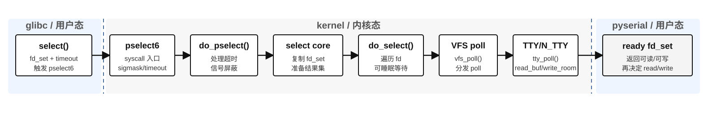

# pyserial select/pselect6 到 Linux 内核链路

本文单独说明 `pselect6`。它不是 `write()`、`read()` 或 `clearPort()` 的数据搬运主链路，而是 pyserial 在串口读写前后使用的“文件描述符就绪检查/取消等待”机制。

结论先说清楚：

- `readPort()` 会出现 `pselect6`：pyserial 在真正 `os.read()` 之前调用 `select.select([fd, pipe_abort_read_r], [], [], timeout)`，检查 `/dev/ttyACM0` 是否已有数据可读。
- `writePort()` 在默认阻塞写配置下也可能出现 `pselect6`：pyserial 先调用 `os.write(fd, data)`，随后用 `select.select([pipe_abort_write_r], [fd], [], timeout)` 等待 fd 可写或写操作被取消。
- `clearPort()` 本身不走 `pselect6`：它是 `flush()` -> `tcdrain()` -> `ioctl(fd, TCSBRK, 1)`，核心是等待之前提交的输出完成。

---

## 图：pselect6 syscall 后的模块级链路



```
pselect6 syscall
  │  接收 nfds、readfds、writefds、exceptfds、timeout、sigmask
  ▼
select syscall 层
  │  do_pselect()：处理 timeout 和信号屏蔽语义
  │  core_sys_select()：从用户态复制 fd_set，准备结果 fd_set
  ▼
select/poll core
  │  do_select()：遍历 fd_set 中被监视的 fd
  │  timeout=0 时只检查一轮，不进入长期睡眠
  ▼
VFS poll
  │  vfs_poll(file, wait)：分发到具体 file_operations.poll
  ▼
TTY poll
  │  tty_poll()：从 file 找到 tty_struct，获取当前 N_TTY 行规程
  ▼
N_TTY poll
  │  n_tty_poll()：检查 read_buf 是否已有数据，检查 write_room 是否可写
  │  input_available_p() 有数据则返回 EPOLLIN
  ▼
pselect6 返回
  │  把就绪 fd 写回用户态 fd_set；pyserial 再决定是否调用 read/write
```

这张图只从 `pselect6` syscall 开始，画的是“就绪检查/等待控制”路径。它不负责复制舵机协议帧，也不把舵机回包复制给 Python；真正的数据搬运仍然属于 `write()` 或 `read()` 系统调用。

模块职责可以这样讲：

| 模块 | 在 `pselect6` 链路中的职责 |
| --- | --- |
| pselect6 syscall 层 | 接收用户态 fd 集合、超时时间和可选信号屏蔽参数。 |
| select 核心 | 把用户态 fd_set 转成内核可遍历的数据结构，调用 `do_select()` 检查每个 fd。 |
| VFS poll | 不关心串口细节，只调用当前文件的 `poll` 方法。 |
| TTY poll | 把 `/dev/ttyACM0` 的 poll 请求转交给当前 line discipline。 |
| N_TTY poll | 判断 N_TTY `read_buf` 是否有数据可读，以及底层 tty 是否还有写空间。 |
| pyserial 侧结果 | `readPort()` 中如果返回可读，后续才调用 `os.read()`；`writePort()` 中如果返回可写，表示可以继续写或结束等待。 |

一句话：`pselect6` 回答“现在能不能读/写”，不回答“数据内容是什么”；它是控制路径，不是舵机协议字节的数据路径。

---

## 1. pselect6 在这里干什么

`select()` 是用户态库函数，Linux 内核里实际处理它的系统调用通常是 `pselect6`。它接收三类 fd 集合：

- `readfds`：关心哪些 fd “可读”。
- `writefds`：关心哪些 fd “可写”。
- `exceptfds`：关心哪些 fd 有异常状态。

pyserial 读写时还会把一个内部 pipe 放进 fd 集合。这个 pipe 不是舵机设备，而是 pyserial 用来中断阻塞读写的取消通道。

所以在本项目里，`pselect6` 主要回答两个问题：

- `readPort()`：`/dev/ttyACM0` 当前有没有回包字节可读？
- `writePort()`：`/dev/ttyACM0` 当前是否还能继续写，或者写操作是否被取消？

---

## 2. readPort 中的 pselect6

`readPort(length)` 最终进入 pyserial 的 `read(size)`。在 POSIX 后端里，pyserial 先做一次 `select()`：

```text
select.select([self.fd, self.pipe_abort_read_r], [], [], timeout.time_left())
```

对应到内核，大致路径是：

```text
pselect6()
  -> do_pselect()
  -> core_sys_select()
  -> do_select()
  -> vfs_poll()
  -> tty_poll()
  -> n_tty_poll()
```

这里的关键点是：`pselect6` 只检查“有没有数据可读”。如果返回可读，pyserial 后面才会调用：

```text
os.read(self.fd, size)
```

真正把舵机回包字节从内核复制到用户态的是后面的 `read()` 系统调用，不是 `pselect6`。

---

## 3. writePort 中的 pselect6

`writePort(packet)` 最终进入 pyserial 的 `write(data)`。默认 `write_timeout=None` 时，pyserial 是阻塞写。典型顺序是：

```text
os.write(self.fd, data)
select.select([self.pipe_abort_write_r], [self.fd], [], None)
```

也就是说，舵机协议帧的数据提交发生在前面的 `write()` 系统调用里；后面的 `pselect6` 只是等待 fd 可写或检测写操作是否被取消。

在本项目这种小包写入场景下，`write()` 往往很快把数据提交给 TTY/CDC ACM/USB core，`pselect6` 通常不是主要耗时来源。它更多是 pyserial 为了处理阻塞写超时和取消机制保留的控制路径。

---

## 4. pselect6 复制了什么

`pselect6` 会从用户态复制 fd 集合、超时时间等控制信息，例如：

```text
readfds / writefds / exceptfds
timeout
signal mask
```

它不会复制 Feetech/SCServo 协议帧，也不会把舵机回包复制给 Python。协议数据的复制分别发生在：

- 写方向：`write()` 路径中的 `copy_from_iter()` 和 CDC ACM 写缓冲 `memcpy()`。
- 读方向：`read()` 路径中的 N_TTY 缓冲读取和 `copy_to_iter()`。

因此，分析舵机数据路径时，`pselect6` 应该归类为“就绪检查/等待控制”，不要归类为“协议字节传输”。

---

## 5. 和三个 SDK 函数的关系

| SDK 函数 | 主要系统调用 | 是否可能看到 pselect6 | pselect6 的作用 |
| --- | --- | --- | --- |
| `writePort()` | `write()` | 是，默认阻塞写时常见 | `os.write()` 后检查 fd 可写/取消等待 |
| `readPort()` | `read()` | 是，读之前常见 | 检查 fd 是否已有数据可读 |
| `clearPort()` | `ioctl(TCSBRK, 1)` | 否 | 不使用 pselect6，只等待输出完成 |

一句话概括：`write/read/clear` 三者的数据或等待主链路分别是 `write()`、`read()`、`ioctl(TCSBRK)`；`pselect6` 是 pyserial 额外引入的就绪检查系统调用，尤其和 `readPort()` 关系最直接，和默认阻塞 `writePort()` 也有关。
