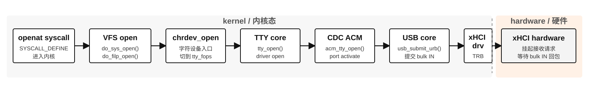
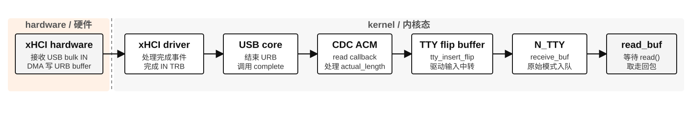
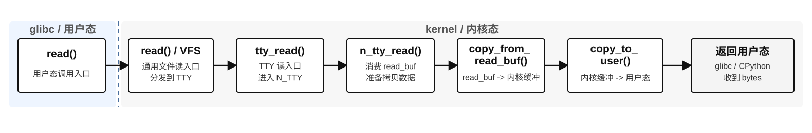

# readPort：read 系统调用到 Linux 内核链路

本文从 `scservo_sdk/port_handler.py` 的 `PortHandler.readPort(length)` 开始，重点解释它触发的 `read()` 系统调用：一次已经进入 Linux TTY/N_TTY 缓冲区的舵机回包，如何被 `read()` 从内核复制回 Python。

读方向完整讲起来是三条相关路径，它们发生在不同时间点：

1. `openat` syscall 准备路径：系统调用进入内核后，VFS/TTY/CDC ACM 激活端口，提前把 bulk IN 读 URB 提交到 USB core/xHCI。用户态叫 `open()` 也没关系，ARM64/现代 glibc 通常实际进入 `openat`。
2. USB 异步接收路径：舵机回包到达后，xHCI 通过 DMA 写入 URB 缓冲，完成中断和回调再把数据推入 TTY/N_TTY 接收缓冲。
3. `os.read(fd, size)` 同步取数路径：把已经到达 N_TTY 缓冲区的数据复制到用户态，内核路径是 `read -> ksys_read -> vfs_read -> new_sync_read -> tty_read -> iterate_tty_read -> n_tty_read/copy_to_iter`。

本次源码核对后的补齐点：

| 链路段 | 核对结论 |
| --- | --- |
| VFS 读分发 | 已补 `new_sync_read()`，明确 `vfs_read -> new_sync_read -> tty_fops.read_iter` |
| 读 URB 预提交 | 已补 `acm_submit_read_urb -> usb_submit_urb -> usb_hcd_submit_urb -> xhci_urb_enqueue -> xhci_queue_bulk_tx` |
| xHCI 完成中断 | 已补 `xhci_irq -> xhci_handle_events -> handle_tx_event -> usb_hcd_giveback_urb -> urb->complete` |
| flip buffer 复制 | 已补 `tty_insert_flip_string()` 到 `__tty_insert_flip_string_flags()` 的复制路径 |
| CPython 来源 | 来源标识覆盖 `os_read_impl/_Py_read`，不再只标入口函数 |

---

## 图 1：openat syscall 后的接收准备路径



```text
openat syscall
  │  用户态参数已经进入内核；这里从 syscall 入口开始
  ▼
VFS open
  │  do_sys_open() / do_filp_open()：路径解析，打开字符设备
  ▼
chrdev_open
  │  字符设备通用 open，切到 tty_fops.open
  ▼
TTY core
  │  tty_open()：创建/绑定 tty_struct，调用驱动 open
  ▼
CDC ACM
  │  acm_tty_open() -> tty_port_open() -> acm_port_activate()
  ▼
USB core
  │  acm_submit_read_urbs() -> usb_submit_urb()
  ▼
xHCI driver
  │  xhci_urb_enqueue() -> xhci_queue_bulk_tx()
  │  写 bulk IN TRB，并敲 doorbell
  ▼
xHCI hardware
  │  接收请求已经挂好，等待设备从 bulk IN endpoint 回包
```

这张图画的是“准备接收”：从 `openat` syscall 进入内核后，TTY/CDC ACM 激活端口，并把一批空的 bulk IN 读 URB 提交到 USB core/xHCI。此时不一定已经有舵机回包，内核只是把接收通道先布置好。

## 图 2：舵机回包异步进入内核缓冲区



```
xHCI hardware
  │  接收 USB bulk IN 数据，DMA 写入 CDC ACM 读 URB buffer
  ▼
xHCI driver
  │  处理 transfer event，完成 bulk IN TRB
  ▼
USB core
  │  结束 URB，调用 urb->complete
  ▼
CDC ACM
  │  acm_read_bulk_callback()：读 URB 完成回调
  │  acm_process_read_urb()：处理 urb->actual_length
  ▼
TTY flip buffer
  │  tty_insert_flip_string()：URB buffer -> TTY flip buffer
  │  tty_flip_buffer_push()：调度 TTY core 消费输入
  ▼
N_TTY
  │  n_tty_receive_buf_common()：flip buffer -> N_TTY read_buf
  │  wake_up_interruptible_poll()：唤醒可能阻塞在 read_wait 上的读取者
  ▼
N_TTY read_buf
  │  舵机回包已经在内核中等待 read() 取走
```

这张图画的是“数据真的传过来了”：xHCI 硬件收到 USB bulk IN 数据后，通过 DMA、Transfer Event、IRQ/MSI、USB core giveback 和 CDC ACM 完成回调，把字节放入 N_TTY `read_buf`。这不是用户态 `read()` 的同步调用栈，而是硬件到内核缓冲区的异步接收路径。

## 图 3：read() syscall 从内核缓冲区取回用户态



```
sys_read / ksys_read
  │  fdget_pos()：fd -> struct file；TTY 是 stream，通常不维护文件偏移
  │
  ▼
VFS
  │  vfs_read()：检查 FMODE_READ、FMODE_CAN_READ、access_ok、rw_verify_area
  │  new_sync_read()：包装同步 kiocb + iov_iter
  │
  ▼
TTY core
  │  tty_read()：从 struct file 找到 tty_struct，获取当前 N_TTY 行规程
  │  iterate_tty_read()：准备 64 字节 kernel_buf，协调行规程 read 和用户态复制
  │
  ▼
N_TTY
  │  n_tty_read()：从 N_TTY read_buf 消费已经到达的舵机回包字节
  │  copy_from_read_buf()：read_buf -> kernel_buf
  │
  ▼
TTY core
  │  copy_to_iter()：kernel_buf -> 用户态 Python bytes 缓冲
  ▼
用户态缓冲
  │  read() 返回本次实际读到的字节数
```

这张图画的是“程序把数据取走”：`read()` syscall 从 N_TTY `read_buf` 消费已经到达的舵机回包，并通过 `copy_to_iter()` 复制回用户态 Python bytes。它不直接进入 CDC ACM/USB/xHCI；这些模块已经在图 1 和图 2 中完成了接收准备与异步入缓冲。

模块职责可以这样讲：

| 模块 | 在 `readPort()` 读链路中的职责 |
| --- | --- |
| open/VFS/TTY open | 从 `openat` syscall 进入内核，把 fd 绑定到 TTY/CDC ACM 驱动，并触发端口激活。 |
| xHCI / USB core | open 后提前挂起 bulk IN 读 URB；回包到达后处理完成事件，把 URB 还给 CDC ACM。 |
| CDC ACM | 作为 USB 串口驱动，把 URB 接收缓冲中的字节推入 TTY flip buffer。 |
| TTY flip buffer | 作为 TTY 输入中转缓冲，把驱动收到的数据交给当前行规程。 |
| N_TTY receive | 把 TTY flip buffer 中的输入字节放进 N_TTY `read_buf`。 |
| syscall / fd 层 | 接收 `read(fd, buf, count)`，把整数 fd 转成 `/dev/ttyACM0` 对应的 `struct file`。 |
| VFS | 做通用读权限、用户态目标地址和范围检查，再通过 `tty_fops.read_iter` 分发到 TTY。 |
| TTY core | 找到 `tty_struct`，稳定当前 N_TTY 行规程，准备内核临时缓冲，并负责最后的 `copy_to_iter()`。 |
| N_TTY read | 从 `read_buf` 取出已经到达的串口字节。raw 模式下基本不解释舵机协议。 |
| 用户态缓冲 | CPython 提前分配的 bytes 缓冲，`copy_to_iter()` 把内核读出的字节复制到这里。 |

一句话：读方向要分成三张图看。图 1 解释“`openat` syscall 怎么先把接收请求挂好”，图 2 解释“舵机回包怎么异步进入 N_TTY `read_buf`”，图 3 解释“程序调用 `read()` 后怎么把 `read_buf` 中的数据复制回用户态”。

---

## 1. scservo_sdk 入口

`readPort()` 在 `protocol_packet_handler.rxPacket()` 的循环中被反复调用：

来源：scservo_sdk/protocol_packet_handler.py:相关代码片段（节选：仅保留本链路相关分支，已按当前仓库源码核对）
```python
# scservo_sdk/protocol_packet_handler.py
rxpacket.extend(port.readPort(wait_length - rx_length))  # 非阻塞读取还缺的字节
rx_length = len(rxpacket)                                # 更新当前已收到长度
```

SDK 起点源码：

来源：scservo_sdk/port_handler.py:readPort（节选：仅保留本链路相关分支，已按当前仓库源码核对）
```python
# scservo_sdk/port_handler.py
def readPort(self, length):                  # length 是本次最多希望读取的字节数
    if (sys.version_info > (3, 0)):           # Python 3 分支
        return self.ser.read(length)         # 调 pyserial Serial.read(size)
    else:                                    # Python 2 分支
        return [ord(ch) for ch in self.ser.read(length)] # 转成 int 列表
```

在本项目里 `serial.Serial(..., timeout=0)`，因此 `readPort()` 是非阻塞读：有多少读多少，没有数据就返回空 `bytes`，整体超时由 SDK 的 `isPacketTimeout()` 控制。

---

## 2. 完整调用栈

读链路拆成三个调用栈最清楚：`openat` syscall 负责把接收请求挂好，USB/xHCI 完成中断负责把舵机回包放进内核缓冲区，`read()` 负责把已经进入 `read_buf` 的字节复制回用户态。

### 2.1 open 接收准备路径（按模块拆分）

这条路径不适合画成一条很长的调用栈。按模块拆开后，它实际做的是五件事：打开设备文件、分发到字符设备、进入 TTY、激活 CDC ACM 端口、把 bulk IN 读 URB 挂到 USB/xHCI。

#### 2.1.1 syscall / VFS：打开设备文件并安装 fd

```text
Linux SYSCALL_DEFINE4(openat, dfd, filename, flags, mode)
│  用户态参数是 /dev/ttyACM0、O_RDWR、O_NOCTTY、O_NONBLOCK；这里从内核 syscall 入口开始。
└── do_sys_open(dfd, filename, flags, mode)
    │  dfd 通常是 AT_FDCWD；构造 open_how，然后进入 openat2 共用实现。
    └── do_sys_openat2(dfd, filename, &how)
        ├── build_open_flags()
        │   │  解析 O_RDWR/O_NOCTTY/O_NONBLOCK。
        ├── getname(filename)
        │   │  从用户态复制路径字符串 /dev/ttyACM0。
        ├── get_unused_fd_flags()
        │   │  从当前进程 fd 表中分配一个空闲 fd。
        ├── do_filp_open(dfd, tmp, &op)
        │   │  路径解析，找到 /dev/ttyACM0 对应的字符设备 inode，并创建 struct file。
        └── fd_install(fd, file)
            │  把 struct file 安装到进程 fd 表，openat 返回 fd。
```

这一段是 VFS 的职责：把路径字符串变成 `struct file` 和整数 fd。它还没有处理串口协议，只是找到 `/dev/ttyACM0` 这个字符设备。

#### 2.1.2 字符设备层：把 cdev 分发到 TTY

```text
do_filp_open()
│  已经找到 /dev/ttyACM0 对应的字符设备 inode。
└── chrdev_open(inode, file)
    │  通过 inode->i_rdev 在 cdev_map 中找到注册的 struct cdev。
    └── fops_get(p->ops)
        │  拿到这个字符设备注册的 file_operations。
        └── replace_fops(file, fops)
            │  把 file->f_op 从通用 chrdev 操作替换成 TTY 操作。
            └── file->f_op->open(inode, file)
                │  对 TTY 字符设备来说，这里进入 tty_open()。
```

这一段是“通用字符设备”到“TTY 子系统”的分发。也就是说，VFS 不知道 `/dev/ttyACM0` 的 USB 细节，它只通过字符设备号找到对应的 TTY open 函数。

#### 2.1.3 TTY core：绑定 file 和 tty_struct

```text
tty_open(inode, file)
│  nonseekable_open()：TTY 是流式设备，不能像普通文件一样 lseek。
├── tty_alloc_file(file)
│   │  为这个 struct file 准备 TTY 私有数据。
├── tty_open_by_driver(device, file)
│   │  根据设备号找到或创建 tty_struct。
├── tty_add_file(tty, file)
│   │  把当前打开的 file 挂到 tty_struct 上。
└── tty->ops->open(tty, file)
    │  调具体 TTY 驱动的 open；/dev/ttyACM0 对应 CDC ACM。
```

这一段建立了 `struct file -> tty_struct -> tty driver` 的关系。`O_NOCTTY` 也在这一层发挥作用：pyserial 打开串口时不把它设置成当前进程的控制终端。

#### 2.1.4 CDC ACM / tty_port：激活串口端口

```text
acm_tty_open(tty, file)
│  CDC ACM 的 TTY open 入口。
└── tty_port_open(&acm->port, tty, file)
    │  增加 port->count，把 tty_port 和 tty_struct 绑定。
    ├── tty_port_tty_set(port, tty)
    ├── port->ops->activate(port, tty)
    │   │  首次打开时才真正初始化硬件侧端口。
    │   └── acm_port_activate(port, tty)
    └── tty_port_block_til_ready(port, tty, file)
        │  pyserial 使用 O_NONBLOCK，所以这里不会长时间等待 carrier。
```

这一段把 TTY 抽象落到 CDC ACM 设备实例上。`tty_port_open()` 负责 open 计数、端口状态、是否第一次打开，以及非阻塞打开时快速返回。

#### 2.1.5 CDC ACM / USB / xHCI：挂起 bulk IN 接收请求

```text
acm_port_activate(port, tty)
│  usb_autopm_get_interface()：唤醒 USB 接口，避免设备运行时挂起。
├── set_bit(TTY_NO_WRITE_SPLIT, &tty->flags)
│   │  设置 TTY 写路径策略；虽在 open 中设置，但主要影响后续 write。
├── usb_submit_urb(acm->ctrlurb, GFP_KERNEL)
│   │  提交 CDC ACM 控制中断 URB，用于状态通知。
├── acm_tty_set_termios(tty, NULL)
│   │  把当前串口参数同步到 CDC ACM 设备。
├── clear_bit(ACM_THROTTLED, &acm->flags)
│   │  清除接收节流状态，允许继续收数据。
└── acm_submit_read_urbs(acm, GFP_KERNEL)
    │  遍历 CDC ACM 接收 URB 池。
    └── acm_submit_read_urb(acm, index, GFP_KERNEL)
        │  每个空闲 bulk IN URB 都提交给 USB core。
        └── usb_submit_urb(read_urb)
            │  USB core 校验 URB、处理 DMA 访问关系。
            └── usb_hcd_submit_urb()
                │  交给主机控制器驱动。
                └── xhci_urb_enqueue()
                    │  bulk IN endpoint 排进 xHCI transfer ring。
                    └── xhci_queue_bulk_tx()
                        │  写 IN TRB 并敲 doorbell，硬件开始等待设备回包。
```

这一段才是 read 方向和 USB 真正相关的准备动作：`openat()` 返回用户态之前，CDC ACM 已经把 bulk IN 接收 URB 挂到了 USB core/xHCI。后续舵机回包到达时，硬件可以直接把数据 DMA 到这些 URB 的接收缓冲。

模块化总结：

| 模块 | open `/dev/ttyACM0` 时做的事 |
| --- | --- |
| syscall / VFS | 复制路径和 flags，解析 `/dev/ttyACM0`，创建 `struct file` 并安装 fd。 |
| chrdev | 根据字符设备号找到注册的 TTY `file_operations`，进入 `tty_open()`。 |
| TTY core | 找到或创建 `tty_struct`，把当前 `struct file` 和 TTY 设备绑定。 |
| CDC ACM / tty_port | 维护端口 open 计数，首次打开时激活 CDC ACM 端口。 |
| USB core / xHCI | 提交控制 URB 和 bulk IN 读 URB，把 IN TRB 写入 xHCI transfer ring。 |

这条路径回答“为什么用户还没 `read()`，内核就能收到回包”：因为打开串口时，CDC ACM 已经把接收 URB 提前提交给 USB core/xHCI。

### 2.2 USB 回包异步入缓冲路径（按模块拆分）

这条路径也不是一条普通进程上下文里的同步调用栈，而是硬件 DMA、IRQ/MSI、中断处理、URB 完成回调和 TTY workqueue 接在一起。按模块拆开后，它实际做的是五件事：硬件把 USB 包写入 URB buffer，xHCI 驱动解析完成事件，USB core 归还 URB，CDC ACM 把数据推入 TTY，N_TTY 把字节放进 `read_buf`。

#### 2.2.1 xHCI hardware：DMA 写 URB buffer 并触发中断

```text
舵机回包到达 USB bulk IN endpoint
│  硬件层：STS3215 回包经 USB CDC ACM 数据 IN 端点返回主机。
└── xHCI hardware
    ├── DMA 写 urb->transfer_buffer
    │   │  把 USB 总线收到的字节写入 CDC ACM 读 URB 的接收缓冲。
    ├── 写 event ring
    │   │  产生 Transfer Event TRB，说明某个 bulk IN TD/URB 完成。
    └── 触发 IRQ/MSI
        │  向 CPU/中断控制器发 Interrupt Request，进入 Linux 中断框架。
```

这一段是物理硬件到内核的边界：数据边界是 DMA 写 `urb->transfer_buffer`，控制边界是 IRQ/MSI 让 CPU 进入中断处理。

#### 2.2.2 xHCI driver：解析 event ring 并完成 TD

```text
Linux IRQ framework
│  调用 xHCI 主控驱动初始化时注册好的中断处理函数。
└── xhci_irq()
    │  检查 xHCI status 里的 STS_EINT，并清除本次中断状态。
    └── xhci_handle_events()
        │  遍历 event ring 上归 OS 处理的 event TRB。
        └── xhci_handle_event_trb()
            │  识别 TRB_TRANSFER 事件。
            └── handle_tx_event()
                │  根据 event 找回 endpoint ring、TD 和 URB。
                └── process_bulk_intr_td()
                    │  根据 event 中的剩余长度计算 urb->actual_length。
                    └── finish_td()
                        │  TD 完成后准备归还 URB。
                        └── xhci_giveback_urb_in_irq()
                            │  从 endpoint 队列摘下 URB，交给 USB core。
```

这一段是 xHCI 驱动的职责：把硬件 event ring 里的 Transfer Event 翻译成 Linux USB core 能理解的“某个 URB 完成了，并且实际收到 `urb->actual_length` 字节”。

#### 2.2.3 USB core：归还完成的 URB

```text
xhci_giveback_urb_in_irq()
│  HCD 驱动层把完成的 URB 交回 USB core。
└── usb_hcd_giveback_urb(hcd, urb, status)
    │  处理 giveback 上下文，进入统一 URB 完成分发。
    └── __usb_hcd_giveback_urb(urb)
        ├── unmap_urb_for_dma()
        │   │  按需解除或确认 DMA 映射关系。
        ├── urb->status = status
        │   │  写回本次 USB 传输完成状态。
        └── urb->complete(urb)
            │  调用提交该 URB 的驱动注册的完成函数。
            └── acm_read_bulk_callback(urb)
```

这一段是 USB core 的职责：它不解释舵机协议，只负责把完成的 URB 归还给提交者。对 CDC ACM 来说，`urb->complete` 就是 `acm_read_bulk_callback()`。

#### 2.2.4 CDC ACM：把 URB 数据推入 TTY flip buffer

```text
acm_read_bulk_callback(urb)
│  CDC ACM 读完成回调：检查 urb->status 和 actual_length。
├── acm_process_read_urb(acm, urb)
│   │  处理收到的字节。
│   └── tty_insert_flip_string(&acm->port, urb->transfer_buffer, urb->actual_length)
│       │  CPU 复制：URB transfer_buffer -> TTY flip buffer。
└── acm_submit_read_urb(acm, rb->index, GFP_ATOMIC)
    │  重新提交同一个 read URB，让接收循环继续。
```

这一段是 CDC ACM 的职责：把 USB 层的接收缓冲变成 TTY 层的输入字节，并把刚完成的 read URB 再挂回去，继续等下一次 USB 回包。

#### 2.2.5 TTY / N_TTY：从 flip buffer 进入 read_buf

```text
tty_flip_buffer_push(&acm->port)
│  通知 TTY core 有新输入，调度 flip buffer 消费工作。
└── queue_work(system_unbound_wq, &port->buf.work)
    │  后续在 workqueue 上执行。
    └── flush_to_ldisc()
        │  把 TTY flip buffer 交给当前 line discipline。
        └── n_tty_receive_buf_common()
            │  原始模式下基本不解释字节，只做输入入队。
            ├── N_TTY read_buf
            │   │  舵机回包字节进入 read() 后续要消费的内核缓冲区。
            └── wake_up_interruptible_poll(&tty->read_wait, EPOLLIN)
                │  唤醒可能阻塞在 read() / poll() / select() 上的读取者。
```

这一段是 TTY/N_TTY 的职责：把驱动收到的字节放进 `read()` 真正读取的 `read_buf`，并唤醒等待输入的任务。

模块化总结：

| 模块 | 硬件回包进入内核缓冲区时做的事 |
| --- | --- |
| xHCI hardware | 接收 USB bulk IN 数据，DMA 写 URB buffer，写 Transfer Event，触发 IRQ/MSI。 |
| xHCI driver | 处理中断和 event ring，找到完成的 TD/URB，计算 `urb->actual_length`。 |
| USB core | 通过 `usb_hcd_giveback_urb()` 归还 URB，并调用 `urb->complete()`。 |
| CDC ACM | 在 `acm_read_bulk_callback()` 中处理 URB 数据，复制到 TTY flip buffer，并重新提交 read URB。 |
| TTY / N_TTY | 消费 flip buffer，把字节写入 N_TTY `read_buf`，唤醒等待读取的进程。 |

这条路径回答“舵机真的回包后，字节怎么进入内核缓冲区”：硬件负责 DMA，xHCI 中断负责完成事件，USB core 负责 URB giveback，CDC ACM/TTY/N_TTY 负责把字节放进 `read_buf`。

### 2.3 read syscall 同步取数路径

```text
Linux SYSCALL_DEFINE3(read, fd, buf, count)
│  内核 syscall 入口：接收 fd、用户态目标 buf、期望读取 count。
└── ksys_read(fd, buf, count)
    │  fdget_pos() + file_ppos()：把 int fd 转成 struct file；TTY 是 stream，通常没有文件偏移。
    └── vfs_read(file, buf, count, pos)
        │  access_ok() + rw_verify_area()：检查用户态目标地址、读权限和读取范围。
        └── new_sync_read(file, buf, count, pos)
            │  init_sync_kiocb() + iov_iter_ubuf()：把用户态目标缓冲包装成 kiocb + iov_iter。
            └── filp->f_op->read_iter(iocb, iter)
                │  /dev/ttyACM0 对应 tty_fops.read_iter。
                └── tty_read(iocb, iter)
                    │  TTY read 入口：获取 tty_struct 和当前 N_TTY 行规程。
                    └── iterate_tty_read(ld, tty, file, iter)
                        │  准备 64 字节 kernel_buf，调用行规程 read。
                        ├── n_tty_read(tty, file, kernel_buf, nr, cookie, offset)
                        │   │  从 N_TTY read_buf 消费已经到达的串口字节。
                        │   └── copy_from_read_buf()
                        │       │  memcpy()：从 N_TTY 环形 read_buf 复制到 kernel_buf。
                        └── copy_to_iter(kernel_buf, size, iter)
                            │  n_tty_read 返回后，把 kernel_buf 中的字节复制到用户态 bytes 缓冲。
```

这条栈回答“用户态 `read()` 在做什么”：它不去 USB 设备现场要数据，只从 N_TTY `read_buf` 里取已经到达的字节。

---

## 3. USB CDC ACM 接收路径

与 write 不同，读 URB 是在串口打开时就预提交给 USB core 的。舵机回包到达 USB bulk IN endpoint 后，xHCI 通过 DMA 把收到的数据写入 URB 接收缓冲，并在 event ring 上产生 Transfer Event，再通过 IRQ/MSI 进入 xHCI 驱动。xHCI 驱动把完成的 URB 还给 USB core，USB core 才调用 CDC ACM 注册的完成回调。回调把数据推入 TTY flip buffer，再经 N_TTY 行规程放入 `read_buf`。只有数据进入 `read_buf` 后，后续 `read()` 才能从 N_TTY 中取到它。本节解释数据从 USB 线到内核缓冲区的完整路径。

### 3.1 打开 tty 时预提交读 URB

来源：linux/drivers/usb/class/cdc-acm.c:acm_port_activate（节选：仅保留本链路相关分支，已按当前仓库源码核对）
```c
// linux/drivers/usb/class/cdc-acm.c
static int acm_port_activate(struct tty_port *port, struct tty_struct *tty)  // 定义当前层的 C 函数入口
{
    struct acm *acm = container_of(port, struct acm, port); // tty_port -> acm  // 定义当前链路涉及的内核数据结构

    acm->ctrlurb->dev = acm->dev;                 // 控制中断 URB 绑定 USB 设备
    usb_submit_urb(acm->ctrlurb, GFP_KERNEL);     // 提交控制状态 URB

    clear_bit(ACM_THROTTLED, &acm->flags);        // 确保未被流控暂停
    acm_submit_read_urbs(acm, GFP_KERNEL);        // 提交所有 bulk IN 读 URB
    return 0;                                     // 激活完成
}
```

### 3.2 提交读 URB

来源：linux/drivers/usb/class/cdc-acm.c:acm_submit_read_urb（节选：仅保留本链路相关分支，已按当前仓库源码核对）
```c
// linux/drivers/usb/class/cdc-acm.c
static int acm_submit_read_urb(struct acm *acm, int index, gfp_t mem_flags)  // 定义当前层的 C 函数入口
{
    int res;                                      // usb_submit_urb 返回值

    if (!test_and_clear_bit(index, &acm->read_urbs_free)) // 该 URB 不空闲
        return 0;                                 // 已经提交过，不重复提交

    res = usb_submit_urb(acm->read_urbs[index], mem_flags); // 提交 bulk IN URB
    if (res) {                                    // 提交失败
        set_bit(index, &acm->read_urbs_free);     // 标回空闲
        return res;                               // 返回错误
    }

    return 0;                                     // 成功提交
}

static int acm_submit_read_urbs(struct acm *acm, gfp_t mem_flags)  // 定义当前层的 C 函数入口
{
    int i;                                        // URB 下标

    for (i = 0; i < acm->rx_buflimit; ++i)        // 遍历所有接收 URB
        acm_submit_read_urb(acm, i, mem_flags);   // 逐个提交给 USB core

    return 0;                                     // 所有读 URB 已提交
}
```

CDC ACM 的读不是用户调用 `read()` 时才向 USB 设备要数据，而是驱动提前把 bulk IN URB 提交给 USB core。舵机回包到达时，USB 主控把数据填进 URB 的 `transfer_buffer`。

这些接收 URB 的缓冲区在设备初始化时已经通过 `usb_alloc_coherent()` 分配，并设置了 `URB_NO_TRANSFER_DMA_MAP`。因此 USB core 提交读 URB 时主要处理 DMA 访问关系，不会再额外分配一块普通缓冲来复制舵机回包。

来源：linux/drivers/usb/class/cdc-acm.c:相关代码片段（节选：仅保留本链路相关分支，已按当前仓库源码核对）
```c
// linux/drivers/usb/class/cdc-acm.c
rb->base = usb_alloc_coherent(acm->dev, readsize, GFP_KERNEL, &rb->dma);  // 更新当前层需要传递的状态、长度、指针或错误码
urb->transfer_flags |= URB_NO_TRANSFER_DMA_MAP;  // 更新当前层需要传递的状态、长度、指针或错误码
urb->transfer_dma = rb->dma;  // 更新当前层需要传递的状态、长度、指针或错误码
usb_fill_bulk_urb(urb, acm->dev, acm->in, rb->base,  // 调用下一层 C 函数继续完成当前路径
                  acm->readsize, acm_read_bulk_callback, rb);  // 调用下一层 C 函数继续完成当前路径
```

### 3.3 读 URB 进入 USB core/xHCI 队列

`acm_submit_read_urb()` 调用的 `usb_submit_urb()` 和写路径共用 USB core/HCD/xHCI 入队逻辑。区别是这里的 endpoint 是 bulk IN，URB 被预先排到 xHCI transfer ring 后，硬件等待设备返回数据；后面的 `read()` 系统调用只是消费已经到达 TTY/N_TTY 缓冲区的数据，不会在当下才创建这条 USB 传输。

来源：linux/drivers/usb/core/urb.c:usb_submit_urb（节选：仅保留 bulk IN 读 URB 相关分支，已按当前仓库源码核对）
```c
// linux/drivers/usb/core/urb.c
int usb_submit_urb(struct urb *urb, gfp_t mem_flags) // USB core 接收驱动提交的异步传输请求
{
    int xfertype, max;                            // endpoint 类型和最大包长
    struct usb_device *dev;                       // URB 绑定的 USB 设备
    struct usb_host_endpoint *ep;                 // pipe 对应的 endpoint
    int is_out;                                   // 方向标记；bulk IN 读 URB 为 0
    unsigned int allowed;                         // 当前传输类型允许的 URB 标志

    if (!urb || !urb->complete)                   // URB 必须存在并带完成回调
        return -EINVAL;                           // 参数错误，不能提交
    if (urb->hcpriv) {                            // hcpriv 非空表示 URB 已经在 HCD 手里
        WARN_ONCE(1, "URB %pK submitted while active\n", urb); // 警告重复提交
        return -EBUSY;                            // 返回忙
    }

    dev = urb->dev;                               // 取出 USB 设备
    if ((!dev) || (dev->state < USB_STATE_UNAUTHENTICATED)) // 设备不存在或状态太早
        return -ENODEV;                           // 设备不可用

    ep = usb_pipe_endpoint(dev, urb->pipe);       // 从 pipe 找到 bulk IN endpoint
    if (!ep)                                      // endpoint 查不到
        return -ENOENT;                           // 返回不存在

    urb->ep = ep;                                 // 把 endpoint 缓存在 URB 上
    urb->status = -EINPROGRESS;                   // 标记传输已经进入进行中状态
    urb->actual_length = 0;                       // 完成前实际接收长度清零

    xfertype = usb_endpoint_type(&ep->desc);      // 读取 endpoint 类型
    if (xfertype == USB_ENDPOINT_XFER_CONTROL) {  // 控制端点分支
        /* CDC ACM 数据读 URB 是 bulk IN，不走控制端点分支。 */ // 节选说明
    } else {                                      // 非控制端点
        is_out = usb_endpoint_dir_out(&ep->desc); // bulk IN endpoint 得到 is_out=0
    }

    urb->transfer_flags &= ~(URB_DIR_MASK | URB_DMA_MAP_SINGLE | // 清掉上次提交遗留的方向和 DMA 标志
            URB_DMA_MAP_PAGE | URB_DMA_MAP_SG | URB_MAP_LOCAL | // 清掉 page/sg/local 映射标志
            URB_SETUP_MAP_SINGLE | URB_SETUP_MAP_LOCAL |        // 清掉控制包映射标志
            URB_DMA_SG_COMBINED);                // 清掉合并 SG 标志
    urb->transfer_flags |= (is_out ? URB_DIR_OUT : URB_DIR_IN); // bulk IN 读 URB 设置 URB_DIR_IN

    if (xfertype != USB_ENDPOINT_XFER_CONTROL && // 非控制端点
            dev->state < USB_STATE_CONFIGURED)   // 设备必须已配置
        return -ENODEV;                           // 未配置设备不能提交数据 URB

    max = usb_endpoint_maxp(&ep->desc);           // 读取 endpoint 最大包长
    if (max <= 0)                                 // endpoint 描述符异常
        return -EMSGSIZE;                         // 包长非法

    allowed = (URB_NO_TRANSFER_DMA_MAP | URB_NO_INTERRUPT | URB_DIR_MASK | // 基础允许标志
            URB_FREE_BUFFER);                     // 允许完成时释放缓冲
    switch (xfertype) {                           // 按传输类型补充允许标志
    case USB_ENDPOINT_XFER_BULK:                  // CDC ACM 读数据端点是 bulk
    case USB_ENDPOINT_XFER_INT:                   // interrupt 和 bulk 共享部分规则
        if (is_out)                               // OUT 方向才允许 ZERO_PACKET
            allowed |= URB_ZERO_PACKET;           // bulk IN 不会加这个标志
        fallthrough;                              // 继续执行非 isoc 默认规则
    default:                                      // 所有非 isochronous endpoint
        if (!is_out)                              // IN 方向
            allowed |= URB_SHORT_NOT_OK;          // 允许驱动要求短包视为错误
        break;                                    // 规则处理结束
    }
    allowed &= urb->transfer_flags;               // 只保留当前 URB 实际设置且允许的标志

    return usb_hcd_submit_urb(urb, mem_flags);    // 交给 Host Controller Driver，树莓派 5 上进入 xHCI
}
```

来源：linux/drivers/usb/core/hcd.c:usb_hcd_submit_urb（节选：仅保留 bulk IN 读 URB 相关分支，已按当前仓库源码核对）
```c
// linux/drivers/usb/core/hcd.c
int usb_hcd_submit_urb(struct urb *urb, gfp_t mem_flags) // USB core 到 HCD 的提交入口
{
    int status;                                   // HCD 提交结果
    struct usb_hcd *hcd = bus_to_hcd(urb->dev->bus); // 从 USB bus 找到主机控制器

    usb_get_urb(urb);                             // 增加 URB 引用，HCD 完成前不能释放
    atomic_inc(&urb->use_count);                  // 标记 URB 正在被 HCD 使用
    atomic_inc(&urb->dev->urbnum);                // 设备当前活跃 URB 数加一
    usbmon_urb_submit(&hcd->self, urb);           // 给 usbmon 记录提交事件

    status = map_urb_for_dma(hcd, urb, mem_flags); // 建立或确认 DMA 访问关系
    if (likely(status == 0)) {                    // DMA 关系处理成功
        status = hcd->driver->urb_enqueue(hcd, urb, mem_flags); // 调 HCD 的 urb_enqueue，xHCI 下就是 xhci_urb_enqueue()
        if (unlikely(status))                     // HCD 入队失败
            unmap_urb_for_dma(hcd, urb);          // 回滚 DMA 映射关系
    }

    if (unlikely(status)) {                       // 提交流程失败
        usbmon_urb_submit_error(&hcd->self, urb, status); // 给 usbmon 记录错误
        urb->hcpriv = NULL;                       // 清掉 HCD 私有指针
        INIT_LIST_HEAD(&urb->urb_list);           // 重置 URB 链表节点
        atomic_dec(&urb->use_count);              // 撤销使用计数
    }

    return status;                                // 0 表示读 URB 已交给 HCD，完成会异步回调
}
```

读 URB 的 DMA 映射分发和写 URB 走同一套函数，只是方向变成 `DMA_FROM_DEVICE`。CDC ACM 读缓冲同样来自 `usb_alloc_coherent()` 并设置了 `URB_NO_TRANSFER_DMA_MAP`，因此这里确认/沿用已有 DMA 地址，而不是在用户态 `read()` 时再复制一份 USB 接收缓冲。

来源：linux/drivers/usb/core/hcd.c:map_urb_for_dma / linux/drivers/usb/host/xhci.c:xhci_map_urb_for_dma / linux/drivers/usb/core/hcd.c:usb_hcd_map_urb_for_dma（节选：仅保留 CDC ACM 读链路相关分支，已按当前仓库源码核对）
```c
// linux/drivers/usb/core/hcd.c
static int map_urb_for_dma(struct usb_hcd *hcd, struct urb *urb, // USB core 调用的 DMA 映射分发入口
                           gfp_t mem_flags)      // 提交读 URB 时通常是 GFP_KERNEL 或 GFP_ATOMIC
{
    if (hcd->driver->map_urb_for_dma)             // xHCI HCD 注册了自己的映射钩子
        return hcd->driver->map_urb_for_dma(hcd, urb, mem_flags); // 先进入 xhci_map_urb_for_dma()
    else                                          // 没有 HCD 私有钩子
        return usb_hcd_map_urb_for_dma(hcd, urb, mem_flags); // 直接走通用映射
}

// linux/drivers/usb/host/xhci.c
static int xhci_map_urb_for_dma(struct usb_hcd *hcd, struct urb *urb, // xHCI 的 DMA 映射钩子
                                gfp_t mem_flags)  // 原样传给通用映射
{
    struct xhci_hcd *xhci;                        // xHCI 主控私有结构

    xhci = hcd_to_xhci(hcd);                      // 从通用 HCD 取 xHCI 对象

    if (xhci_urb_suitable_for_idt(urb))           // IDT 只适用于很小的 OUT 传输
        return 0;                                 // bulk IN 读 URB 不会走这个返回

    if (xhci->quirks & XHCI_SG_TRB_CACHE_SIZE_QUIRK) { // 少数 xHCI 需要临时缓冲规避 SG/TRB 缓存限制
        if (xhci_urb_temp_buffer_required(hcd, urb)) // 判断是否需要 bounce buffer
            return xhci_map_temp_buffer(hcd, urb); // 需要时先分配临时缓冲
    }
    return usb_hcd_map_urb_for_dma(hcd, urb, mem_flags); // 常规 bulk IN 读 URB 进入通用映射
}

// linux/drivers/usb/core/hcd.c
int usb_hcd_map_urb_for_dma(struct usb_hcd *hcd, struct urb *urb, // 通用 HCD DMA 映射函数
                            gfp_t mem_flags)     // 映射所需的内存分配上下文
{
    enum dma_data_direction dir;                  // DMA 方向
    int ret = 0;                                  // 默认成功

    dir = usb_urb_dir_in(urb) ? DMA_FROM_DEVICE : DMA_TO_DEVICE; // bulk IN 读 URB 是 DMA_FROM_DEVICE
    if (urb->transfer_buffer_length != 0          // 有接收缓冲才需要处理映射
        && !(urb->transfer_flags & URB_NO_TRANSFER_DMA_MAP)) { // CDC ACM 读 URB 设置了该标志，所以跳过重映射分支
        /* 通用 sg/page/single 映射分支在这里；本链路使用 coherent 缓冲，不进入。 */ // 节选说明
    }
    return ret;                                   // 返回 0 后继续交给 xHCI urb_enqueue
}
```

来源：linux/drivers/usb/host/xhci.c:xhci_urb_enqueue（节选：仅保留 bulk IN 读 URB 相关分支，已按当前仓库源码核对）
```c
// linux/drivers/usb/host/xhci.c
static int xhci_urb_enqueue(struct usb_hcd *hcd, struct urb *urb, gfp_t mem_flags) // xHCI 接收 URB 的入口
{
    struct xhci_hcd *xhci = hcd_to_xhci(hcd);     // 从通用 HCD 取 xHCI 私有结构
    unsigned long flags;                          // 保存中断标志
    int ret = 0;                                  // 入队结果
    unsigned int slot_id, ep_index;               // USB 设备 slot 和 endpoint 索引
    struct urb_priv *urb_priv;                    // xHCI 跟踪 URB/TD 的私有结构
    int num_tds;                                  // 本 URB 需要的 TD 数量

    ep_index = xhci_get_endpoint_index(&urb->ep->desc); // 根据 endpoint 描述符计算 ep_index
    num_tds = 1;                                  // 普通 bulk IN 读 URB 通常一个 TD
    urb_priv = kzalloc(struct_size(urb_priv, td, num_tds), mem_flags); // 分配 xHCI 私有跟踪结构
    if (!urb_priv)                                // 分配失败
        return -ENOMEM;                           // 返回内存不足

    urb_priv->num_tds = num_tds;                  // 记录 TD 数量
    urb_priv->num_tds_done = 0;                   // 完成 TD 计数清零
    urb->hcpriv = urb_priv;                       // 把 xHCI 私有结构挂到 URB 上

    spin_lock_irqsave(&xhci->lock, flags);        // 锁住 xHCI 状态和 transfer ring
    ret = xhci_check_args(hcd, urb->dev, urb->ep, true, true, __func__); // 检查设备和 endpoint 是否可用
    if (ret <= 0) {                               // 参数或状态非法
        ret = ret ? ret : -EINVAL;                // 规范化错误码
        goto free_priv;                           // 释放私有结构并返回
    }

    slot_id = urb->dev->slot_id;                  // 读取 xHCI slot id
    switch (usb_endpoint_type(&urb->ep->desc)) {  // 按 endpoint 类型分发
    case USB_ENDPOINT_XFER_BULK:                  // CDC ACM bulk IN 进入这个分支
        ret = xhci_queue_bulk_tx(xhci, GFP_ATOMIC, urb, slot_id, ep_index); // 把读 URB 转成 bulk transfer TRB
        break;                                    // bulk 分支结束
    }

    if (ret) {                                    // 入队失败
free_priv:
        xhci_urb_free_priv(urb_priv);             // 释放 xHCI 私有结构
        urb->hcpriv = NULL;                       // 清掉 URB 私有指针
    }
    spin_unlock_irqrestore(&xhci->lock, flags);   // 释放 xHCI 锁
    return ret;                                   // 0 表示 URB 已排进 xHCI transfer ring
}
```

来源：linux/drivers/usb/host/xhci-ring.c:xhci_queue_bulk_tx（节选：仅保留 bulk IN 读 URB 相关分支，已按当前仓库源码核对）
```c
// linux/drivers/usb/host/xhci-ring.c
int xhci_queue_bulk_tx(struct xhci_hcd *xhci, gfp_t mem_flags, // 把 bulk URB 写入 xHCI transfer ring
        struct urb *urb, int slot_id, unsigned int ep_index) // URB、设备 slot 和 endpoint 索引
{
    struct xhci_ring *ring;                       // endpoint 对应的 transfer ring
    struct urb_priv *urb_priv;                    // 前面分配的 URB 私有结构
    struct xhci_td *td;                           // 当前 Transfer Descriptor
    struct xhci_generic_trb *start_trb;           // 本 TD 的第一个 TRB
    bool more_trbs_coming = true;                 // 是否还有后续 TRB
    bool first_trb = true;                        // 首个 TRB 的 cycle bit 延后交给硬件
    unsigned int start_cycle, enqd_len, trb_buff_len, full_len; // 首 TRB cycle、已入队长度、本 TRB 长度、总长度
    unsigned int num_trbs;                       // 这个 URB 需要写入的 TRB 数量
    u32 field, length_field, remainder;           // TRB 控制字段和长度字段
    u64 addr, send_addr;                          // DMA 地址
    int ret;                                      // prepare_transfer 返回值

    ring = xhci_urb_to_transfer_ring(xhci, urb);  // 找到 bulk IN endpoint 的 transfer ring
    if (!ring)                                    // ring 不存在
        return -EINVAL;                           // endpoint 状态异常

    full_len = urb->transfer_buffer_length;       // 本次读 URB 可接收的最大字节数
    num_trbs = count_trbs_needed(urb);            // 根据接收缓冲长度和边界计算需要的 TRB 数
    addr = (u64) urb->transfer_dma;               // CDC ACM 读缓冲的 DMA 地址
    send_addr = addr;                             // 当前 TRB 要写入的 DMA 地址
    ret = prepare_transfer(xhci, xhci->devs[slot_id], // 为 endpoint ring 预留 TRB 空间
            ep_index, urb->stream_id,             // 指定 endpoint 和 stream
            num_trbs, urb, 0, mem_flags);         // 按 TRB 数预留一个 TD 的 ring 空间
    if (unlikely(ret < 0))                        // ring 空间准备失败
        return ret;                               // 返回 HCD 错误码

    urb_priv = urb->hcpriv;                       // 取 xHCI 私有结构
    td = &urb_priv->td[0];                        // 普通 bulk URB 的第一个 TD
    start_trb = &ring->enqueue->generic;          // 保存第一个 TRB 地址
    start_cycle = ring->cycle_state;              // 保存首 TRB 当前 cycle，等所有 TRB 写完后再交给硬件

    for (enqd_len = 0; first_trb || enqd_len < full_len; // 遍历，把整个接收缓冲描述成一个或多个 TRB
            enqd_len += trb_buff_len) {           // 每轮推进一个 TRB 长度
        field = TRB_TYPE(TRB_NORMAL);             // bulk 传输使用 Normal TRB
        trb_buff_len = TRB_BUFF_LEN_UP_TO_BOUNDARY(addr); // 单个 TRB 不能跨 64KB 边界
        if (enqd_len + trb_buff_len > full_len)   // 最后一段不能超过 URB 总长度
            trb_buff_len = full_len - enqd_len;   // 截断成剩余长度

        if (first_trb) {                          // 第一个 TRB
            first_trb = false;                    // 后续循环不再是首 TRB
        } else {                                  // 后续 TRB
            field |= ring->cycle_state;           // 非首 TRB 直接带当前 cycle 状态
        }

        if (enqd_len + trb_buff_len >= full_len) { // 最后一个 TRB
            field &= ~TRB_CHAIN;                  // 清掉 CHAIN，表示 TD 结束
            field |= TRB_IOC;                     // 完成时产生事件
            more_trbs_coming = false;             // 没有后续 TRB
            td->last_trb = ring->enqueue;         // 记录 TD 最后一个 TRB
            td->last_trb_seg = ring->enq_seg;     // 记录最后 TRB 所在 segment
        }

        if (usb_urb_dir_in(urb))                  // bulk IN 读 URB
            field |= TRB_ISP;                     // 短包也产生事件，便于收到实际长度后完成

        remainder = xhci_td_remainder(xhci, enqd_len, trb_buff_len, // 计算 TD 剩余量
                                      full_len, urb, more_trbs_coming); // 供控制器调度和事件生成使用
        length_field = TRB_LEN(trb_buff_len) |    // 当前 TRB 可接收长度
            TRB_TD_SIZE(remainder) |              // TD 剩余大小提示
            TRB_INTR_TARGET(0);                   // 完成事件发给 interrupter 0

        queue_trb(xhci, ring, more_trbs_coming,   // 把 TRB 写入 transfer ring
                  lower_32_bits(send_addr),       // buffer DMA 地址低 32 位
                  upper_32_bits(send_addr),       // buffer DMA 地址高 32 位
                  length_field,                   // 长度和中断目标字段
                  field);                         // 类型、cycle、IOC、ISP 等控制位
        addr += trb_buff_len;                     // 推进下一个 TRB 的 DMA 地址
        send_addr = addr;                         // 更新下一轮写入地址
    }

    giveback_first_trb(xhci, slot_id, ep_index, urb->stream_id, // 交出首 TRB 并敲 doorbell
            start_cycle, start_trb);              // 通知 xHCI 硬件这个 bulk IN URB 可以执行
    return 0;                                     // 入队完成；后续由完成事件触发 acm_read_bulk_callback()
}
```

### 3.4 xHCI 完成中断与 USB core giveback

`xhci_queue_bulk_tx()` 把 bulk IN 读 URB 写进 transfer ring 并敲 doorbell 之后，CPU 这条提交调用栈就结束了。真正收到舵机回包时，xHCI 硬件会把数据 DMA 到 `urb->transfer_buffer`，同时在 event ring 写入 Transfer Event 并触发 IRQ/MSI。Linux 从 `xhci_irq()` 进入 xHCI 驱动，处理 event ring，计算 `urb->actual_length`，最后通过 `usb_hcd_giveback_urb()` 进入 USB core 的 URB 完成分发。

这一段是“硬件到内核”的临界点：数据边界是 DMA 写 `urb->transfer_buffer`，控制边界是 IRQ/MSI 让内核开始处理 xHCI event ring。

调用链可以这样画：

```text
xHCI hardware DMA 写 urb->transfer_buffer
  -> xHCI hardware 写 event ring / 触发 IRQ/MSI
  -> xhci_irq()
  -> xhci_handle_events()
  -> xhci_handle_event_trb()
  -> handle_tx_event()
  -> process_bulk_intr_td()
  -> finish_td()
  -> xhci_giveback_urb_in_irq()
  -> usb_hcd_giveback_urb()
  -> __usb_hcd_giveback_urb()
  -> urb->complete()
```

来源：linux/drivers/usb/host/xhci-ring.c:xhci_irq / xhci_handle_event_trb / process_bulk_intr_td / xhci_giveback_urb_in_irq，linux/drivers/usb/core/hcd.c:__usb_hcd_giveback_urb（节选：仅保留本链路相关分支，已按当前仓库源码核对）
```c
// linux/drivers/usb/host/xhci-ring.c
irqreturn_t xhci_irq(struct usb_hcd *hcd)          // xHCI 中断入口，IRQ/MSI 最终进入这里
{
    struct xhci_hcd *xhci = hcd_to_xhci(hcd);      // USB HCD -> xHCI 私有结构
    u32 status;                                    // xHCI 状态寄存器

    spin_lock(&xhci->lock);                        // 中断上下文保护 xHCI 状态
    status = readl(&xhci->op_regs->status);        // 读取 xHCI Operational Status
    if (!(status & STS_EINT))                      // 不是 xHCI 事件中断
        goto out;                                  // 可能是共享 IRQ，直接返回

    status |= STS_EINT;                            // 写 1 清中断状态
    writel(status, &xhci->op_regs->status);        // 确认本次 xHCI 中断

    xhci_handle_events(xhci, xhci->interrupters[0]); // 处理 primary interrupter 的 event ring
out:
    spin_unlock(&xhci->lock);                      // 释放中断锁
    return IRQ_HANDLED;                            // 中断处理结束
}

static int xhci_handle_event_trb(struct xhci_hcd *xhci, // 处理一个 event ring TRB
                                 struct xhci_interrupter *ir,
                                 union xhci_trb *event)
{
    u32 trb_type = TRB_FIELD_TO_TYPE(le32_to_cpu(event->event_cmd.flags)); // 读事件类型

    switch (trb_type) {                             // 根据 event TRB 类型分发
    case TRB_TRANSFER:                              // bulk IN/OUT 传输完成事件
        handle_tx_event(xhci, ir, &event->trans_event); // 进入传输完成处理
        break;                                     // 完成 transfer event 分发
    }
}

static int process_bulk_intr_td(struct xhci_hcd *xhci, struct xhci_virt_ep *ep,
        struct xhci_ring *ep_ring, struct xhci_td *td,
        union xhci_trb *ep_trb, struct xhci_transfer_event *event)
{
    u32 trb_comp_code = GET_COMP_CODE(le32_to_cpu(event->transfer_len)); // Transfer Event 完成码
    u32 remaining = EVENT_TRB_LEN(le32_to_cpu(event->transfer_len)); // 事件里记录的未传输长度
    u32 requested = td->urb->transfer_buffer_length; // 这个 URB 原本请求接收的长度

    if (ep_trb == td->last_trb)                    // 当前 TD 已到最后一个 TRB
        td->urb->actual_length = requested - remaining; // 得到本次实际收到的字节数

    return finish_td(xhci, ep, ep_ring, td, trb_comp_code); // 完成 TD，并可能归还 URB
}

static void xhci_giveback_urb_in_irq(struct xhci_hcd *xhci,
                                     struct xhci_td *cur_td, int status)
{
    struct urb *urb = cur_td->urb;                 // 从 TD 找回原始 URB
    struct usb_hcd *hcd = bus_to_hcd(urb->dev->bus); // 找到所属 USB HCD

    xhci_urb_free_priv(urb->hcpriv);               // 释放 xHCI 私有 URB 跟踪结构
    usb_hcd_unlink_urb_from_ep(hcd, urb);          // 从 endpoint 队列摘下已完成 URB
    usb_hcd_giveback_urb(hcd, urb, status);        // 交还 USB core，后续调用 urb->complete
}

// linux/drivers/usb/core/hcd.c
static void __usb_hcd_giveback_urb(struct urb *urb) // USB core 的 URB 完成分发
{
    struct usb_hcd *hcd = bus_to_hcd(urb->dev->bus); // 找回 HCD
    int status = urb->unlinked;                    // 本次完成状态

    unmap_urb_for_dma(hcd, urb);                   // 按需解除 DMA 映射；coherent buffer 基本是确认关系
    urb->status = status;                          // 把完成状态写回 URB
    urb->complete(urb);                            // 调用 CDC ACM 注册的 acm_read_bulk_callback()
}
```

这一小节解释的是“为什么 CDC ACM 回调会被调用”：不是硬件直接调用 `acm_read_bulk_callback()`，而是 xHCI 硬件产生 Transfer Event 和中断，xHCI 驱动处理 event ring，USB core 最终执行 `urb->complete()`。

### 3.5 CDC ACM URB 完成回调

来源：linux/drivers/usb/class/cdc-acm.c:acm_read_bulk_callback（节选：仅保留本链路相关分支，已按当前仓库源码核对）
```c
// linux/drivers/usb/class/cdc-acm.c
static void acm_read_bulk_callback(struct urb *urb)  // 定义当前层的 C 函数入口
{
    struct acm_rb *rb = urb->context;             // 接收缓冲描述符
    struct acm *acm = rb->instance;               // 所属 CDC ACM 设备
    int status = urb->status;                     // USB 传输状态

    switch (status) {                             // 按完成状态处理
    case 0:                                       // 正常完成
        usb_mark_last_busy(acm->dev);             // 更新 USB 自动电源管理活跃时间
        acm_process_read_urb(acm, urb);           // 把 URB 数据推给 TTY
        break;                                    // 完成正常路径
    case -EPIPE:                                  // endpoint stall  // 处理当前 switch 命中的具体命令分支
        set_bit(EVENT_RX_STALL, &acm->flags);     // 标记需要清 halt
        return;                                   // 暂停后续提交
    }

    if (test_bit(ACM_THROTTLED, &acm->flags))     // 如果 TTY 已经节流
        return;                                   // 不继续提交读 URB

    acm_submit_read_urb(acm, rb->index, GFP_ATOMIC); // 重新提交同一个 URB，继续接收后续数据
}
```

### 3.6 推入 TTY flip buffer

来源：linux/drivers/usb/class/cdc-acm.c:acm_process_read_urb（节选：仅保留本链路相关分支，已按当前仓库源码核对）
```c
// linux/drivers/usb/class/cdc-acm.c
static void acm_process_read_urb(struct acm *acm, struct urb *urb)  // 定义当前层的 C 函数入口
{
    unsigned long flags;                          // 保存中断标志

    if (!urb->actual_length)                      // 本次 URB 没有数据
        return;                                   // 直接返回

    spin_lock_irqsave(&acm->read_lock, flags);    // 保护接收路径
    tty_insert_flip_string(&acm->port,            // 把 USB 收到的字节插入 TTY flip buffer
                           urb->transfer_buffer,  // 源数据：USB URB 缓冲
                           urb->actual_length);   // 字节数：实际收到长度
    spin_unlock_irqrestore(&acm->read_lock, flags); // 释放接收锁

    tty_flip_buffer_push(&acm->port);             // 通知 TTY 核心处理新数据
}
```

这一步把 USB 层收到的舵机状态包变成 TTY 层可被 `read()` 消费的数据。

`tty_insert_flip_string()` 是 CDC ACM 到 TTY flip buffer 的 CPU 复制点。它在头文件中是 inline 包装，最终进入 `__tty_insert_flip_string_flags()`，该函数按 TTY buffer 可用空间分段 `memcpy()`。

来源：linux/include/linux/tty_flip.h:tty_insert_flip_string / linux/drivers/tty/tty_buffer.c:__tty_insert_flip_string_flags（节选：仅保留普通字节 TTY_NORMAL 路径，已按当前仓库源码核对）
```c
// linux/include/linux/tty_flip.h
static inline size_t tty_insert_flip_string(struct tty_port *port, // CDC ACM 调用的普通字节入队接口
                                            const u8 *chars, size_t size) // chars 指向 URB transfer_buffer
{
    return tty_insert_flip_string_fixed_flag(port, chars, TTY_NORMAL, size); // 普通串口字节统一标成 TTY_NORMAL
}

static inline size_t tty_insert_flip_string_fixed_flag(struct tty_port *port, // 带固定 flag 的 flip buffer 入队接口
                                                       const u8 *chars, u8 flag, // flag 对所有字符相同
                                                       size_t size) // 要复制的字节数
{
    return __tty_insert_flip_string_flags(port, chars, &flag, false, size); // 进入真正复制函数，flags 不随字符变化
}

// linux/drivers/tty/tty_buffer.c
size_t __tty_insert_flip_string_flags(struct tty_port *port, const u8 *chars, // 把驱动收到的字节复制进 flip buffer
                                      const u8 *flags, bool mutable_flags, // flags 描述每个字节的状态
                                      size_t size) // 目标复制长度
{
    bool need_flags = mutable_flags || flags[0] != TTY_NORMAL; // 普通字节不需要额外 flag buffer
    size_t copied = 0;                           // 已复制字节数

    do {                                         // 可能跨多个 tty_buffer 分段复制
        size_t goal = min_t(size_t, size - copied, TTY_BUFFER_PAGE); // 本轮最多申请一页大小空间
        size_t space = __tty_buffer_request_room(port, goal, need_flags); // 向 flip buffer 申请可写空间
        struct tty_buffer *tb = port->buf.tail;  // 当前写入的 flip buffer

        if (unlikely(space == 0))                // 没有可用空间
            break;                               // 停止复制，返回已复制长度

        memcpy(char_buf_ptr(tb, tb->used), chars, space); // URB transfer_buffer -> TTY flip buffer

        if (mutable_flags) {                     // 每个字节有独立 flag
            memcpy(flag_buf_ptr(tb, tb->used), flags, space); // 同步复制 flag 数组
            flags += space;                      // 推进 flag 源指针
        } else if (tb->flags) {                  // 当前 buffer 分配了 flag 区
            memset(flag_buf_ptr(tb, tb->used), flags[0], space); // 写入固定 flag
        } else {                                 // 普通 TTY_NORMAL 且无 flag 区
            WARN_ON_ONCE(need_flags);            // 理论上不需要 flag，却发现状态不一致时报警
        }

        tb->used += space;                       // 推进 flip buffer 已用长度
        copied += space;                         // 累加本次已经复制的字节数
        chars += space;                          // 推进 URB 缓冲源指针
    } while (unlikely(size > copied));            // 还有未复制字节时继续申请下一个 buffer

    return copied;                               // 返回实际进入 flip buffer 的字节数
}
```

### 3.7 从 flip buffer 到 N_TTY read_buf

`tty_flip_buffer_push()` 不是直接让用户态 `read()` 读取 URB 缓冲，而是把 TTY flip buffer 的处理工作放到 workqueue。`flush_to_ldisc()` 之后会把 flip buffer 中的数据交给当前行规程；本项目通常仍使用 N_TTY 行规程，并处于原始模式，因此 N_TTY 基本不解释舵机字节，只把它们写入自己的 `read_buf`，随后唤醒等待在 `read_wait` 上的读者。

来源：linux/drivers/tty/tty_buffer.c:tty_flip_buffer_push（节选：仅保留本链路相关分支，已按当前仓库源码核对）
```c
// linux/drivers/tty/tty_buffer.c
void tty_flip_buffer_push(struct tty_port *port)  // 定义当前层的 C 函数入口
{
    struct tty_bufhead *buf = &port->buf;  // 定义当前链路涉及的内核数据结构

    tty_flip_buffer_commit(buf->tail);             // 提交 flip buffer 中的新字节
    queue_work(system_unbound_wq, &buf->work);     // 调度 flush_to_ldisc()
}

static void flush_to_ldisc(struct work_struct *work)  // 定义当前层的 C 函数入口
{
    struct tty_port *port = container_of(work, struct tty_port, buf.work);  // 定义当前链路涉及的内核数据结构
    struct tty_buffer *head = port->buf.head;  // 定义当前链路涉及的内核数据结构
    size_t count = smp_load_acquire(&head->commit) - head->read;  // 更新当前层需要传递的状态、长度、指针或错误码

    receive_buf(port, head, count);                // 把 flip buffer 交给 line discipline
}

static size_t tty_ldisc_receive_buf(struct tty_ldisc *ld, const u8 *p,  // 定义当前层的 C 函数入口
                                    const u8 *f, size_t count)  // 本行参与当前 C 层路径的控制流或数据准备
{
    if (ld->ops->receive_buf2)  // 检查状态或错误码，决定是否走异常/分支路径
        count = ld->ops->receive_buf2(ld->tty, p, f, count); // N_TTY receive_buf2  // 更新当前层需要传递的状态、长度、指针或错误码
    return count;  // 把本层处理结果或错误码返回上一层
}
```

来源：linux/drivers/tty/n_tty.c:n_tty_receive_buf_common（节选：仅保留本链路相关分支，已按当前仓库源码核对）
```c
// linux/drivers/tty/n_tty.c
static size_t n_tty_receive_buf_common(struct tty_struct *tty, const u8 *cp,  // 定义当前层的 C 函数入口
                                       const u8 *fp, size_t count, bool flow)  // 本行参与当前 C 层路径的控制流或数据准备
{
    struct n_tty_data *ldata = tty->disc_data;  // 定义当前链路涉及的内核数据结构

    down_read(&tty->termios_rwsem);                // 读取 termios 配置
    __receive_buf(tty, cp, fp, count);             // 原始模式下把字节写入 read_buf
    smp_store_release(&ldata->commit_head, ldata->read_head); // 发布给 read 侧
    wake_up_interruptible_poll(&tty->read_wait, EPOLLIN | EPOLLRDNORM);  // 唤醒等待读取的任务
    up_read(&tty->termios_rwsem);  // 调用下一层 C 函数继续完成当前路径

    return count;  // 把本层处理结果或错误码返回上一层
}
```

`wake_up_interruptible_poll()` 在这里用来唤醒等待在 `tty->read_wait` 上的读取任务。CDC ACM 收到数据并推入 N_TTY `read_buf` 后，等待中的 `read()` 可以被唤醒并继续从 `read_buf` 取数。

来源：linux/include/linux/wait.h:wake_up_interruptible_poll（已按当前仓库源码核对）
```c
// linux/include/linux/wait.h
// 唤醒 interruptible 等待队列，并携带 poll 事件掩码；宏续行不能追加行尾注释。
#define wake_up_interruptible_poll(x, m)          \
    __wake_up(x, TASK_INTERRUPTIBLE, 1, poll_to_key(m))
```

这一段会引入从 TTY flip buffer 到 N_TTY `read_buf` 的内核内复制或逐字节入队。它发生在 USB 完成回调之后、用户态 `read()` 取走数据之前。

---

## 4. read 系统调用取数据

本章追踪 `read` 系统调用从 CPython 到 glibc、再到 Linux VFS、TTY 层、N_TTY 行规程的完整路径，解释内核如何把已经到达 `read_buf` 的字节复制到用户态。

### 4.1 CPython 与 glibc

来源：cpython/Modules/posixmodule.c:os_read_impl / cpython/Python/fileutils.c:_Py_read（节选：仅保留本链路相关分支，已按当前仓库源码核对）
```c
// cpython/Modules/posixmodule.c
static PyObject *  // 本行参与当前 C 层路径的控制流或数据准备
os_read_impl(PyObject *module, int fd, Py_ssize_t length)  // 调用下一层 C 函数继续完成当前路径
{
    PyBytesWriter *writer = PyBytesWriter_Create(length); // 分配 Python bytes 写入器
    Py_ssize_t n = _Py_read(fd, PyBytesWriter_GetData(writer), length); // 调 _Py_read
    return PyBytesWriter_FinishWithSize(writer, n);       // 按实际读到字节数构造 bytes
}

// cpython/Python/fileutils.c
Py_ssize_t  // 本行参与当前 C 层路径的控制流或数据准备
_Py_read(int fd, void *buf, size_t count)  // 调用下一层 C 函数继续完成当前路径
{
    Py_ssize_t n;                                // read 返回值
    int err;                                     // errno  // 本行参与当前 C 层路径的控制流或数据准备

    do {                                        // EINTR 重试循环
        Py_BEGIN_ALLOW_THREADS                   // 释放 GIL
        errno = 0;                               // 清 errno
        n = read(fd, buf, count);                // 调 libc read(fd, buf, count)
        err = errno;                             // 保存 errno
        Py_END_ALLOW_THREADS                     // 恢复 GIL
    } while (n < 0 && err == EINTR &&            // 信号打断
             !PyErr_CheckSignals());             // Python 信号处理器未抛异常则重试

    return n;                                    // 返回读到字节数或 -1
}
```

来源：glibc-2.42/sysdeps/unix/sysv/linux/read.c:__libc_read（节选：仅保留本链路相关分支，已按当前仓库源码核对）
```c
// glibc-2.42/sysdeps/unix/sysv/linux/read.c
ssize_t  // 本行参与当前 C 层路径的控制流或数据准备
__libc_read (int fd, void *buf, size_t nbytes)  // 调用下一层 C 函数继续完成当前路径
{
  return SYSCALL_CANCEL (read, fd, buf, nbytes); // 发 read 系统调用
}
weak_alias (__libc_read, read)                   // read 是 __libc_read 的别名
```

### 4.2 Linux VFS read

来源：linux/fs/read_write.c:SYSCALL_DEFINE read（节选：仅保留本链路相关分支，已按当前仓库源码核对）
```c
// linux/fs/read_write.c
SYSCALL_DEFINE3(read, unsigned int, fd, char __user *, buf, size_t, count)  // 定义 Linux 系统调用入口，用户态 syscall 会进入这里
{
    return ksys_read(fd, buf, count);             // 进入通用 read 逻辑
}

ssize_t ksys_read(unsigned int fd, char __user *buf, size_t count)  // 定义当前层的 C 函数入口
{
    struct fd f = fdget_pos(fd);                  // fd -> struct file  // 定义当前链路涉及的内核数据结构
    ssize_t ret = -EBADF;                         // 默认 fd 错误

    if (fd_file(f)) {                             // fd 有效
        loff_t pos, *ppos = file_ppos(fd_file(f)); // tty 是 stream，ppos 通常 NULL
        if (ppos) {                               // 普通文件才需要维护文件偏移
            pos = *ppos;                          // 保存原始偏移
            ppos = &pos;                          // 使用临时偏移变量
        }
        ret = vfs_read(fd_file(f), buf, count, ppos); // 调 VFS read
        if (ret >= 0 && ppos)                     // 普通文件读取成功后
            fd_file(f)->f_pos = pos;              // 回写文件偏移
        fdput_pos(f);                             // 释放 fd 引用
    }
    return ret;                                   // 返回读到字节数或错误
}

ssize_t vfs_read(struct file *file, char __user *buf, size_t count, loff_t *pos)  // 定义当前层的 C 函数入口
{
    ssize_t ret;                                  // 返回值

    if (!(file->f_mode & FMODE_READ))             // 文件不是可读方式打开
        return -EBADF;                            // 返回 fd 错误
    if (!(file->f_mode & FMODE_CAN_READ))         // 文件类型不支持读
        return -EINVAL;                           // 返回参数错误
    if (unlikely(!access_ok(buf, count)))         // 用户态目标地址不合法
        return -EFAULT;                           // 返回坏地址

    ret = rw_verify_area(READ, file, pos, count); // 检查读范围和权限
    if (ret)  // 检查状态或错误码，决定是否走异常/分支路径
        return ret;  // 把本层处理结果或错误码返回上一层
    if (count > MAX_RW_COUNT)                     // 限制单次读写最大长度
        count = MAX_RW_COUNT;  // 更新当前层需要传递的状态、长度、指针或错误码

    if (file->f_op->read)                         // 老式 read
        ret = file->f_op->read(file, buf, count, pos); // 调 read
    else if (file->f_op->read_iter)               // tty_fops 使用 read_iter
        ret = new_sync_read(file, buf, count, pos); // 包装成 iov_iter
    else                                          // 没有读方法
        ret = -EINVAL;                            // 不支持

    if (ret > 0) {                                // 成功读取
        fsnotify_access(file);                    // 文件访问通知
        add_rchar(current, ret);                  // 统计当前任务读取字节数
    }
    inc_syscr(current);                           // 统计 read 系统调用次数

    return ret;                                   // 返回实际字节数
}
```

#### 4.2.1 fd 引用、权限检查、通知和统计

这一段里的 `fdget_pos()`、`file_ppos()`、`fdput_pos()`、`access_ok()`、`rw_verify_area()`、`fsnotify_access()`、`add_rchar()`、`inc_syscr()` 都是 VFS 通用辅助动作。它们负责把 fd 变成 `struct file`、判断 TTY 是否需要文件偏移、检查用户态目标地址和读权限、记录访问通知与任务统计；真正把舵机回包字节复制到用户态的是后面的 `tty_read -> iterate_tty_read -> copy_to_iter`。

来源：linux/fs/file.c:fdget_pos / linux/fs/read_write.c:file_ppos / linux/include/linux/file.h:fdput_pos（节选：保留 fd 引用和 stream 偏移分支，已按当前仓库源码核对）
```c
// linux/fs/file.c
struct fd fdget_pos(unsigned int fd)              // 把用户传入的整数 fd 转成内核 struct fd
{
    struct fd f = fdget(fd);                      // 从当前进程 fd 表取 struct file 引用
    struct file *file = fd_file(f);               // 从 struct fd 中取出 struct file 指针

    if (file && file_needs_f_pos_lock(file)) {    // 共享普通文件位置时才需要锁 f_pos
        f.word |= FDPUT_POS_UNLOCK;               // 标记 fdput_pos() 返回时需要解锁
        mutex_lock(&file->f_pos_lock);            // 锁住普通文件的当前位置
    }
    return f;                                     // 返回带引用的 fd 包装
}

// linux/fs/read_write.c
static inline loff_t *file_ppos(struct file *file) // 判断本次 I/O 是否需要文件偏移
{
    return file->f_mode & FMODE_STREAM ? NULL : &file->f_pos; // TTY 是 stream，返回 NULL
}

// linux/include/linux/file.h
static inline void fdput_pos(struct fd f)         // 释放 fdget_pos() 获取的资源
{
    if (f.word & FDPUT_POS_UNLOCK)                // 如果前面锁了普通文件 f_pos
        __f_unlock_pos(fd_file(f));               // 解锁文件位置
    fdput(f);                                     // 释放 fd 引用
}
```

来源：linux/arch/arm64/include/asm/uaccess.h:access_ok / linux/fs/read_write.c:rw_verify_area（节选：保留 read 链路相关检查，已按当前仓库源码核对）
```c
// linux/arch/arm64/include/asm/uaccess.h
static inline int access_ok(const void __user *addr, unsigned long size) // 检查用户态目标缓冲范围是否可能合法
{
    if (IS_ENABLED(CONFIG_ARM64_TAGGED_ADDR_ABI) && // ARM64 tagged address ABI 开启时
        (current->flags & PF_KTHREAD || test_thread_flag(TIF_TAGGED_ADDR))) // 需要处理 tagged 用户地址
        addr = untagged_addr(addr);                // 去掉地址 tag 后再检查范围

    return likely(__access_ok(addr, size));        // 判断 addr+size 是否落在用户态地址空间
}

// linux/fs/read_write.c
int rw_verify_area(int read_write, struct file *file, const loff_t *ppos, size_t count) // 检查读写范围和权限
{
    int mask = read_write == READ ? MAY_READ : MAY_WRITE; // read 链路使用 MAY_READ
    int ret;                                      // 保存权限检查结果

    if (unlikely((ssize_t) count < 0))            // count 被解释成负数时非法
        return -EINVAL;                           // 返回参数错误

    if (ppos) {                                   // 普通文件才检查偏移范围
        loff_t pos = *ppos;                       // 读取当前位置
        if (unlikely(pos < 0)) {                  // 负偏移需要额外判断
            if (!unsigned_offsets(file))          // 文件不允许无符号偏移
                return -EINVAL;                   // 返回参数错误
            if (count >= -pos)                    // 读取长度会越过可表示范围
                return -EOVERFLOW;                // 返回溢出
        } else if (unlikely((loff_t) (pos + count) < 0)) { // 正偏移加 count 后溢出
            if (!unsigned_offsets(file))          // 文件不允许无符号偏移
                return -EINVAL;                   // 返回参数错误
        }
    }

    ret = security_file_permission(file, mask);   // LSM/security 层检查是否允许读
    if (ret)                                      // 权限检查失败
        return ret;                               // 直接返回错误

    return fsnotify_file_area_perm(file, mask, ppos, count); // 通知/检查文件区域权限
}
```

来源：linux/include/linux/fsnotify.h:fsnotify_access / linux/include/linux/sched/xacct.h:add_rchar,inc_syscr（节选：保留 read 统计相关分支，已按当前仓库源码核对）
```c
// linux/include/linux/fsnotify.h
static inline void fsnotify_access(struct file *file) // VFS 读成功后的访问通知
{
    fsnotify_file(file, FS_ACCESS);               // 通知 inotify/fanotify 等观察者文件被访问
}

// linux/include/linux/sched/xacct.h
static inline void add_rchar(struct task_struct *tsk, ssize_t amt) // 统计当前任务读取的字符数
{
    tsk->ioac.rchar += amt;                       // 增加 task extended accounting 的读字节计数
}

static inline void inc_syscr(struct task_struct *tsk) // 统计当前任务 read 类系统调用次数
{
    tsk->ioac.syscr++;                            // read syscall 计数加一
}
```

### 4.3 `new_sync_read()`

`new_sync_read()` 是 `vfs_read()` 和 `tty_fops.read_iter` 之间的同步包装层。它把 CPython 传下来的用户态目标缓冲包装成 `iov_iter`，然后调用 `/dev/ttyACM0` 的 `read_iter`，也就是 `tty_read()`。

来源：linux/fs/read_write.c:new_sync_read（已按当前仓库源码核对）
```c
// linux/fs/read_write.c
static ssize_t new_sync_read(struct file *filp, char __user *buf, size_t len, loff_t *ppos) // 把 VFS read 请求包装成同步 read_iter 调用
{
    struct kiocb kiocb;                          // 同步 I/O 控制块，携带 file 和当前位置
    struct iov_iter iter;                        // 描述用户态目标缓冲的迭代器
    ssize_t ret;                                 // 保存 read_iter 返回值

    init_sync_kiocb(&kiocb, filp);               // 初始化同步 kiocb，并绑定当前 struct file
    kiocb.ki_pos = (ppos ? *ppos : 0);           // 普通文件使用当前位置；TTY stream 的 ppos 通常为 NULL
    iov_iter_ubuf(&iter, ITER_DEST, buf, len);   // 把用户态接收缓冲包装成 ITER_DEST

    ret = filp->f_op->read_iter(&kiocb, &iter);  // 调用 tty_fops.read_iter，也就是 tty_read()
    BUG_ON(ret == -EIOCBQUEUED);                 // 同步 read 路径不允许返回异步排队状态
    if (ppos)                                    // 普通文件需要维护偏移
        *ppos = kiocb.ki_pos;                    // 把 read_iter 更新后的偏移回写给调用方
    return ret;                                  // 返回读到字节数或错误码
}
```

### 4.4 TTY read 与 N_TTY read

来源：linux/drivers/tty/tty_io.c:tty_read（节选：仅保留本链路相关分支，已按当前仓库源码核对）
```c
// linux/drivers/tty/tty_io.c
static ssize_t tty_read(struct kiocb *iocb, struct iov_iter *to)  // 定义当前层的 C 函数入口
{
    struct file *file = iocb->ki_filp;            // 当前打开的 tty 文件
    struct tty_struct *tty = file_tty(file);      // file -> tty_struct  // 定义当前链路涉及的内核数据结构
    struct tty_ldisc *ld;                         // 当前 line discipline
    ssize_t ret;                                  // 返回值

    if (!tty || tty_io_error(tty))                // tty 不存在或 I/O 错误
        return -EIO;                              // 返回错误

    ld = tty_ldisc_ref_wait(tty);                 // 获取 N_TTY 行规程
    if (!ld)                                      // 如果没有行规程
        return hung_up_tty_read(iocb, to);        // 挂起处理
    ret = -EIO;                                   // 默认错误
    if (ld->ops->read)                            // N_TTY 提供 read
        ret = iterate_tty_read(ld, tty, file, to); // 分块读
    tty_ldisc_deref(ld);                          // 释放行规程引用

    return ret;                                   // 返回读到字节数
}
```

`tty_ldisc_ref_wait()` 和写路径一样，是 TTY 层保护行规程生命周期的等待/引用函数。它保证本次读拿到的 N_TTY 行规程在 `iterate_tty_read()` 期间保持有效，不负责搬运舵机回包字节。

来源：linux/drivers/tty/tty_ldisc.c:tty_ldisc_ref_wait（已按当前仓库源码核对）
```c
// linux/drivers/tty/tty_ldisc.c
struct tty_ldisc *tty_ldisc_ref_wait(struct tty_struct *tty) // 等待并获取当前 tty line discipline
{
    struct tty_ldisc *ld;                         // 保存当前行规程指针

    ldsem_down_read(&tty->ldisc_sem, MAX_SCHEDULE_TIMEOUT); // 以读模式锁住 ldisc 生命周期
    ld = tty->ldisc;                              // 读取当前行规程，通常是 N_TTY
    if (!ld)                                      // 如果行规程已经不存在
        ldsem_up_read(&tty->ldisc_sem);           // 释放刚拿到的读锁
    return ld;                                    // 返回行规程指针或 NULL
}
```

`tty_read()` 本身不直接把数据复制到用户态，而是调用 `iterate_tty_read()`。这里有一个固定的 64 字节 `kernel_buf`：N_TTY 先把 `read_buf` 中的数据复制到这个内核临时缓冲，TTY core 再用 `copy_to_iter()` 把数据复制到用户态 `bytes` 缓冲。

来源：linux/drivers/tty/tty_io.c:iterate_tty_read（节选：仅保留本链路相关分支，已按当前仓库源码核对）
```c
// linux/drivers/tty/tty_io.c
static ssize_t iterate_tty_read(struct tty_ldisc *ld, struct tty_struct *tty,  // 定义当前层的 C 函数入口
                                struct file *file, struct iov_iter *to)  // 定义当前链路涉及的内核数据结构
{
    void *cookie = NULL;                           // N_TTY 跨次继续读的状态
    unsigned long offset = 0;                      // 已复制到用户态的偏移
    size_t copied, count = iov_iter_count(to);     // 用户本次请求读取的字节数
    u8 kernel_buf[64];                             // TTY core 的内核临时缓冲
    ssize_t retval = 0;  // 更新当前层需要传递的状态、长度、指针或错误码

    do {  // 本行参与当前 C 层路径的控制流或数据准备
        ssize_t size = min(count, sizeof(kernel_buf));  // 更新当前层需要传递的状态、长度、指针或错误码

        size = ld->ops->read(tty, file, kernel_buf, size, &cookie, offset);  // 更新当前层需要传递的状态、长度、指针或错误码
        if (!size)  // 检查状态或错误码，决定是否走异常/分支路径
            break;  // 本行参与当前 C 层路径的控制流或数据准备
        if (size < 0) {  // 检查状态或错误码，决定是否走异常/分支路径
            retval = retval ? retval : size;  // 更新当前层需要传递的状态、长度、指针或错误码
            break;  // 本行参与当前 C 层路径的控制流或数据准备
        }

        copied = copy_to_iter(kernel_buf, size, to); // 从内核临时缓冲复制到用户态 iov_iter
        offset += copied;  // 更新当前层需要传递的状态、长度、指针或错误码
        count -= copied;  // 更新当前层需要传递的状态、长度、指针或错误码
        if (unlikely(copied != size)) {  // 检查状态或错误码，决定是否走异常/分支路径
            count = 0;  // 更新当前层需要传递的状态、长度、指针或错误码
            retval = -EFAULT;  // 更新当前层需要传递的状态、长度、指针或错误码
        }
    } while (cookie);  // 调用下一层 C 函数继续完成当前路径

    memzero_explicit(kernel_buf, sizeof(kernel_buf));  // 调用下一层 C 函数继续完成当前路径
    return offset ? offset : retval;  // 把本层处理结果或错误码返回上一层
}
```

`copy_to_iter()` 是同步 `read()` 路径中“内核临时缓冲 -> 用户态 Python bytes 缓冲”的复制入口。它先检查源内核缓冲大小，再进入 `_copy_to_iter()` 执行真正的拷贝；如果复制不完整，`iterate_tty_read()` 会把本次 read 结果改成 `-EFAULT`。

来源：linux/include/linux/uio.h:copy_to_iter（已按当前仓库源码核对）
```c
// linux/include/linux/uio.h
static __always_inline __must_check
size_t copy_to_iter(const void *addr, size_t bytes, struct iov_iter *i) // 从内核缓冲复制到 iov_iter 指向的用户缓冲
{
    if (check_copy_size(addr, bytes, true))       // 检查源内核缓冲大小是否可信
        return _copy_to_iter(addr, bytes, i);     // 执行真正的内核态到用户态复制
    return 0;                                     // 检查失败则不复制
}
```

来源：linux/drivers/tty/n_tty.c:n_tty_read（节选：仅保留本链路相关分支，已按当前仓库源码核对）
```c
// linux/drivers/tty/n_tty.c
static ssize_t n_tty_read(struct tty_struct *tty, struct file *file, u8 *kbuf,  // 定义当前层的 C 函数入口
                          size_t nr, void **cookie, unsigned long offset)  // 本行参与当前 C 层路径的控制流或数据准备
{
    struct n_tty_data *ldata = tty->disc_data;    // N_TTY 私有数据，包含 read_buf
    u8 *kb = kbuf;                                // 内核临时缓冲写入位置
    DEFINE_WAIT_FUNC(wait, woken_wake_function);  // 读等待队列节点
    ssize_t retval;                               // 返回值

    if (file->f_flags & O_NONBLOCK) {             // pyserial 打开 fd 时使用非阻塞语义
        if (!mutex_trylock(&ldata->atomic_read_lock)) // 读锁被占用
            return -EAGAIN;                       // 非阻塞返回 EAGAIN
    } else {                                      // 阻塞 fd
        mutex_lock_interruptible(&ldata->atomic_read_lock); // 可被信号打断地取锁
    }

    down_read(&tty->termios_rwsem);               // 读 termios 配置
    add_wait_queue(&tty->read_wait, &wait);       // 加入读等待队列

    while (nr) {                                  // 还有用户请求的空间
        if (!input_available_p(tty, 0)) {         // N_TTY 缓冲区没有数据
            if (tty_io_nonblock(tty, file)) {     // 非阻塞 read
                retval = -EAGAIN;                 // 立即返回 EAGAIN
                break;                            // 退出
            }
            wait_woken(&wait, TASK_INTERRUPTIBLE, MAX_SCHEDULE_TIMEOUT); // 阻塞等待
            continue;                             // 醒来后重新检查
        }

        if (copy_from_read_buf(tty, &kb, &nr)) {  // 从 ldata->read_buf 复制到 kbuf
            remove_wait_queue(&tty->read_wait, &wait); // 移除等待节点
            *cookie = cookie;                     // 如果还有数据，支持继续读
            return kb - kbuf;                     // 返回本次复制字节数
        }
    }

    remove_wait_queue(&tty->read_wait, &wait);    // 清理等待队列
    mutex_unlock(&ldata->atomic_read_lock);       // 释放读锁
    if (kb - kbuf)                                // 如果读到数据
        retval = kb - kbuf;                       // 返回字节数
    return retval;                                // 返回字节数或错误
}
```

`copy_from_read_buf()` 内部通过 `memcpy()` 从 N_TTY 的环形 `read_buf` 复制到 `iterate_tty_read()` 提供的 `kernel_buf`。因此，同步 `read()` 路径中 CPU 参与的主要复制是 `read_buf -> kernel_buf -> 用户态 bytes`。

来源：linux/drivers/tty/n_tty.c:copy_from_read_buf（节选：仅保留本链路相关分支，已按当前仓库源码核对）
```c
// linux/drivers/tty/n_tty.c
static bool copy_from_read_buf(const struct tty_struct *tty, u8 **kbp,  // 定义当前层的 C 函数入口
                               size_t *nr)  // 本行参与当前 C 层路径的控制流或数据准备
{
    struct n_tty_data *ldata = tty->disc_data;  // 定义当前链路涉及的内核数据结构
    size_t head = smp_load_acquire(&ldata->commit_head);  // 更新当前层需要传递的状态、长度、指针或错误码
    size_t tail = MASK(ldata->read_tail);  // 更新当前层需要传递的状态、长度、指针或错误码
    size_t n = min3(head - ldata->read_tail, N_TTY_BUF_SIZE - tail, *nr);  // 更新当前层需要传递的状态、长度、指针或错误码
    u8 *from = read_buf_addr(ldata, tail);  // 更新当前层需要传递的状态、长度、指针或错误码

    memcpy(*kbp, from, n);                         // N_TTY read_buf -> kernel_buf  // 调用下一层 C 函数继续完成当前路径
    zero_buffer(tty, from, n);                     // 清掉已消费区域
    smp_store_release(&ldata->read_tail, ldata->read_tail + n);  // 调用下一层 C 函数继续完成当前路径
    *kbp += n;
    *nr -= n;

    return head != ldata->read_tail;  // 把本层处理结果或错误码返回上一层
}
```

在 `readPort(length)` 中，如果调用 `read()` 时 `ldata->read_buf` 已经有数据，`n_tty_read()` 会直接复制数据并返回。如果当时没有可消费的数据，非阻塞 read 可能返回 `EAGAIN` 或空读，阻塞 read 则会等待 `tty->read_wait` 被唤醒。

---

## 5. 关键数据结构

| 结构 | 位置 | 本链路中的含义 |
|------|------|----------------|
| `struct file` | VFS | 一个打开的 `/dev/ttyACM0` 文件实例，挂 `tty_fops` |
| `struct tty_struct` | TTY core | 一个 tty 设备实例，保存 `tty->ops`、`tty->driver_data`、等待队列 |
| `struct tty_ldisc` | TTY line discipline | 当前行规程，通常是 `N_TTY`，提供 `read/write` 等方法 |
| `struct n_tty_data` | `n_tty.c` | N_TTY 私有缓冲，`read_buf` 保存已经收到但用户还没读走的字节 |
| `struct acm` | `cdc-acm.c` | CDC ACM USB 串口设备，连接 USB 和 TTY |
| `struct urb` | USB core | USB Request Block，bulk IN URB 收舵机回包 |
| `struct usb_hcd` | USB core/HCD | USB 主机控制器抽象，负责把 URB 分发给 xHCI |
| `struct xhci_hcd` / TRB | xHCI driver | 树莓派 5 USB 主控的传输环和硬件请求描述 |

---

## 6. readPort 究竟完成了什么

`readPort(length)` 完成的是“非阻塞取走当前已经进入 TTY 缓冲区的舵机回包字节”：

1. CDC ACM 驱动提前提交 bulk IN URB。
2. 舵机通过 USB 返回状态包，xHCI 完成 URB。
3. `acm_read_bulk_callback()` 把 URB 数据推入 TTY flip buffer。
4. N_TTY 把 flip buffer 数据放入 `n_tty_data.read_buf`。
5. `read(fd, buf, count)` 从 N_TTY `read_buf` 取走数据，并复制回 Python。
6. SDK 的 `rxPacket()` 把这些 bytes 拼成 Feetech 状态包并校验。

从“舵机回包进入主机”到“Python 拿到 bytes”，数据搬运可以分为下面几步：

| 阶段 | 源地址 | 目标地址 | 代码位置 | 说明 |
| --- | --- | --- | --- | --- |
| USB 接收 | USB 总线数据 | CDC ACM 读 URB 的 `transfer_buffer` | xHCI DMA | 硬件 DMA 写入，不是 CPU `memcpy()` |
| CDC ACM 到 TTY | URB `transfer_buffer` | TTY flip buffer | `tty_insert_flip_string()` | CPU 复制收到的舵机回包字节 |
| TTY 到 N_TTY | TTY flip buffer | N_TTY `read_buf` | `flush_to_ldisc()` / `n_tty_receive_buf_common()` | 原始模式下基本不解释协议，只放入行规程读缓冲 |
| N_TTY 到 TTY 临时缓冲 | N_TTY `read_buf` | `iterate_tty_read()` 的 `kernel_buf` | `copy_from_read_buf()` | `read()` 同步路径中的第一次 CPU 复制 |
| 内核到用户态 | `kernel_buf` | CPython `bytes` 缓冲 | `copy_to_iter()` | `read()` 同步路径中的第二次 CPU 复制 |

本链路最终涉及的系统调用参数是：

```text
read(
    __NR_read=63,
    fd=/dev/ttyACM0,
    buf=<Python bytes 写入器的用户态地址>,
    count=wait_length - rx_length
)
```
